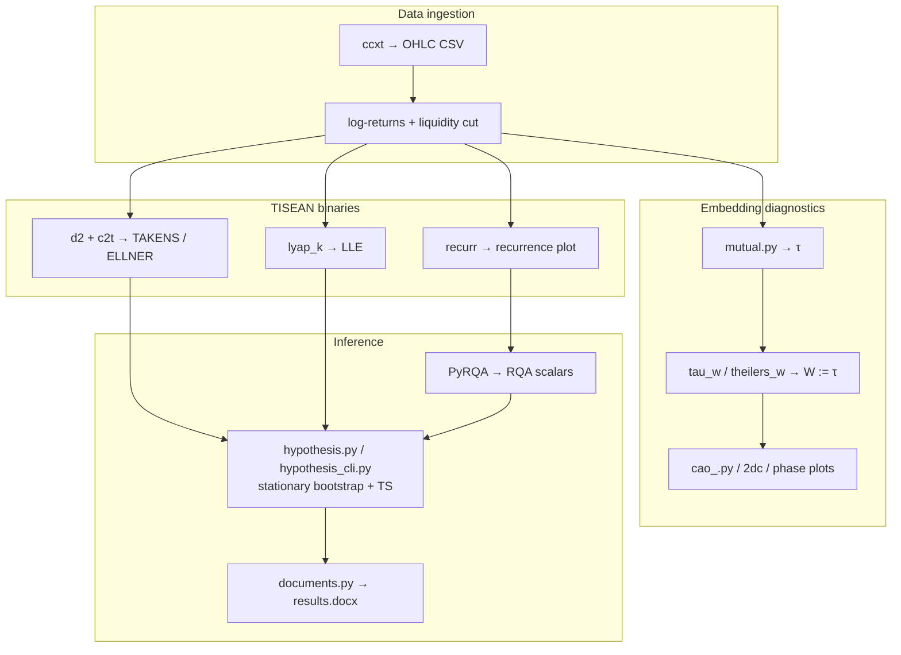
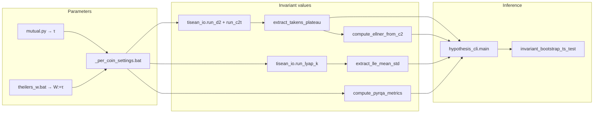
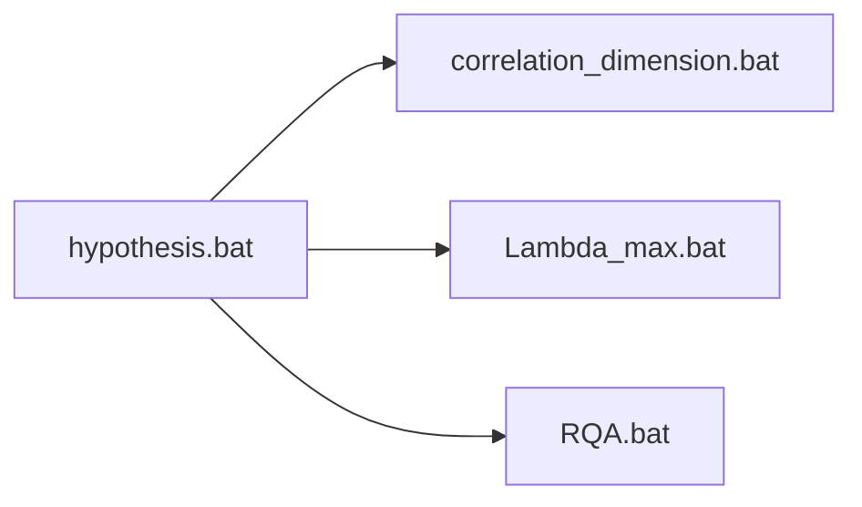
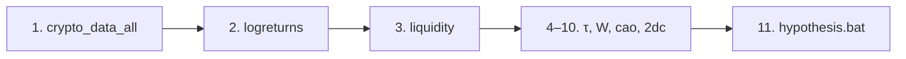
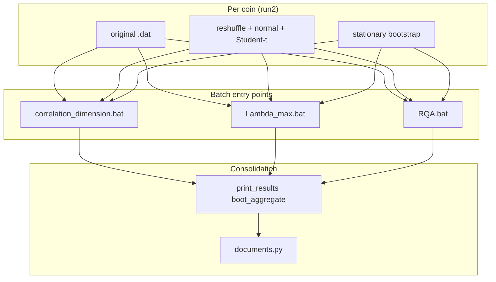

# Deterministic Chaos in Financial Time Series


This repository serves as a storage for codebase used in my bachelor's thesis focused on "Determining the presence of deterministic chaos in financial time series", released in June 2026 in Czech, at Prague University of Economics and Business (VŠE v Praze).
&nbsp; 
Link:
This project combines:
&nbsp;
- data download from exchange APIs (`ccxt`),
- log-return preprocessing,
- invariant estimation via TISEAN,
- recurrence quantification via `PyRQA`,
- stationary-bootstrap testing of the original-series invariant against **three independent null reference series** (random permutation, Gaussian, Student-t with $\nu=3.5$), with a `TS` decision rule **plus a two-sided Student-t p-value** (df $= B-1$) for dimension metrics (`ELLNER` by default, optionally `TAKENS` or `TAKENS,ELLNER`), **LLE**, and (by default) **RQA** scalars.
&nbsp;
&nbsp;
&nbsp; 

&nbsp;

## Table of Contents
- [Quick Start](#quick-start)
- [Theoretical Foundations](#theoretical-Foundations)
- [Project Scope](#project-scope)
- [Calculation pipeline (math → code)](#calculation-pipeline-math--code)
- [Current Architecture (Important)](#current-architecture-important)
- [Windows CMD primer (batch files)](#windows-cmd-primer-batch-files) *(collapsible)*
- [End-to-End Workflow](#end-to-end-workflow)
- [Distributed Hypothesis Workflow](#distributed-hypothesis-workflow)
- [Statistical Model (Current, Supervisor-Aligned)](#statistical-model-current-supervisor-aligned)
- [Outputs and Folder Structure](#outputs-and-folder-structure)
- [How to Read Surrogate Results](#how-to-read-surrogate-results)
- [Per-Coin Configuration](#per-coin-configuration)
- [Repository Map](#repository-map)
- [Diagnostics: Mutual Information (`mutual.py`)](#diagnostics-mutual-information-mutualpy)
- [Diagnostics: Cao Embedding Dimension (`cao_.py`)](#diagnostics-cao-embedding-dimension-caopy)
- [Diagnostics: Capacity Dimension (`2dc.py`)](#diagnostics-capacity-dimension-2dcpy)
- [d2.c — building C⁽ᵐ⁾(r) on a geometric ε-grid](#1-d2c--building-cm-r-on-a-geometric-ε-grid)
- [correlation_dimension.bat — orchestration](#2-correlation_dimensionbat--orchestration)
- [c2t.f — turning C⁽ᵐ⁾(r) into d₂⁽ᵀ⁾(r')](#3-c2tf--turning-cm-r-into-d2tr)
- [invariants_correlation.py — plateau picker + Ellner number](#4-invariants_correlationpy--plateau-picker--ellner-number)
- [How this gets called per series](#5-how-this-gets-called-per-series)
- [TL;DR data-flow diagram](#tldr-data-flow-diagram)
- [lyap_k.c — building S(t, m, ε)](#1-lyap_kc--building-st-m-ε)
- [Lambda_max.bat — orchestration](#2-lambda_maxbat--orchestration)
- [tisean_io.run_lyap_k — the bootstrap-path lyap_k call](#3-tisean_iorun_lyap_k--the-bootstrap-path-lyap_k-call)
- [invariants_lyapunov.py — parsing, linear window, OLS](#4-invariants_lyapunovpy--parsing-linear-window-ols)
- [How this gets called per series](#5-how-this-gets-called-per-series)
- [TL;DR data-flow diagram](#tldr-data-flow-diagram)
- [TISEAN Binaries Used (Active Pipeline)](#tisean-binaries-used-active-pipeline)
- [Method Notes by Script](#method-notes-by-script)
- [Desktop GUI](#desktop-gui)
- [Troubleshooting](#troubleshooting)
- [Historical/Removed Components](#historicalremoved-components)
- [Third-party: TISEAN](#third-party-tisean)
- [Citation](#citation)
- [License](#license)

&nbsp;


## Quick Start

> **Repo is relocatable.** After `git clone https://github.com/cryptotradingaddiction/Deterministic-chaos-in-financial-time-series.git`, every Python script and every `.bat` resolves its data, results and TISEAN paths from the repository root (no hardcoded absolute paths). All examples below assume your shell `cwd` is the repository root; everything works the same whether you cloned to `C:\projects\…`, `D:\work\…`, or anywhere else.
&nbsp;
### 1) Install Python dependencies

Use **Python 3.10+** (3.12 is a common choice on Windows). The dependency list is the extensionless file `requirements` at the repo root (not `requirements.txt`). Packages are grouped in that file (numerics, plotting, ML, exchange API, PyRQA, `nolds`, YAML, GUI) with compatible version ranges.

```bat
py -3 -m pip install -r requirements
```
&nbsp;

### 2) Ensure external tools are installed

- TISEAN: [https://www.pks.mpg.de/tisean/](https://www.pks.mpg.de/tisean/)
- gnuplot: [http://www.gnuplot.info/](http://www.gnuplot.info/)

The Git repository ships **only** the orchestration `.bat` files under `Tisean_3.0.0\bin\`. Install TISEAN locally and copy **`d2.exe`**, **`lyap_k.exe`**, **`recurr.exe`**, **`c2t.exe`**, **`corr.exe`**, **`stp.exe`** into that folder (or point **`TISEAN_BIN`** at a directory that contains them).

**Path resolution at run time:**

| Object | Where the project looks for it |
|--------|-------------------------------|
| TISEAN binaries | (1) `TISEAN_BIN` env, (2) `<repo_root>\Tisean_3.0.0\bin`, (3) system `PATH`. See `tisean_io.resolve_tool`. |
| gnuplot | (1) `gnuplot.exe` on `PATH`, (2) `C:\Program Files\gnuplot\bin\gnuplot.exe` as a Windows fallback. All `.bat` files derive this automatically. |
| `data/`, `data/results/` | `<repo_root>` by default (via `config.yaml` → `paths.*`, resolved through `config_loader.resolve_path`). Override with absolute paths when datasets live outside the repo. |

Optional environment overrides (no code changes):

| Variable | Effect |
|----------|--------|
| `TISEAN_BIN` | Directory searched first for `d2.exe`, `lyap_k.exe`, `recurr.exe` when Python resolves tools (falls back to the repo-local `Tisean_3.0.0\bin`, then `PATH`). |
| `DCH_TEST_MODE` | If set to `true`, active `.bat` scripts treat `TEST_MODE` as true (first **`DCH_TEST_POINTS`** rows per series, default **100** via `_dch_test_env.bat`), output roots such as `*_test_100`. |
| `DCH_TEST_POINTS` | Number of rows copied in test mode (default **100**). Used by `.bat` files and `config_loader.dch_test_point_count()`. |
| `DCH_RUN_HYPOTHESIS` | If set to `false`, active invariant `.bat` scripts compute only the invariant outputs/plots and skip `hypothesis.py` plus `_hypothesis_aggregate_summary.txt` aggregation. Default is `true`. |
| `DCH_DIMENSION_METRICS` | Controls which dimension metrics `correlation_dimension.bat` sends to `hypothesis.py`. Default: `ELLNER`. Valid practical values: `ELLNER`, `TAKENS`, `TAKENS,ELLNER`. |
| `DCH_BOOTSTRAP_SAMPLES` | Default for `hypothesis.py --bootstrap_samples` when the CLI flag is omitted (desktop sets this from the GUI spinbox). |
| `DCH_STATIONARY_BLOCK_MEAN` | Mean stationary-bootstrap block length. `<= 0` (default) uses $\sqrt{n}$. |
| `DCH_LYAP_STEPS` | `lyap_k -n` (number of reference points). Defaults: **500** production, **200** when `DCH_TEST_MODE=true`. The production branches of `Lambda_max.bat` and `desktop_app.py` **explicitly clear** this variable so a stale test-mode value cannot leak into a production run. |
| `DCH_LYAP_ITERATIONS` | `lyap_k -s` (length of the S(t) curve). Defaults: **100** production, **30** when `DCH_TEST_MODE=true`. Same explicit-clear policy as `DCH_LYAP_STEPS`. |
| `DCH_LYAP_MIN_NEIGHBORS` | Python-side neighbour filter in `extract_lle_ols` (**not** a `lyap_k` flag). Defaults: **10** production, **3** when `DCH_TEST_MODE=true`. Same explicit-clear policy. |

&nbsp;

### 3) Prepare config

`config.yaml` ships with **relative** defaults that work straight out of the box:

```yaml
paths:
  # Resolved against the repository root by config_loader.resolve_path.
  # Override with absolute paths only when data lives outside the project.
  data_dir: "data"
  results_dir: "data/results"

download:
  from: null
  to: null

liquidity:
  mode: fixed              # active pipeline: last fixed_tail_points hours; use liquidity for rolling zero-% start
  window_size: 720
  tolerance: 1.0
  analysis_end: null       # liquidity mode only: null = through last sample
  fixed_tail_points: 8760  # fixed mode: last N hourly rows (1 year ≈ 8760)
  create_cut_files: true
  create_backup_before_cut: true
```

Notes:

- if `download.from` is `null`, downloader uses default per-asset start settings;
- if `download.to` is `null`, downloader uses current UTC date.
- `liquidity` controls how `liquidity.py` builds `*_logreturns_cut.*` (see `config.example.yaml` for full comments). **Fixed** mode keeps the last **`fixed_tail_points`** hourly samples (no calendar from/to).
- The default analysis window is **8760 h** ≈ one year of hourly data; raise to 17520 / 35040 for longer runs (with a corresponding wall-clock cost in the hypothesis stage — see [Computational cost](#computational-cost-roughly-what-each-stage-pays)).

&nbsp;


## Theoretical Foundations

### Deterministic Chaos

Deterministic chaos refers to complex, aperiodic behavior arising from deterministic nonlinear dynamical systems. A system is considered chaotic if it exhibits three key properties:

1. **Sensitive Dependence on Initial Conditions**: Arbitrarily small differences in initial states grow exponentially over time
2. **Topological Mixing**: The system evolves such that any given region of phase space eventually overlaps with any other region
3. **Dense Periodic Orbits**: Periodic orbits are densely distributed in the phase space

The canonical mathematical example is the logistic map:

$$x_{n+1} = r \cdot x_n (1 - x_n)$$

For certain values of the parameter $r$ (specifically $r > 3.57$), this simple deterministic equation produces chaotic dynamics indistinguishable from random noise by conventional statistical methods.

### Lyapunov Exponents

The Lyapunov exponent quantifies the rate at which nearby trajectories in phase space diverge or converge. For a one-dimensional map $x_{n+1} = f(x_n)$, the Lyapunov exponent is defined as:

$$\lambda = \lim_{n \to \infty} \frac{1}{n} \sum_{i=0}^{n-1} \ln |f'(x_i)|$$

For continuous-time systems, if the initial separation between two trajectories is $\delta_0$, the separation at time $t$ evolves as:

$$|\delta(t)| \approx e^{\lambda t} |\delta_0|$$

**Interpretation**:
- $\lambda > 0$: Chaotic behavior—nearby trajectories diverge exponentially
- $\lambda = 0$: Marginal stability—characteristic of bifurcation points
- $\lambda < 0$: Stable fixed point or periodic orbit—trajectories converge

&nbsp;

## Mathematical Formulations

### Phase Space Reconstruction (Takens' Embedding)

Given a scalar time series $\{x_1, x_2, \ldots, x_N\}$, we reconstruct the phase space using delay coordinates:

$$\mathbf{y}_i = (x_i, x_{i+\tau}, x_{i+2\tau}, \ldots, x_{i+(m-1)\tau})$$

where:
- $m$ = embedding dimension
- $\tau$ = time delay

Takens' theorem guarantees that for sufficiently large $m$ (specifically, $m > 2D$, where $D$ is the dimension of the original attractor), the reconstructed attractor is topologically equivalent to the original.

### Correlation Integral

$$C(r) = \lim_{N \to \infty} \frac{2}{N(N-1)} \sum_{i=1}^{N} \sum_{j=i+1}^{N} \Theta(r - \|\mathbf{y}_i - \mathbf{y}_j\|)$$

where $\Theta$ is the Heaviside step function.

&nbsp;

## Project Scope

The pipeline is designed to test whether selected chaos-related invariants from original financial time series differ significantly from values generated by surrogate null-model series.

Main tested invariants:

- **TAKENS** — plateau mean of the Takens–Theiler estimator $d_2^{(T)}(r')$ (eqs. 8.75–8.76) from `c2t.exe`,
- **ELLNER** — Ellner extension $d_2^{(E)}$ (eq. 8.78) on the plateau $[r_{\min}, r_{\max}]$:

  $$d_2^{(E)} = \frac{C^{(m)}(r_{\max}) - C^{(m)}(r_{\min})}{\displaystyle\int_{r_{\min}}^{r_{\max}} \frac{C(r)}{r}\, dr}$$

- **LLE** — largest Lyapunov exponent proxy from `lyap_k` (Kantz $S(t)$ slope),
- **RQA** — `RR`, `DET`, `LAM`, `MAXLINE`, `ENTR`, `TT`, `TREND` (PyRQA + custom trend).

The hypothesis part is distributed across per-invariant batch scripts and consolidated with `hypothesis.bat`.

### Pipeline overview



---
&nbsp;

## Calculation pipeline (math → code)

This section is the **method-first map**: each quantity used in the thesis pipeline, where it is defined mathematically, and the **exact function or executable** that computes it. Shared embedding parameters ($\tau$, $W$, $m=3$) come from `Tisean_3.0.0/bin/_per_coin_settings.bat` after `mutual.py` and `theilers_w.bat`; verify with `py -3 audit_invariant_parameters.py`.

### Contents of this section

- [Shared inputs and parameters](#shared-inputs-and-parameters)
- [Per-coin parameter resolution (single sources of truth)](#per-coin-parameter-resolution-single-sources-of-truth)
- [Correlation dimension (TAKENS & ELLNER)](#correlation-dimension-takens--ellner)
- [Largest Lyapunov exponent (LLE)](#largest-lyapunov-exponent-lle)
- [Recurrence quantification (RQA)](#recurrence-quantification-rqa)
- [Surrogates, bootstrap, and test statistic](#surrogates-bootstrap-and-test-statistic)
- [Independent RNG streams for surrogate vs bootstrap](#independent-rng-streams-for-surrogate-vs-bootstrap)
- [Numerical robustness](#numerical-robustness)
- [LLE diagnostic plot path resolution](#lle-diagnostic-plot-path-resolution)
- [End-to-end call graph (formal invariants only)](#end-to-end-call-graph-formal-invariants-only)
- [Python call tree inside `hypothesis_cli`](#python-call-tree-inside-hypothesis_cli)
- [Computational cost (roughly what each stage pays)](#computational-cost-roughly-what-each-stage-pays)
- [Diagnostics (not in the bootstrap TS table)](#diagnostics-not-in-the-bootstrap-ts-table)
- [One-line entry points by batch script](#one-line-entry-points-by-batch-script)

### Shared inputs and parameters

| Object | Role | Computation |
|--------|------|-------------|
| Log-return series $r_t$ | Analysis signal (no z-score in invariant path) | `compute_logreturns.py` → `liquidity.py` writes `*_logreturns_cut.dat` when configured |
| Embedding delay $\tau$ | Takens delay for all formal invariants | First MI minimum: `mutual.py` → `mi_fraser_swinney`, `find_first_minimum`, `process_file` → `mutual/_mi_summary.txt` → `config_loader.sync_per_coin_bat_tau_from_mutual_summary` → `TAU_D2_*`, `TAU_LLE_*`, `TAU_RQA_*` |
| Theiler window $W$ | Excludes temporally correlated pairs ($\|i-j\|\le W$ in TISEAN) | **Project rule $W := \tau$:** `theilers_w.bat` (`corr.exe`, `stp.exe`, optional `detect_theiler.py` diagnostics) → `config_loader.sync_per_coin_bat_w_d2_from_theiler_summary` sets `W_D2_<sym> = TAU_D2_<sym>` |
| Embedding dimension $m$ | State-space dimension for invariants | Fixed **$m=3$:** `hypothesis_config.M_D2`, `M_LYAP`, `RQA_EMBEDDING_DIM`; bat `-M1,3` / `lyap_k -m3 -M3` / `recurr -m1,3` |
| $\mu_r$, $\sigma_r$ | Mean and SD of original log-returns (reference series only) | `hypothesis_cli.py` (`load_data` → `np.mean` / `np.std(ddof=1)`) |

**Series loading for all in-memory hypothesis runs:** `surrogate_sampling.load_series_1d` ← `tisean_io.load_data`.

---

### Per-coin parameter resolution (single sources of truth)

Adding or removing a coin is a **single-line** edit; the rest of the project is wired to follow.

| Layer | Source of truth | Used by |
|-------|-----------------|---------|
| Symbol list | `config_loader.PIPELINE_SYMBOLS` (`("BTCUSD", "ETHUSD", "LTCUSD", "XRPUSD", "LINKUSD", "DOGEUSD", "ADAUSD")`) | `pipeline_logreturn_files`, `audit_invariant_parameters`, `documents.SYMS` |
| Filenames | `config_loader.pipeline_logreturn_files(ext="dat"\|"csv"\|"raw", config=None)` — appends the matching suffix from `config["files"]` to each symbol | Every Python pipeline script and every `.bat` (via a `py -3 -c …` one-liner that prints the space-separated list) |
| Filename suffixes | `config["files"]` (`raw_csv_suffix`, `logreturns_dat_suffix`, `logreturns_csv_suffix`) with defaults in `config_loader.DEFAULT_CONFIG` | `pipeline_logreturn_files`, `compute_logreturns.py`, `liquidity.py` |
| Per-coin τ | (1) `mutual/_mi_summary.txt` (`first_min_tau`), (2) `_per_coin_settings.bat` (`TAU_D2_*` / `TAU_LLE_*` / `TAU_RQA_*`), (3) `TAU_FALLBACK_BY_SYMBOL` | All TISEAN bats, `tau_for_symbol_from_mutual`, `rqa_params_for_symbol` |
| Per-coin W | `_per_coin_settings.bat` `W_D2_<sym> := TAU_D2_<sym>` (synced by `theilers_w.bat` → `sync_per_coin_bat_w_d2_from_theiler_summary`) | `d2.exe -t`, `lyap_k.exe -t`, `recurr.exe -t`, PyRQA `theiler_corrector = W + 1` (`tisean_theiler_min_diagonal_k`), `compute_rqa_trend.min_k` |
| Embedding $m$ | `hypothesis_config.M_D2 = M_LYAP = RQA_EMBEDDING_DIM = 3` | All invariant code; `audit_invariant_parameters.py` enforces equality |

**Cross-module audit.** `py -3 audit_invariant_parameters.py` walks every coin and flags `MISSING` keys, non-numeric values, and mismatches across `TAU_D2`/`TAU_LLE`/`TAU_RQA`/`W_D2`/`mutual/_mi_summary.txt`. A coin is now reported as **`MISSING`** *or* **`non-numeric`**, never both (the audit short-circuits after `MISSING` so the noise stays low).

**Relocatable paths.** `config_loader.DEFAULT_CONFIG` ships `data_dir = "data"` and `results_dir = "data/results"` (relative). `config_loader.resolve_path` upgrades them against `project_root()` so the project works after a fresh `git clone` to any directory. All `.bat` files derive `REPO_ROOT` from `%~dp0..\..\` (the parent of `Tisean_3.0.0\bin\`).

---

### Correlation dimension (TAKENS & ELLNER)

| Object | Math / book ref. | Code path |
|--------|------------------|-----------|
| Correlation sum $C^{(m)}(r)$ | Grassberger–Procaccia integral | **TISEAN** `d2.exe` via `tisean_io.run_d2` (`-dτ -M1,10 -tW`; `hypothesis_config.D2_DIAGNOSTIC_M_MAX`); batch: `correlation_dimension.bat` |
| Takens curve $d_2^{(T)}(r')$ | Eqs. 8.75–8.76 | **TISEAN** `c2t.exe` via `tisean_io.run_c2t` → `*_takens.dat` (blocks $m=1\ldots 10$ for plots) |
| Plateau on $\ln r'$ | Stable scaling region (after 8.77) | `invariants_correlation.select_plateau_values` ← `extract_takens_plateau` ← `tisean_io.extract_tagged_block(..., tag="#m")` (edge-margin search, $\sqrt{\cdot}$ length bonus weight 0.5, returns NaN when $n < $ `MIN_PLATEAU_POINTS`) |
| **TAKENS** | Mean of $d_2^{(T)}$ on plateau at $m=M_{D_2}=3$ | `invariants_correlation.extract_takens_plateau` → `invariants_compute.compute_invariants` (metric key `TAKENS`) |
| $r_{\min}, r_{\max}$ | Plateau endpoints | Returned by `extract_takens_plateau` |
| **ELLNER** $d_2^{(E)}$ | Eq. 8.78 on $[r_{\min}, r_{\max}]$ | `invariants_correlation.compute_ellner_from_c2` — full-grid `np.interp` for $C(r_{\min}), C(r_{\max})$; log-$r$ trapezoid $\int C(r)\, d(\ln r)$; `.c2` block `#dim=3` → `compute_invariants` (`ELLNER`) |
| Hypothesis orchestration | CLI + bootstrap loop | `hypothesis.py` → `hypothesis_cli.main`; batch: `correlation_dimension.bat` → `--metrics_list %DCH_DIMENSION_METRICS%` |

---

### Largest Lyapunov exponent (LLE)

| Object | Math / book ref. | Code path |
|--------|------------------|-----------|
| Divergence curves $S(t)$ | Kantz / TISEAN `lyap_k` (eq. 8.94–8.95) | **TISEAN** `lyap_k.exe` via `tisean_io.run_lyap_k` (`-dτ -m3 -M3 -tW -n<ref_pts> -s<iters>`); batch: `Lambda_max.bat` sweeps `m=3..10` for diagnostic plots (`hypothesis_config.M_LYAP_DIAGNOSTIC_MAX`) |
| Reference points / S(t) length | `lyap_k -n` / `-s` | `hypothesis_config.lyap_k_steps` (env `DCH_LYAP_STEPS`, default 500) and `lyap_k_iterations` (env `DCH_LYAP_ITERATIONS`, default 100) |
| **LLE** | OLS slope of the highest-quality $\varepsilon$-block at $m=M_{\mathrm{LYAP}}=3$ | `invariants_lyapunov.extract_lle_ols` ← `_parse_lyap_blocks` / `_best_linear_slope_window` (returns `(slope, t_lo, t_hi, intercept, std_err)`); quality $= (t_{\mathrm{hi}}-t_{\mathrm{lo}})/\mathrm{std\_err}$ → `compute_invariants` (`LLE`, with `std_err` as primary uncertainty) |
| LLE diagnostic plot | Visual check of linear region | `plot_lyap_k_output.plot_orig_lle_fit` (called from `hypothesis_cli.main` when `LLE` in metrics) |

---

### Recurrence quantification (RQA)

| Object | Math / ref. | Code path |
|--------|-------------|-----------|
| Recurrence radius $r$ | $p$-th percentile of embedded pairwise distances (default $p=4\%$) | `invariants_rqa.compute_percentile_radius` ← `rqa_radius.py` (stdout for `RQA.bat`); hypothesis: locked after orig run in `hypothesis_cli.main` |
| Embedded states | $m=3$, delay $\tau$ | `invariants_rqa.embed_series` |
| TISEAN recurrence plot | Diagnostic RP | **TISEAN** `recurr.exe` in `RQA.bat` (`-m1,3 -dτ -tW -r`) |
| PyRQA **RR, DET, LAM, MAXLINE, ENTR, TT** | Standard RQA scalars | `invariants_rqa.compute_pyrqa_metrics` (PyRQA `RQAComputation`; `theiler_corrector = W+1` via `tisean_theiler_min_diagonal_k`) |
| **TREND** | Slope of diagonal recurrence density vs $k$ | `invariants_rqa.compute_rqa_trend` |
| Batch RQA table (no bootstrap) | Per-coin metrics file | `rqa_values.py` (reads `config_loader.rqa_params_for_symbol`) |

---

### Surrogates, bootstrap, and test statistic

| Object | Definition | Code path |
|--------|------------|-----------|
| Reshuffle reference (null #1) | i.i.d. permutation of observations — "ordering is irrelevant" | `hypothesis_surrogates.generate_single_surrogate` |
| Gaussian reference (null #2) | $\mathcal{N}(\mu_r,\sigma_r)$, length $n$ — "i.i.d. Gaussian noise with matched moments" | `hypothesis_surrogates.generate_normal_series` |
| Student-$t$ reference (null #3) | $t_{\nu=3.5}$ scaled to $(\mu_r,\sigma_r)$ — heavy-tailed match for financial returns | `hypothesis_surrogates.generate_t_series` (`hypothesis_config.T_DOF`) |
| Stationary bootstrap replicates | Politis–Romano block resampling; block length $\sqrt{n}$ if unset | `surrogate_sampling.stationary_bootstrap_samples` ← `hypothesis_cli.main` (env `DCH_STATIONARY_BLOCK_MEAN`, default via `hypothesis_config.DEFAULT_STATIONARY_BLOCK_MEAN`) |
| $\overline{T}_{\mathrm{boot}}$, $s_{\mathrm{boot}}$, $B_{\mathrm{eff}}$ | Mean / sample SD / count of finite bootstrap invariant values | `hypothesis_cli.main` (loop over `compute_invariants` on each bootstrap series) |
| $T_{\mathrm{ref}}$ | Invariant on one of the three reference series ($\mathrm{ref} \in \{\mathrm{surr},\,\mathrm{normal},\,t_{3.5}\}$) | Same `compute_invariants` on the matching label |
| **TS** (per metric × reference) | $\mathrm{TS}_{\mathrm{ref}} = (\overline{T}_{\mathrm{boot}} - T_{\mathrm{ref}}) / s_{\mathrm{boot}}$ | `hypothesis_ts.invariant_bootstrap_ts_test` |
| **p-value** (per metric × reference) | $p = 2 \cdot \mathrm{SF}_t(\lvert\mathrm{TS}\rvert,\; df = B_{\mathrm{eff}} - 1)$ — two-sided Student-$t$ tail, MATLAB-equivalent `2*(1 - tcdf(|TS|, B-1))` | `hypothesis_ts.invariant_bootstrap_ts_test` via `scipy.stats.t.sf` (numerically stable in the 3-sigma upper tail) |
| Decision | Reject $H_0$ if $\lvert\mathrm{TS}_{\mathrm{ref}}\rvert > 3$ — reported **per reference** | Same function; threshold `hypothesis_config.DEFAULT_TS_THRESHOLD` / `--ts_threshold` |
| Summary table | Machine-readable per-coin output: one row per (metric, reference) | `hypothesis_cli.main` writes `*_surrogate_summary.txt`; aggregate: `print_results.py boot_aggregate` |

**Why three references.** The bootstrap centre and SD describe the *original* series's invariant distribution and are shared across the three tests; only $T_{\mathrm{ref}}$ in the numerator changes. Each comparison answers a different question: *surr* rules out "any ordering would give the same number", *normal* rules out i.i.d. Gaussian noise, and *t3.5* rules out a heavy-tailed i.i.d. null that is the realistic random benchmark for financial log-returns. A metric that rejects $H_0$ against all three references is the strongest evidence of nonlinear structure; rejection against `surr` alone usually only reflects departure from the multiset null.

**Bootstrap count $B$:** default `hypothesis_config.DEFAULT_BOOTSTRAP_SAMPLES` (100); override `DCH_BOOTSTRAP_SAMPLES` or `--bootstrap_samples` (bat passes via `_dch_hypothesis_cli_extra.bat`). $B_{\mathrm{eff}}$ in the p-value uses only finite bootstrap invariant values (non-finite replicates are dropped), so $B_{\mathrm{eff}} \le B$ in practice.

---

### Independent RNG streams for surrogate vs bootstrap

`hypothesis_cli.main` derives **two statistically independent streams** from one user-supplied `--seed` (default `0`):

```python
seed_surr, seed_boot = np.random.SeedSequence(args.seed).spawn(2)
rng = np.random.default_rng(seed_surr)
# surr = rng.permutation(orig_data)
# normal/t3.5 also drawn from `rng`
boot_series = stationary_bootstrap_samples(orig_data, B, ..., seed=seed_boot)
```

Why bother:

- **Reproducibility:** same `--seed` → identical outputs across runs and machines (NumPy `default_rng` is platform-independent).
- **Independence:** the surrogate stream and the bootstrap stream do not consume each other's bits. Adding a metric or changing the surrogate logic later does not silently reshuffle the bootstrap draws (a single shared `Generator` would do exactly that).
- **API:** `surrogate_sampling.stationary_bootstrap_samples` takes `seed` as anything `np.random.default_rng` accepts (`int`, `SeedSequence`, `BitGenerator`, `None`). The hypothesis CLI passes a spawned `SeedSequence`.

---

### Numerical robustness

| Site | What changed and why |
|------|----------------------|
| `invariants_lyapunov._fit_lle_block` | A block with $\mathrm{std\_err} = 0$ (perfectly linear $S(t)$ window) is **not** rejected; it is given `quality = +inf` so it wins the selection. The earlier strict `std_err > 0` filter silently discarded the cleanest possible fit. |
| `invariants_correlation.select_plateau_values` | Returns `NaN` plus a warning when fewer than `MIN_PLATEAU_POINTS = 8` usable samples exist (no silent "use the whole range" fallback). Edge margin and $\sqrt{\cdot}$ length bonus (weight 0.5) are shared by `print_results._stable_plateau_values`, which is now a thin adapter calling `select_plateau_values`. |
| `invariants_correlation.compute_ellner_from_c2` | Integrates $\int C(r)\, d(\ln r)$ on the **log-r** grid (correct for `d2.exe`'s exponential ε scan); endpoint $C$ values come from `np.interp` over the full sorted grid, not the masked subset. |
| `cao_.py` `calculate_for_m` | Non-finite $a_i$ ratios and $|\Delta x^{new}|$ values are **dropped** before averaging. The previous `np.where(..., 1e10)` placeholder biased $E(m)$ upward in proportion to the number of degenerate neighbours. |
| `tisean_io.run_d2` / `run_lyap_k` / `run_c2t` | Each subprocess runs with `cwd = <output_dir>` and passes the output prefix by **basename**. Windows TISEAN builds use `character*72` FORTRAN path buffers — long absolute paths could silently truncate the output filename. |
| `invariants_rqa.compute_pyrqa_metrics` | A PyRQA failure now emits `logger.exception(...)` before returning all-NaN metrics, so bootstrap "no sd" / "insufficient data" outcomes are diagnosable. |
| `invariants_compute.compute_invariants` | Sole dispatcher used for every series label (`orig`, `surr`, `normal`, `t3.5`, bootstrap). Cleans `tmp_hyp/<label>*` on every call so long runs do not accumulate junk; honours the optional `lyap_keep_path` for the LLE diagnostic plot below. |
| `invariants_compute.out_n` keys | Plateau-point counts for TAKENS/ELLNER are intentionally shared (ELLNER reuses Takens plateau dispersion). `out_n["LLE"]` is **not** a plateau count but the number of usable ε-blocks in `lyap_k` output; it is informational only and **does not** drive any TS decision. |
| `hypothesis_config.lyap_*` env clearing | The production branches of `Lambda_max.bat` and `desktop_app.py` clear `DCH_LYAP_STEPS / DCH_LYAP_ITERATIONS / DCH_LYAP_MIN_NEIGHBORS` so a stale test-mode env can no longer truncate hypothesis.py's lyap_k calls below the lyap_k.exe production settings. |

---

### LLE diagnostic plot path resolution

When `LLE` is in `--metrics_list`, `hypothesis_cli.main` writes a per-coin S(t)-with-OLS-fit PNG via `plot_lyap_k_output.plot_orig_lle_fit`. The lyap_k output can come from two different upstream paths:

1. **From `Lambda_max.bat`:** the bat produces `<RUN_DIR>/{base}_lyap.txt` *before* `hypothesis.py` is invoked; the CLI's `args.output_dir` is `<RUN_DIR>/hypothesis_lle`.
2. **From a direct CLI invocation** (e.g. `test_hypothesis_stack.py` or a manual one-off): the bat-produced file does not exist. `compute_invariants` is now called with `lyap_keep_path = <output_dir>/{base}_orig_lyap.txt`, which copies the lyap_k output for the orig run before the `tmp_hyp/` cleanup runs.

Resolution order in `hypothesis_cli.main`:

```python
cand_paths = [
    os.path.join(args.output_dir, f"{args.base}_orig_lyap.txt"),  # from compute_invariants
    os.path.join(run_dir, f"{args.base}_lyap.txt"),               # from Lambda_max.bat
]
cand_lyap = next((p for p in cand_paths if os.path.isfile(p)), None)
```

If neither path exists, the plot is skipped with a warning and the rest of the pipeline continues.

---

### End-to-end call graph (formal invariants only)



`invariants_compute.compute_invariants` is the **single dispatcher** used inside `hypothesis_cli` for every series label (`orig`, `surr`, `normal`, `t*`, bootstrap).

---

### Python call tree inside `hypothesis_cli`

This is what runs per coin between **load** and **summary file**. Inputs `(--input, --base, --delay, --theiler, --output_dir, --metrics_list, --bootstrap_samples, --seed, --ts_threshold)` arrive from the calling `.bat`.

```text
hypothesis_cli.main
├── parse args  →  os.environ["DCH_TEST_MODE"] := "true" if --test_mode true
├── tisean_io.load_data(args.input)                                    # → orig_data
├── mu_r, sigma_r := np.mean / np.std(orig_data, ddof=1)
├── seed_surr, seed_boot := np.random.SeedSequence(args.seed).spawn(2) # independent RNG streams
├── hypothesis_surrogates.generate_single_surrogate(orig_data, rng)    # randperm via rng(seed_surr)
├── hypothesis_surrogates.generate_normal_series(mu_r, sigma_r, n, rng)
├── hypothesis_surrogates.generate_t_series(mu_r, sigma_r, n, rng, dof=T_DOF)
├── for label in ("orig", "surr", "normal", "t3.5"):                   # reference series
│       invariants_compute.compute_invariants(
│           series, tmp_dir, f"{base}_{label}", delay, theiler,
│           metrics_for_label, rqa_radius, rqa_radius_mode=...,
│           rqa_percentile=...,
│           lyap_keep_path=<output_dir>/{base}_orig_lyap.txt if label=="orig" and LLE in scope,
│       )
│         ├── if TAKENS / ELLNER in scope:
│         │     tisean_io.run_d2 → .d2/.h2/.c2 (cwd=tmp, output by basename)
│         │     tisean_io.run_c2t → *_takens.dat
│         │     invariants_correlation.extract_takens_plateau          # plateau mean (TAKENS), r_min, r_max
│         │     invariants_correlation.compute_ellner_from_c2          # ELLNER on [r_min, r_max], log-r trapezoid
│         ├── if LLE in scope:
│         │     tisean_io.run_lyap_k → {base}_lyap.txt (cwd workaround, optional copy to lyap_keep_path)
│         │     invariants_lyapunov.extract_lle_ols
│         │       ├── _parse_lyap_blocks                                # per (ε, m) blocks
│         │       ├── _fit_lle_block → _best_linear_slope_window         # OLS slope + std_err
│         │       └── pick block with max quality = (t_hi - t_lo)/std_err  (∞ if std_err == 0)
│         └── if any RQA metric in scope:
│               invariants_rqa.compute_percentile_radius (orig only; locked thereafter)
│               invariants_rqa.compute_pyrqa_metrics (RR/DET/LAM/MAXLINE/ENTR/TT)
│               invariants_rqa.compute_rqa_trend (custom TREND, min_k = W+1)
├── surrogate_sampling.stationary_bootstrap_samples(orig_data, B, …, seed=seed_boot)  # Politis-Romano
├── for boot_data in boot_series:                                      # B replicates
│       compute_invariants(boot_data, …, bootstrap_metrics, locked_rqa_radius)
│       collect finite invariant values into bootstrap_values[metric]
├── for metric in bootstrap_metrics:
│       bootstrap_mean[metric]  := mean of finite bootstrap values
│       bootstrap_sd[metric]    := SD (ddof=1) of finite bootstrap values
│       bootstrap_n[metric]     := count of finite bootstrap values
├── for metric in bootstrap_metrics:
│       for ref in ("surr", "normal", "t3.5"):                       # three independent nulls
│           hypothesis_ts.invariant_bootstrap_ts_test(
│               boot_mean[metric], boot_sd[metric],
│               results[ref][metric],
│               n_bootstrap=boot_n[metric],                          # df = B_eff − 1 for the Student-t p-value
│               threshold=args.ts_threshold,
│           )
│               → (TS_ref, |TS_ref|, p_ref, "reject H0" / "fail to reject H0" / "insufficient data" / "no sd")
├── write {base}_surrogate_summary.txt
│     - parameters, series statistics, Step-0 reference comparison
│     - one row per (metric, reference): boot_mean, boot_sd, B, orig, ref_val, TS, |TS|, p_value, decision
│     - per-metric conclusion line summarising decisions across the three references
└── if LLE in metric_names: plot_lyap_k_output.plot_orig_lle_fit(cand_lyap, out_png)
```

`print_results.py boot_aggregate` later walks every `*_surrogate_summary.txt` under a result root and consolidates the rows into `_hypothesis_aggregate_summary.txt`, which `documents.py` turns into the thesis tables in `results.docx`.

---

### Computational cost (roughly what each stage pays)

For $C = 7$ coins, $N$ samples per series, $B$ stationary-bootstrap replicates. Wall-clock numbers below are order-of-magnitude on a typical laptop; the actual TISEAN single-thread runtime dominates.

| Stage | Per-coin asymptotic | Notes |
|-------|---------------------|-------|
| 1. `crypto_data_all.py` | $O(N)$ I/O | network-bound, paginated 1 000-bar fetches |
| 2. `compute_logreturns.py` | $O(N)$ | trivial |
| 3. `liquidity.py` | $O(N)$ | rolling zero-% scan or trailing cut |
| 4. `mutual.py` | $O(N \cdot \tau_{\max} \log N)$ amortized | Fraser–Swinney recursive partition; minutes on $N\!\approx\!8760$ |
| 5. `tau_w.py`, 6. `theilers_w.bat` | $O(N)$ + TISEAN `corr` + `stp` | seconds–minutes |
| 7–10. `cao_.py`, `2dc.py`, phase plots | $O(N \log N)$ (KD-tree) | parallel via `multiprocessing` in `cao_.py` |
| **11a. `correlation_dimension.bat`** | `d2.exe` is the heaviest single call on long $N$ (Grassberger–Procaccia all-pairs by default; `-N0`) | $\sim$ minutes per series on $N\!\approx\!8760$, scaling super-linearly with $N$ when `-N0` is used. |
| **11b. `Lambda_max.bat`** | `lyap_k.exe`: $O(N \cdot \mathrm{n_{ref}} \cdot \mathrm{iters})$ | `-n500 -s100` in production; seconds–minute per coin. |
| **11c. `RQA.bat`** | `recurr.exe` + PyRQA + custom TREND | RQA radius `pdist` is $O(\min(N, 5000)^2)$ but capped via `RQA_RADIUS_MAX_VECTORS = 5000`. |
| **Bootstrap (11a/b/c)** | **Multiplies the per-series TISEAN work by $B + 4$** (orig + surr + normal + t + $B$ bootstrap calls) per metric scope. Default $B = 100$. | RQA radius is computed once on `orig` and **locked** so the bootstrap calls don't repeat the `pdist` percentile. |

**Practical estimates** (one full pipeline run, $N = 8760$, $B = 100$, 7 coins, single physical core):

| Mode | Stages 1–10 | Stage 11 (ELLNER only) | Stage 11 (ELLNER + LLE + RQA) | Total |
|------|-------------|------------------------|-------------------------------|-------|
| Smoke ($N = 100$, $B = 3$) | seconds | seconds | seconds | a couple of minutes |
| Test ($N = 100$, $B = 100$) | seconds | tens of seconds | tens of seconds | minutes |
| Production ($N = 8760$, $B = 100$) | minutes | tens of minutes per coin | $\sim$ 1–3 hours per coin | several hours total |
| Production ($N = 35040$, $B = 100$) | tens of minutes | hours per coin | half a day per coin | comfortably overnight |

Disk / RAM:

- One run's `data/results/` tree is a few hundred MB (raw `.d2`/`.h2`/`.c2`/`*_lyap.txt`, gnuplot PNGs, summary text).
- Peak RAM during the RQA percentile-radius step is dominated by `pdist` over $\le 5000$ vectors ($\sim 100$ MB at most).

Knobs that reduce wall-clock:

- `DCH_DIMENSION_METRICS=ELLNER` (default; skip TAKENS plateau when not needed for the thesis run).
- `DCH_RUN_HYPOTHESIS=false` for invariant-only runs (plots and aggregate text without bootstrap).
- Lower `DCH_BOOTSTRAP_SAMPLES` for exploratory passes; bump back to 100 for the final run.
- Run the three invariant `.bat` files in parallel CMD windows if you have the cores — they share `_per_coin_settings.bat` and per-coin output folders, so they do not conflict.

---

### Diagnostics (not in the bootstrap TS table)

These scripts inform $\tau$ or exploratory geometry; they are **not** mixed into the formal TS decision unless you explicitly reuse their outputs in `.bat`.

| Object | Purpose | Code path |
|--------|---------|-----------|
| Mutual information $I(\tau)$ | Choose $\tau$ | `mutual.py` (`mi_fraser_swinney`, `find_first_minimum`) |
| Cao $E_1(m)$, $E_2(m)$ | Embedding dimension hint | `cao_.py` (Chebyshev NN, $m=1\ldots d_{\max}$) |
| Capacity dimension $D_c$ | Box-counting sweep | `2dc.py` (min–max normalized coordinates per $m$) |
| Decorrelation time $\tau_w$ | Separate heuristic (not $\tau$ for TISEAN) | `tau_w.py` |
| Phase portraits | Visualization | `phase_2D.py`, `phase_3D.py` |

---

### One-line entry points by batch script

| Batch script | Primary math outputs | Python entry |
|--------------|---------------------|--------------|
| `correlation_dimension.bat` | TAKENS, ELLNER (+ gnuplot) | `hypothesis.py` with `--metrics_list` from `DCH_DIMENSION_METRICS` |
| `Lambda_max.bat` | LLE | `hypothesis.py --metrics_list LLE` |
| `RQA.bat` | RR, DET, LAM, … | `rqa_radius.py` → `recurr.exe` → `rqa_values.py` → `hypothesis.py` (fixed $r$) |
| `hypothesis.bat` | All of the above | Sequences the three bats + `print_results.py` + `documents.py` |

---
&nbsp;

## Current Architecture (Important)

### Active execution model

- `run1` is removed from active workflow.
- All active invariant workflows are `run2`-based and per-coin parametrized.
- `hypothesis.bat` is a wrapper that calls three pipelines:



### Statistical model currently used

- **Three null/reference series:** one point-wise reshuffle (`randperm`), one Gaussian $\mathcal{N}(\mu_r, \sigma_r)$ series, and one Student-$t$ reference with $\nu = 3.5$ scaled to $(\mu_r, \sigma_r)$. **All three are full nulls**, not just descriptive benchmarks — each gets its own TS / p-value / decision in the summary.
- **Inference:** for metrics in `DCH_DIMENSION_METRICS` (default **ELLNER**), **LLE**, and (by default) **RQA**, `hypothesis_cli.py` draws **B** stationary-bootstrap replicates (default $B=100$), computes the invariant on each, and uses the bootstrap mean and sample SD as centre and spread.
- **Decision rule** (per metric $T$, per reference $\mathrm{ref}$):

  $$\mathrm{TS}_{\mathrm{ref}} = \frac{\overline{T}_{\mathrm{boot}} - T_{\mathrm{ref}}}{s_{\mathrm{boot}}}, \qquad p_{\mathrm{ref}} = 2 \cdot \mathrm{SF}_t\!\bigl(\lvert\mathrm{TS}_{\mathrm{ref}}\rvert,\; df = B_{\mathrm{eff}} - 1\bigr), \qquad \text{reject } H_0 \text{ if } \lvert\mathrm{TS}_{\mathrm{ref}}\rvert > 3$$

  $\mathrm{SF}_t$ is the upper-tail survival function of the Student-$t$ distribution (equivalent to MATLAB's `1 - tcdf` but numerically stable in the rejection region). The bootstrap centre and SD are shared across the three tests; only $T_{\mathrm{ref}}$ in the numerator changes. RQA uses the same rule when `--rqa_bootstrap on` (default); recurrence radius $r$ is **locked from the original** series for all bootstrap and reference runs.

---
&nbsp;


**Hypothesis modules only** (no full TISEAN pipeline):

```bat
REM Run from the repository root (cd /d <wherever you cloned>):
cd /d %~dp0
py -3 test_hypothesis_stack.py
```

**Desktop:** `py -3 desktop_app.py` from the repo root, enable **TEST_MODE**, then **Run full** or run step **11. hypothesis** alone.

Note: **LLE** at N≈100 often returns `insufficient data` with production `tau`/`W`; use full mode or longer cuts for meaningful Lyapunov estimates.

---
&nbsp;

<details>
<summary><b>Windows CMD primer (batch files)</b> — click to expand</summary>

## Windows CMD primer (batch files)

The pipelines under `Tisean_3.0.0\bin\*.bat` are **Windows Command Prompt** scripts (`cmd.exe`). They are **not** PowerShell (`.ps1`). Below is the syntax you will actually see, in plain language.

&nbsp;

### What runs the script

- **Double‑clicking** a `.bat` runs it in a minimal window that may close when finished — fine for quick runs; read errors by adding `pause` temporarily or running from an open console (next bullet).

- **Recommended:** open **Command Prompt** (search “cmd”), `cd` to the folder that contains the batch file, then run:

```bat
cd /d <repo_root>\Tisean_3.0.0\bin
hypothesis.bat
```

`cd /d` changes drive **and** directory (needed when `C:` vs `D:` differs from your current drive). The bat files derive `REPO_ROOT` from their own location (`%~dp0..\..\`), so they work regardless of where the project is cloned.

&nbsp;

### Lines that appear at the top of almost every script

| Line | Meaning |
|------|---------|
| `@echo off` | Do not print each command before it runs (`@` suppresses echo for this line too). |
| `setlocal` | Changes to variables stay inside this script (until exit). |
| `setlocal enabledelayedexpansion` | Allows `!VAR!` syntax (see below). Used wherever the loop variable `BASE` changes and is read again in the same block. |
| `REM ...` | Comment (ignored). |

&nbsp;

### Setting and reading variables

- **`set NAME=value`** — no spaces around `=` in classic `set` (e.g. `set DATA_DIR=%REPO_ROOT%\data`).

- **`set "NAME=value"`** — quoted form; safer when the value contains spaces or trailing spaces.

**Immediate expansion `%VAR%`:** replaced once when the **whole line** is parsed (before loops run). Fine for paths fixed at the start.


**Delayed expansion `!VAR!`:** evaluated **when each line runs**, inside `( )` blocks and loops — required when a variable is **set and then read** in the same `for` loop. All invariant pipelines use this for `!BASE!`, `!DATA_FILE!`, etc.

&nbsp;

### Special parameters (`%0`, `%1`, `%~dp0`)

| Syntax | Meaning |
|--------|---------|
| `%0` | The batch file’s own path/name. |
| `%~dp0` | **D**rive + **p**ath of the folder containing the script (trailing `\`). Used so `call "%~dp0_per_coin_settings.bat"` always finds the helper next to the caller, no matter your current directory. |
| `%~1` | First argument to a subroutine, with quotes stripped; `%~2` second, etc. Used in `:RUN_D2`, `:RUN_LLE`, `:RUN_RQA`. |

&nbsp;

### Calling another batch vs “including” it

- **`call other.bat`** runs `other.bat` and **returns** to the caller. Without `call`, control would not come back.

- **`call :LABEL arg1 arg2`** jumps to a **subroutine** `:LABEL` inside the same file; **`exit /b`** returns from it (without closing the whole window).

&nbsp;

### Success and failure

- **`if errorlevel 1`** is true if the **last** program returned a non‑zero exit code (often used after `lyap_k.exe`, Python, etc.).

- **`exit /b 1`** stops this batch with error code `1` (parent `hypothesis.bat` can detect failure).

&nbsp;

### Quotes, spaces, and special characters in `echo`

- Paths with spaces **must** be quoted: `"%GNUPLOT_EXE%"`.

- **`^`** escapes the next character for **this** parse pass: `echo run2 = per-symbol (TAU_D2_^<sym^>)` prints literal `<` and `>` instead of redirecting input/output.

- **`()`** in `echo` lines are often wrapped with `^(` `^)` so `cmd` does not treat them as **block** syntax.

&nbsp;

### Line continuation (outside `.bat` examples)

In README examples, **`^` at end of line** continues a **single** command on the next line (standard `cmd` continuation). The **`^` must be the last character** on the line (no trailing spaces).

&nbsp;

### `for` loops: why `%%F` not `%F`

Inside a **`.bat` file**, loop variables use **double percent**: `for %%F in (...)`. If you typed the same loop **interactively** in `cmd`, you would use **single** percent: `for %F in (...)`.

This repo’s pattern:

```bat
for %%F in (%FILES%) do (
```

`%FILES` expands to the whole list of filenames **once**; `%%F` is each file in turn.

&nbsp;

### Nested `for /f`: extracting the coin symbol

```bat
for /f "tokens=1 delims=_" %%A in ("%%F") do set BASE=%%A
```

Splits `BTCUSD_BITSTAMP_...` on `_` and takes the **first** token → `BASE=BTCUSD`.

&nbsp;

### Dynamic variable names: `call set`

Per-coin settings are variables like `TAU_LLE_BTCUSD`. The script builds the name from `!BASE!`:

```bat
call set "COIN_TAU=%%TAU_LLE_!BASE!%%"
```

&nbsp;

**How to read it:** the inner `%% ... %%` is resolved in a second step so the **name** becomes `TAU_LLE_BTCUSD` and its **value** is assigned to `COIN_TAU`. Without this trick, `%TAU_LLE_%BASE%` would not work as intended.

&nbsp;

### Redirects and quick I/O

| Syntax | Meaning |
|--------|---------|
| `> file.txt echo hello` | Overwrite `file.txt` with `hello` (creates/truncates first). |
| `>> file.txt echo row` | Append a line. |
| `>nul` | Discard output. |
| `2>&1` | Send stderr to same place as stdout (often seen with gnuplot). |

&nbsp;

### Chained commands

- **`command1 && command2`** — run `command2` only if `command1` succeeded (exit code 0).

- **`command1 || command2`** — run `command2` only if `command1` failed (non‑zero exit).

- Example from the scripts: `cd /d "%DATA_DIR%" || (echo ERROR: Cannot enter %DATA_DIR% & exit /b 1)` — if changing directory fails, print and stop with error code 1.

<a id="recurr-batch-percent-flag"></a>

&nbsp;

### Why `recurr` uses `-%%2` in the `.bat` file

In a batch file, **`%%` prints one literal `%` character** (and does **not** expand `%2` as “second script argument”). So **`-%%2`** is broken apart as: `-`, then **`%%` → `%`**, then **`2`** → the executable sees the flag **`- %2`** in TISEAN’s sense (**percentage / subsampling factor 2** → keep **2%** of recurrence pairs). If you typed `- %2` with only one `%`, CMD would try to treat `%2` as the batch file’s second argument instead of passing a percent sign to `recurr.exe`.

&nbsp;

### Where PowerShell appears

Some steps call **`powershell -NoProfile -Command "..."`** to trim the first **`DCH_TEST_POINTS`** lines (default **100**) in test mode. Quotes inside that string use **`!FULL_DATA!`** (delayed expansion) so paths survive the nested quoting. All TISEAN `.bat` files include **`_dch_test_env.bat`** for shared test defaults.

</details>

---
&nbsp;

## End-to-End Workflow



> **All commands below assume your shell `cwd` is the repository root.** `cd /d <wherever_you_cloned>` first, or use `py -3 <repo_root>\<script>.py` if you prefer absolute paths.

### Step 1 - Download raw candles

```bat
py -3 crypto_data_all.py
```

Output example:

- `BTCUSD_BITSTAMP_1h_complete.csv`

`crypto_data_all.py` validates the full downloaded hourly history for
contiguity, then exports the complete contiguous Bitstamp range for each coin.
The final analysis window is not chosen here; it is selected later by
`liquidity.py` after log-returns have been computed.

&nbsp;

### Step 2 - Compute logreturns

```bat
py -3 compute_logreturns.py
```

Output examples:

- `BTCUSD_BITSTAMP_1h_complete_logreturns.dat`
- `BTCUSD_BITSTAMP_1h_complete_logreturns.csv`

&nbsp;

### Step 3 - Liquidity cut (active analysis window)

```bat
py -3 liquidity.py
```

Produces `*_logreturns_cut.dat` / `.csv` used by later diagnostics and TISEAN steps.

&nbsp;

### Step 4 - Embedding diagnostics (recommended before TISEAN)

```bat
py -3 mutual.py
py -3 tau_w.py
cd /d Tisean_3.0.0\bin
theilers_w.bat
cd /d ..\..
py -3 phase_2D.py
py -3 phase_3D.py
py -3 cao_.py
py -3 2dc.py
```

`theilers_w.bat` runs `corr.exe` + `stp.exe` for diagnostic ACF/STP PNGs, sets **`W_final := TAU_D2_<sym>`** (rule **W = τ**), and syncs **`W_D2_<sym>`** in `_per_coin_settings.bat`.

&nbsp;

### Step 5 - Run distributed nonlinear pipeline

```bat
cd /d Tisean_3.0.0\bin
hypothesis.bat
```

What happens per symbol:

1. **Correlation dimension** — `d2.exe` / `c2t.exe`, Takens/Ellner plots, dimension bootstrap test (`DCH_DIMENSION_METRICS`, default `ELLNER`).
2. **LLE** — `lyap_k.exe` with **`-t<W>`** (same `W_D2_<sym>` as `d2`), LLE bootstrap test.
3. **RQA** — `rqa_radius.py` → `recurr.exe`, `rqa_values.py`, RQA bootstrap test with **fixed** radius from the original series.
4. Each script writes `*_surrogate_summary.txt` and `_hypothesis_aggregate_summary.txt` where applicable; the wrapper builds **`results.docx`**.

Set `DCH_RUN_HYPOTHESIS=false` before running a single invariant script (or the wrapper) when you want only the raw invariant outputs and plots:

```bat
set DCH_RUN_HYPOTHESIS=false
correlation_dimension.bat
```

In PowerShell:

```powershell
$env:DCH_RUN_HYPOTHESIS = "false"
& ".\Tisean_3.0.0\bin\correlation_dimension.bat"
```

---
&nbsp;

## Distributed Hypothesis Workflow



### Why distributed

Each invariant family has different output files, parameterization, and practical compute profile. Running hypothesis testing inside each invariant script keeps:

- per-coin parameter consistency,
- output locality (summaries close to the generated invariant files),
- simpler debugging when one stage fails.

&nbsp;

### What each script calls

- `correlation_dimension.bat` -> `hypothesis.py --metrics_list %DCH_DIMENSION_METRICS%` (default `ELLNER`; can be `TAKENS` or `TAKENS,ELLNER`)
- `Lambda_max.bat` -> `hypothesis.py --metrics_list LLE`
- `RQA.bat` -> `rqa_radius.py` (percentile radius for plots) → `recurr.exe` → `rqa_values.py` → `hypothesis.py --metrics_list RR,DET,LAM,MAXLINE,ENTR,TT,TREND --rqa_radius <r> --rqa_radius_mode fixed` (radius locked for bootstrap/reference runs).

All three active invariant scripts respect `DCH_RUN_HYPOTHESIS`. With `DCH_RUN_HYPOTHESIS=false`, these `hypothesis.py` calls and the final `print_results.py boot_aggregate` step are skipped; the main TISEAN/PyRQA outputs are still produced.

&nbsp;

### Wrapper behavior

`hypothesis.bat` no longer contains monolithic fixed-parameter hypothesis logic; it orchestrates the three active scripts above in sequence, then runs **`documents.py`** to refresh **`results.docx`** under **`paths.results_dir`** from `config.yaml` and opens it with the default Windows handler (if the file exists). `correlation_entropy.bat` was removed from the active pipeline.

---
&nbsp;

## Statistical Model (Current, Supervisor-Aligned)

### Three null reference series

For each original log-return series, `hypothesis.py` constructs three independent null draws of the same length $n$:

1. `surr` — point-wise random permutation of the original observations (multi-set null: "ordering is irrelevant"),
2. `normal` — $\mathcal{N}(\mu_r, \sigma_r)$ series (i.i.d. Gaussian null with matched first two moments),
3. `t3.5` — Student-$t$ reference with $\nu = 3.5$, scaled to $(\mu_r, \sigma_r)$ (heavy-tailed i.i.d. null that is the realistic random benchmark for financial log-returns; corresponds to the MATLAB construction `surr_t = mean(surr) + std(surr)*trnd(3.5, n, 1)`).

**Each of the three references is a full null**, not just a descriptive benchmark — the supervisor explicitly asked for all three to be tested. Every metric in the active scope (TAKENS / ELLNER / LLE / RQA-when-bootstrap-on) receives **one TS / p-value / decision triple per reference**. The bootstrap centre and SD describe the *original* series and are shared across the three tests; only $T_{\mathrm{ref}}$ in the numerator changes.

`compute_invariants` therefore runs once per label `(orig, surr, normal, t3.5)` plus $B$ times for the stationary bootstrap. Every per-coin `<BASE>_surrogate_summary.txt` lists the invariant value on the original series and on all three reference series side-by-side in the Step-0 block, followed by the per-reference TS table (one row per metric × reference). After all per-coin runs, `print_results.py boot_aggregate` emits the per-reference TS / p-value columns (`TS_<metric>_<ref>`, `p_<metric>_<ref>` for `<ref> ∈ {surr, normal, t3.5}`) into `_hypothesis_aggregate_summary.txt` (plus back-compat top-level `TS_<metric>` and `absTS_<metric>` that mirror the surr-reference view); `documents.py` carries the per-reference rows into the Word table "Výsledky surrogate testů" with columns **Reference**, **TS**, **|TS|**, **p-hodnota**, **Rozhodnutí**.

&nbsp;

### Invariant sources, test statistic, and p-value

The current statistical test is repeated **per metric × per reference**:

$$\mathrm{TS}_{\mathrm{ref}} = \frac{\overline{T}_{\mathrm{boot}} - T_{\mathrm{ref}}}{s_{\mathrm{boot}}}, \qquad p_{\mathrm{ref}} = 2 \cdot \mathrm{SF}_t\!\bigl(\lvert\mathrm{TS}_{\mathrm{ref}}\rvert,\; df = B_{\mathrm{eff}} - 1\bigr), \qquad \text{reject } H_0 \Leftrightarrow \lvert\mathrm{TS}_{\mathrm{ref}}\rvert > 3$$

where $\mathrm{SF}_t(x, df) = 1 - F_t(x, df)$ is the upper-tail survival function of the Student-$t$ distribution (MATLAB equivalent: `2*(1 - tcdf(|TS|, B-1))`). The implementation uses `scipy.stats.t.sf` rather than `1 - cdf(...)` because typical rejection-region p-values are $10^{-3}\ldots 10^{-5}$, where `1 - cdf` loses precision; the survival-function path stays accurate in that tail.

For selected dimension metrics (**ELLNER** by default; optionally **TAKENS** or **TAKENS+ELLNER**) and for **LLE**, `hypothesis.py` first generates $B$ stationary-bootstrap pseudo-series (default $B=100$). It then computes, per metric:

- $\overline{T}_{\mathrm{boot}}$ — mean of the finite bootstrap invariant values,
- $s_{\mathrm{boot}}$ — sample SD of the finite bootstrap values,
- $B_{\mathrm{eff}}$ — count of finite bootstrap values (drives the p-value df),
- $T_{\mathrm{ref}}$ — invariant on each of the three reference series (`surr`, `normal`, `t3.5`),
- $\mathrm{TS}_{\mathrm{ref}}$ and $p_{\mathrm{ref}}$ as above for each reference.

If $\lvert\mathrm{TS}_{\mathrm{ref}}\rvert > 3$, the null hypothesis represented by that particular reference is rejected (evidence of structure/memory, not proof of chaos). A metric that rejects $H_0$ against **all three** references is the strongest evidence of nonlinear structure; rejection against `surr` alone usually only reflects departure from the multi-set null. The aggregate top-level column `rej_all` keeps the historical meaning — `YES` only when every active metric rejects $H_0$ against the `surr` reference — and per-reference rejections live in the per-source detail block of `_hypothesis_aggregate_summary.txt`.

At the current stage:

- **TAKENS:** `d2.exe` → `.c2`; `c2t.exe` → $d_2^{(T)}(r')$ (eqs. 8.75–8.76). Plateau mean at $m=3$ is **TAKENS**; $s_{\mathrm{boot}}$ is the SD across bootstrap replicates.
- **ELLNER:** same plateau defines $r_{\min}, r_{\max}$; eq. 8.78:

  $$d_2^{(E)} = \frac{C^{(m)}(r_{\max}) - C^{(m)}(r_{\min})}{\displaystyle\int_{r_{\min}}^{r_{\max}} \frac{C(r)}{r}\, dr}$$

  evaluated on `.c2` as **ELLNER**.
- **LLE:** OLS slope of the highest-quality `lyap_k` ε-block at `m=3`, where quality = $(t_{\mathrm{hi}}-t_{\mathrm{lo}})/\mathrm{std\_err}$ (see `invariants_lyapunov.find_best_lle_block` / `extract_lle_ols`). A perfectly linear block ($\mathrm{std\_err} = 0$) is mapped to `quality = +∞` rather than rejected, so the cleanest possible fit wins. `lyap_k` is called with **`-t<W>`** matching `W_D2_<sym>`, **`-n<DCH_LYAP_STEPS>`** (default **500**, test mode **200**), and **`-s<DCH_LYAP_ITERATIONS>`** (default **100**, test mode **30**) for the S(t) curve length. The production branches of `Lambda_max.bat` and `desktop_app.py` clear these env vars explicitly, so a stale test-mode value cannot silently downgrade a production run. Short test series (≈100 points) often have too few neighbours and yield `insufficient data` even when bootstrap runs complete.
- **RQA:** PyRQA scalars on the full series. Default: **4-th percentile** radius from embedded pairwise distances (`--rqa_radius_mode percentile`), locked from the original for bootstrap/reference runs when `--rqa_bootstrap on`. `RAD_RQA_<sym>` remains a fallback. PyRQA `theiler_corrector` uses `W_D2_<sym>` (mapped from TISEAN Theiler `W` via `tisean_theiler_min_diagonal_k`).

Use `--rqa_bootstrap off` for legacy original-only RQA (no TS column). `--seed` (default `0`) fixes reshuffle, reference series, and bootstrap draws.

`d2.exe` currently runs with `-M1,10 -#100 -N0`, matching `EMBED=1,10` in `correlation_dimension.bat` (`hypothesis_config.D2_DIAGNOSTIC_M_MAX`). The full $m = 1\ldots 10$ sweep is for diagnostic plots only; **TAKENS** and **ELLNER** point estimates are extracted from the $m = M_{D_2} = 3$ block in `.c2` / `*_takens.dat`. `-#100` fixes the epsilon grid size explicitly and `-N0` uses all available pairs instead of TISEAN's default pair cap. The radius scan is otherwise left at the TISEAN default so the `.d2` diagnostic plot and the `.c2` input for `c2t.exe` cover the full available scale range; the practical scale choice is made afterwards by plateau detection on the Takens curve. Plateau detection (`invariants_correlation.select_plateau_values`) ignores the first/last two epsilon samples by default and uses a $\sqrt{\cdot}$-scaled length bonus with weight 0.5; the Ellner integral $\int_{r_{\min}}^{r_{\max}} C(r)/r\, dr$ is evaluated in log-$r$ as $\int C(r)\, d(\ln r)$.

---

&nbsp;

## Outputs and Folder Structure

### Root result folders

Typical folders under `<repo_root>\data\results\` (configurable via `paths.results_dir` in `config.yaml`):

- `correlation_dimension_test_100` / `correlation_dimension_full` (test suffix is `test_<N>`; default **N=100**)
- `lambda_max_test_100` / `lambda_max_full`
- `rqa_test_100` / `rqa_full`
- `theiler_w_test_100` / `theiler_w` — per-coin ACF/STP plots and `_theiler_summary.txt`
&nbsp;
&nbsp;
&nbsp;
### Per-coin run folder pattern

Examples:

- `BTCUSD_run2_tau2_W0`
- `ETHUSD_run2_tau3_W2`

Inside these, you get:

- raw TISEAN outputs (`.d2`, `.h2`, `.c2`, recurrence listings `*_recurr.txt`, etc.),
- optional plot images (`.png`) if gnuplot is available,
- hypothesis subfolders such as:
  - `hypothesis_d2` (dimension metrics from `correlation_dimension.bat`),
  - `hypothesis_lle` (from `Lambda_max.bat`),
  - `hypothesis_rqa` (from `RQA.bat`).

Summary file naming:

- `<BASE>_surrogate_summary.txt`

No active `_bootstrap_summary.txt` naming should be used.

---

&nbsp;

## How to Read Surrogate Results

Each `<BASE>_surrogate_summary.txt` contains two related blocks:

1. **Step 0 — invariant comparison against noise references** (descriptive). One row per metric with the original-series invariant alongside its value on each reference (`resh`, `normal`, `t3.5`). No statistical decision attached.
2. **Invariant × reference table** (formal test). **One row per (metric, reference)** with the bootstrap centre/SD and the full TS / p-value / decision triple for that pair.

Columns in the per-reference table:

- `Invariant` — metric name (`TAKENS`, `ELLNER`, `LLE`, `RR`, `DET`, `LAM`, `MAXLINE`, `ENTR`, `TT`, `TREND`),
- `ref` — reference series being tested (`surr`, `normal`, `t3.5`); the row repeats three times per metric so each null is judged independently,
- `boot_mean` — arithmetic mean of the finite stationary-bootstrap invariant values,
- `boot_sd` — sample SD of the finite stationary-bootstrap invariant values,
- `B` — count of finite bootstrap invariant values used for `boot_mean` / `boot_sd` (the p-value uses `df = B − 1`),
- `orig` — invariant value on the original series,
- `ref_val` — invariant value on the chosen reference series (`surr` → reshuffle, `normal` → Gaussian, `t3.5` → Student-$t$),
- `TS` — $(\overline{T}_{\mathrm{boot}} - T_{\mathrm{ref}}) / s_{\mathrm{boot}}$,
- `abs_TS` — $\lvert\mathrm{TS}\rvert$,
- `p_value` — two-sided Student-$t$ p-value with `df = B − 1` (fixed-point above $10^{-3}$, scientific notation below — that's the typical rejection-region scale),
- `decision` — per-(metric, reference) `reject H0`, `fail to reject H0`, `insufficient data`, `no sd`, or `not bootstrap-tested`.

A per-metric **Conclusion** line at the bottom summarises decisions across the three references and adds an `[any reject]` / `[no rejection]` rollup, e.g.:

```text
  ELLNER    : surr=reject H0 | normal=reject H0 | t3.5=reject H0   [any reject]
```

Interpretation:

- $\lvert\mathrm{TS}_{\mathrm{ref}}\rvert > 3$ (equivalently small `p_value`): reject $H_0$ against that particular reference (structure/memory beyond that null),
- rejecting against **all three** references = strongest evidence of nonlinear structure; rejecting only against `surr` usually means departure from the multi-set null,
- `nan` / `insufficient data` / `no sd`: bootstrap or reference values missing (common for **LLE** on very short test windows),
- `not bootstrap-tested`: RQA with `--rqa_bootstrap off`, or metrics outside the active bootstrap set.

When `print_results.py boot_aggregate` builds the compact CSV-style top table, the column **`rej_all`** retains its historical meaning — **YES** only if every bootstrap-tested metric rejects $H_0$ against the **`surr`** reference (primary null). Per-reference rejections live in the per-source detail block immediately below the CSV, where each metric expands into three rows (one per reference) with `TS`, `|TS|`, `p-value`, and `decision`.

---

&nbsp;

## Per-Coin Configuration

Single source of truth:

- `Tisean_3.0.0\bin\_per_coin_settings.bat`

Used variables:

- `TAU_D2_<sym>`, `W_D2_<sym>` for the Takens/Ellner branch (**`W_D2_<sym> := TAU_D2_<sym>`** after `theilers_w.bat`),
- `TAU_LLE_<sym>` for LLE branch,
- `TAU_RQA_<sym>`, `RAD_RQA_<sym>` for RQA branch.

Operational notes:

- edit one place, all active scripts inherit updates;
- run **`theilers_w.bat`** (or desktop step 6) before hypothesis so **`W_D2_<sym>`** is synced to **`TAU_D2_<sym>`**;
- `DCH_TEST_MODE` / `DCH_TEST_POINTS` override per-script `TEST_MODE` and trim length;
- desktop GUI forwards test mode, hypothesis toggle, dimension metrics, and bootstrap **B** via environment variables.

---

&nbsp;

## Repository Map

### Core pipeline scripts

- `crypto_data_all.py` - download market data and export the contiguous Bitstamp history.
- `compute_logreturns.py` - build log-return datasets.
- `liquidity.py` - build `*_logreturns_cut.*` (active analysis window).
- `hypothesis.py` - thin **CLI entry point + re-exports** (`extract_lle_ols`, `find_best_lle_block`, `compute_invariants`, `compute_percentile_radius`, `format_rqa_radius`, …); backward-compatible facade for `rqa_radius.py` and `plot_lyap_k_output.py`.
- `hypothesis_cli.py` - argparse, **`SeedSequence.spawn(2)`** for surrogate vs bootstrap streams, stationary bootstrap, TS table, summary writer, LLE diagnostic plot.
- `hypothesis_config.py` - shared constants (`M_D2`, `M_LYAP`, `RQA_EMBEDDING_DIM`, `DEFAULT_BOOTSTRAP_SAMPLES`, `DEFAULT_TS_THRESHOLD`, …) and metric registry (`ALL_METRICS`, `BOOTSTRAP_TEST_METRICS`, `NULL_SERIES_METRICS`).
- `hypothesis_surrogates.py`, `hypothesis_ts.py` - reference series (`randperm`, Gaussian, Student-t) and per-reference TS / Student-$t$ p-value decision rule.
- `invariants_compute.py` - dispatch `compute_invariants()` (TISEAN + PyRQA per metric set); optional `lyap_keep_path` for the LLE diagnostic plot.
- `invariants_correlation.py`, `invariants_lyapunov.py`, `invariants_rqa.py` - metric extractors (plateau detection, OLS LLE selection by quality, percentile-radius PyRQA stack).
- `tisean_io.py` - `run_d2`, `run_c2t`, `run_lyap_k`, parsers; all three TISEAN wrappers now use the **`cwd` + basename** long-path workaround.
- `surrogate_sampling.py` - `load_series_1d` and Politis–Romano `stationary_bootstrap_samples` (accepts any `default_rng`-compatible seed).
- `print_results.py` - parse/print/aggregate outputs and surrogate summaries (`_parse_float_tok` at module scope; plateau detection delegated to `invariants_correlation.select_plateau_values`).
- `documents.py` - build **`results.docx`** from aggregate summaries; invoked at the end of `hypothesis.bat`.
- `audit_invariant_parameters.py` - cross-module consistency check for τ, W, m, normalization, and bootstrap defaults; safe to run before / after editing `_per_coin_settings.bat`.
- `test_hypothesis_stack.py` - integration smoke test (imports, `rqa_radius.py`, short `hypothesis.py` runs on 100-point BTC cut).

### Batch orchestrators

- `Tisean_3.0.0\bin\_dch_test_env.bat` - shared `DCH_TEST_POINTS` (default 100) and test-mode `lyap_k` defaults.
- `Tisean_3.0.0\bin\hypothesis.bat` - wrapper (dimension + LLE + RQA), then `documents.py` → `results.docx`.
- `Tisean_3.0.0\bin\correlation_dimension.bat` - `d2.exe`, `c2t.exe`, Takens/Ellner + dimension hypothesis (`DCH_DIMENSION_METRICS`).
- `Tisean_3.0.0\bin\Lambda_max.bat` - `lyap_k.exe` with `-t<W>` + LLE hypothesis.
- `Tisean_3.0.0\bin\RQA.bat` - `recurr.exe`, `rqa_values.py`, RQA hypothesis (`--rqa_radius_mode fixed` + radius from `rqa_radius.py`).
- `Tisean_3.0.0\bin\theilers_w.bat` - `corr.exe`, `stp.exe`, `detect_theiler.py` (W := τ); gnuplot ACF + STP PNGs.
- `Tisean_3.0.0\bin\_per_coin_settings.bat` - per-coin `TAU_*`, `W_D2_*`, `RAD_RQA_*`.

### Analytical helpers

- `mutual.py`, `tau_w.py`, `cao_.py`, `2dc.py`, `phase_2D.py`, `phase_3D.py`, `rqa_values.py`, `rqa_radius.py`, `plot_lyap_k_output.py`, `report_helper.py`.

### Config / GUI

- `config.yaml`, `config.example.yaml` - relative-path defaults (`data`, `data/results`); overridable with absolute paths.
- `config_loader.py` - merged YAML + defaults, `pipeline_logreturn_files()` (single source of truth for the per-coin file list), τ/W sync helpers (`sync_per_coin_bat_tau_from_mutual_summary`, `sync_per_coin_bat_w_d2_from_theiler_summary`), `audit_invariant_parameters()`.
- `desktop_app.py` - PySide6 GUI; clears `DCH_LYAP_*` env in the production branch so test-mode leftovers do not leak in.
- `build_desktop_app.bat`, `DChPipelineApp.spec` - PyInstaller build; uses `%~dp0` for repo-local paths.

---
&nbsp;

## Diagnostics: Mutual Information (`mutual.py`)

Standalone Python diagnostic for choosing embedding delay **tau**. It does **not** call TISEAN.

The implementation is meant to follow the paper **equation-by-equation**; the longest rationale lives in **`mutual.py`** (module docstring + comments on Eqs 19–22, 20a/b, and the χ² thresholds).

&nbsp;

### Primary reference (paper)

Fraser, A. M., & Swinney, H. L. (1986). Independent coordinates for strange attractors from mutual information. *Physical Review A*, *33*(2), 1134–1140. [https://doi.org/10.1103/PhysRevA.33.1134](https://doi.org/10.1103/PhysRevA.33.1134)

&nbsp;

### Paper ↔ code correspondence (Fraser & Swinney)

| Paper | Role in this repo |
|-------|-------------------|
| Dyadic length `2^n` pairs; rank transform to permutations of `0 … 2^n−1` | `mi_fraser_swinney`: `n_pow2`, `rx`, `ry` (see comments in `mutual.py` §1–2). |
| Eq. **(19)** — mutual information from total `F` | `I_nats = F_total / N - log(N)` then bits via `log(2)`. |
| Eq. **(20a)** — flat cell | `F = N log N` (natural log). |
| Eq. **(20b)** — subdivide | `N log 4 + Σ F_quadrants`; code cites link to **(14)** / **(16b)** for the `N log 4` term. |
| Eq. **(21)** — 4-cell uniformity test | Reduced χ² with prefactor `(16/5)/N`, threshold **1.547** (20% level, 3 df). |
| Eq. **(22)** — 16-cell test | Prefactor `(256/225)/N`, threshold **1.287** (20% level, 15 df), only if both rank spans ≥ 4. |

&nbsp;

### Algorithm (Fraser & Swinney, 1986)

1. **Pairs.** For delay `tau`, form pairs `(x(t), x(t+tau))`. Let `n_total = len(s) - tau`. The algorithm keeps only the first `n_pow2` pairs where `n_pow2` is the **largest power of two** ≤ `n_total` (paper requires dyadic lengths). If `n_pow2 < 4`, MI is returned as `0.0`.

2. **Rank transform.** Replace `x` and delayed `x` by integer ranks `0 .. n_pow2-1` so both marginals are discrete uniforms on that grid.

3. **Recursive partition.** On the rank square `[0, n_pow2)²`, recursively subdivide rectangular cells into four quadrants until:
   - **4-cell χ² test (paper Eq. 21):** reduced statistic with prefactor `(16/5)/N`; if `χ²₃ < 1.547`, treat as “flat enough” at 20% level *or* refine further if the cell is large enough for the 16-cell test.
   - **16-cell χ² test (paper Eq. 22):** only if both rank spans are ≥ 4; prefactor `(256/225)/N`; if `χ²₁₅ < 1.287`, cell is **flat**.
   - If flat: contribution `F = N log N` (natural log, Eq. 20a).
   - Else: split into four subcells and recurse; combine as `F = N log 4 + Σ F_quadrants` (Eq. 20b).

4. **Mutual information.** After recursion over the full square, `I (nats) = F_total / N - log(N)` (paper Eq. 19). Convert to **bits**: `I_bits = I_nats / log(2)`. Negative numerical noise is clipped to `0`.

5. **Suggested τ.** `find_first_minimum` scans for the **first local minimum** of `I(tau)` (strictly lower than both neighbours along the discrete τ grid). This follows the usual “first minimum of MI” rule cited by Fraser & Swinney / Shaw.

&nbsp;

### Constants and implementation notes

- `DEFAULT_MAX_TAU = 100` unless you change it at the top of `mutual.py`.
- Recursion depth safety: `sys.setrecursionlimit(200000)` at import (deep partitions on long series).
- Aggregated summary header columns: `series_id`, `N`, `max_tau`, `first_min_tau`, `I(first_min)`, `I(tau=1)` (`SUMMARY_HEADER` in source).

&nbsp;

### Outputs (per file)

Written under `paths.results_dir/mutual/`:

| Artifact | Description |
|----------|-------------|
| `<stem>_mi_plot.png` | `I(tau)` vs τ with optional red star at first local minimum |
| `<stem>_mi_results.txt` | Full console-style report from `Reporter` |
| `_mi_summary.txt` | One appended row per processed series (reset at each script run) |

&nbsp;

### Inputs and data selection

- Hard-coded list of seven `*_BITSTAMP_1h_complete_logreturns.dat` names (edit in `if __name__ == "__main__"` block).
- **Data length**: `crypto_data_all.py` exports the full contiguous Bitstamp range (end date from `download.to` or “today”, never a hardcoded calendar cap). `compute_logreturns.py` computes log-returns for that full range, and `liquidity.py` writes the active `*_logreturns_cut.*` files. Windowing is controlled by `config.yaml` → `liquidity`: either the rolling zero-return **liquidity** rule (optional `analysis_end`; `null` means through the last sample) or **fixed** mode, which keeps the last **`fixed_tail_points`** rows (same trailing length for every series). Legacy YAML value **`fixed_date`** is accepted as an alias for **fixed**. `prefer_liquidity_cut` redirects callers to those cut files and fails if they are missing.

&nbsp;

### How to run

```bat
py -3 mutual.py
```

No argparse; all paths from `config.yaml`. To extend symbols, edit `config_loader.PIPELINE_SYMBOLS` (one place — every Python script and `.bat` reads from there). For a different τ range edit `DEFAULT_MAX_TAU` at the top of `mutual.py`.

&nbsp;

### Relation to the main pipeline

Chosen τ from the **first local minimum** of Fraser–Swinney mutual information is written to ``mutual/_mi_summary.txt``. Python tools (**`2dc.py`**, **`phase_2D.py`**, **`phase_3D.py`**, **`cao_.py`**) read that file via ``config_loader.tau_for_symbol_from_mutual`` (with legacy fallbacks if the summary is missing). At the end of each **`mutual.py``** run, **`sync_per_coin_bat_tau_from_mutual_summary`** updates ``TAU_D2_*``, ``TAU_LLE_*``, and ``TAU_RQA_*`` in ``_per_coin_settings.bat`` so TISEAN batches and ``hypothesis.py`` use the same delays.

---

&nbsp;

## Diagnostics: Cao Embedding Dimension (`cao_.py`)

Standalone Python implementation of **Cao (1997)**. It does **not** call TISEAN.

Step-by-step labels (`STEP 1` … `STEP 4`, Takens → NN → `(m+1)` distance → `a_i`) match the comments in **`cao_.py`** (`calculate_for_m`), including Chebyshev norm and `a_i` as distance ratio.

&nbsp;

### Primary reference (paper)

Cao, L. (1997). Practical method for determining the minimum embedding dimension of a scalar time series. *Physica D*, *110*(1–2), 43–50. [https://doi.org/10.1016/S0167-2789(97)00118-8](https://doi.org/10.1016/S0167-2789(97)00118-8)

&nbsp;

### Paper ↔ code correspondence (Cao)

| Idea in Cao (1997) | Implementation |
|--------------------|----------------|
| Takens vectors `X_m` with delay `τ` | Columns `data[k*τ : …]` for `k = 0 … m−1`; valid length `N_valid = N − m·τ`. |
| Nearest neighbour in dimension `m`, **maximum norm** | `NearestNeighbors(..., metric='chebyshev')`; neighbour index `1` skips self-match. |
| Distance in `m+1` vs `m` | Chebyshev in `(m+1)` is `max(d_m, abs diff new coordinate)`; ratio **a_i(m)** as in code (`distance_m_plus_1 / nn_distance`). **Source of truth:** `cao_.py` (one inline comment mentions an equation number from a specific printing — the code definitions prevail). |
| **E(m)**, **E\*(m)** | Means of `a_i` and of `\|Δ new coord.\|` respectively. |
| **E1(m) = E(m+1)/E(m)**, **E2(m) = E\*(m+1)/E\*(m)** | Built after parallel passes over `m = 1 … d_max+1`. |

&nbsp;

### Geometry and notation

- Scalar series `data` length `N`. Takens embedding with integer delay `τ` and dimension `m`:
  - Valid points: `N_valid = N - m·τ`.
  - Row `i` of `X_m`: `[data[i], data[i+τ], …, data[i+(m-1)τ]]`.

&nbsp;

### Nearest neighbours

- Metric: **Chebyshev** (`L∞`): `NearestNeighbors(..., metric='chebyshev', algorithm='kd_tree', n_neighbors=2)`.
- Index `1` is the **true** NN (index `0` is the query point itself).
- If distance `0`, `find_nonzero_neighbor` increases `k` until a positive-distance neighbour is found (avoids division by zero in ratios).

&nbsp;

### Cao statistics (per `m`)

Let `a_i(m)` be the ratio of `(m+1)`-dimensional Chebyshev NN distance to `m`-dimensional NN distance for point `i` (see code: uses `max(nn_distance, |new_coord_diff|)` for the `(m+1)` distance). Then:

- $E(m) = \frac{1}{N_{\mathrm{valid}}}\sum_i a_i(m)$
- $E^*(m) = \frac{1}{N_{\mathrm{valid}}}\sum_i \bigl|x_i^{\mathrm{new}} - x_{\mathrm{NN}}^{\mathrm{new}}\bigr|$ (mean absolute increment on the new coordinate only)

From arrays $E(m)$ and $E^*(m)$ for $m = 1 \ldots d_{\max}+1$:

- $E_1(m) = E(m+1) / E(m)$ — saturates when embedding dimension is sufficient (false neighbours stop growing).
- $E_2(m) = E^*(m+1) / E^*(m)$ — tends to **1** for stochastic-looking trajectories; deviations support deterministic structure (see Cao, 1997).

Returned arrays to plotting are `E1[1:], E2[1:]` indexed by `m = 1..d_max`.

&nbsp;

### Parallelism

- `multiprocessing.Pool`; default `num_processes = mp.cpu_count()`.
- Inside workers, `NearestNeighbors` uses `n_jobs=1` to avoid nested parallelism warnings.

&nbsp;

### Parameters (defaults)

- `d_max = 20` → dimensions `m = 1 .. 20` on plots (internally needs `m+1` for ratios).
- Per-symbol `(file, tau)` in `file_settings` (BTC/ETH τ=2, LTC/LINK τ=4, XRP/DOGE τ=3, ADA τ=2 in the checked-in list).

&nbsp;

### Outputs

Under `paths.results_dir/cao/`:

| Artifact | Description |
|----------|-------------|
| `<filename_stem>_tau{tau}_cao_graph.png` | E1 (blue) and E2 (red) vs `m`, reference line at `y=1`, 300 dpi |
| `<filename_stem>_tau{tau}_cao_results.txt` | Tabular E1/E2 and heuristic “optimal m” / verdict text |
| `_cao_summary.txt` | Aggregated rows (`SUMMARY_HEADER` in source); cleared each run |

&nbsp;

### How to run

```bat
py -3 cao_.py
```

`CAO_FILES` is now derived from `config_loader.pipeline_logreturn_files(ext="dat")` automatically; adjust the symbol list via `PIPELINE_SYMBOLS` in `config_loader.py`. Customize `d_max` or `num_processes` in the `__main__` section.

---

&nbsp;

## Diagnostics: Capacity Dimension (`2dc.py`)

**Pure NumPy / SciPy** capacity dimension estimate on Takens sets — **no** `boxcount.exe`.

&nbsp;

### Takens construction

For embedding dimension `m` and delay `τ`:

- Number of vectors `L = len(x) - (m-1)·τ`.
- Row `i`: `[x[i], x[i+τ], …, x[i+(m-1)τ]]`.

&nbsp;

### Normalization and boxes

- Each coordinate column min–max scaled to `[0, 1]` (epsilon `1e-12` in denominator against degenerate columns).
- For each box scale `r` in `logspace(log10(0.02), log10(0.5), 40)`:
  - `n_bins = ceil(1/r)`; grid indices `floor(Y/r)` clipped to `[0, n_bins-1]` per axis.
  - `M(r) =` number of **distinct** index tuples (unique rows) — occupancy count.

&nbsp;

### Scaling fit

- Working variables: `ln M(r)` vs `ln(1/r)`.
- Drop points where `M(r) ≥ 0.15·L` (saturation / full lattice artefact). If fewer than 5 valid points remain, fallback keeps first ~15 `r` levels then filters again.
- `select_best_scaling_window` scans **all contiguous windows** with at least `MIN_WINDOW_POINTS = 8` points; score `R² + 0.05·(window_length / n)` picks the trade-off between linearity and interval length.
- Slope = estimate of capacity dimension `d_c` for that `m`. Uncertainty: `ci95 = 1.96 * stderr` from `scipy.stats.linregress` on the chosen window.

&nbsp;

### Choosing best `m`

- Candidates must satisfy `R² ≥ MIN_R2_FOR_TRUST` (`0.98`).
- Among those, pick **smallest 95% CI half-width**; tie-break by larger `R²`.
- Flags in per-m rows: `LOW_R2`, `SATURATION_HIGH` if too many discarded `r` (see source).

&nbsp;

### Defaults

- Input files: seven `*_complete_logreturns.csv` names at top of script.
- `TAU_BY_SYMBOL`: BTC/ETH/ADA `2`, XRP/DOGE `3`, LTC/LINK `4`.
- `m_values = [2, 3, 4, 5, 10]`.

&nbsp;

### Outputs

Under `paths.results_dir/2dc/`:

| Artifact | Description |
|----------|-------------|
| `<stem>_2dc_capacity_dimension_tau{tau}.png` | Left: ln `M` vs ln`(1/r)` with fitted segment; right: `d_c` vs `m` plus red dashed `d_c = m` reference |
| `<stem>_2dc_tau{tau}_results.txt` | Per-m table and best-m summary |
| `_2dc_summary.txt` | One row per asset (reset each run) |

&nbsp;

### How to run

```bat
py -3 2dc.py
```

&nbsp;

### Relation to TISEAN `boxcount`

Same scaling idea (count occupied ε-boxes in embedding space); here it is **implemented directly** so you do not depend on TISEAN’s grid conventions for this diagnostic.

&nbsp;

---

# Correlation Dimension Pipeline — Implementation Notes

&nbsp;
 
The Grassberger–Procaccia correlation integral is:
 
$$C^{(m)}(r) = \frac{2}{N(N-1)} \sum_{i < j} \Theta\!\left(r - \|x_i - x_j\|_\infty\right)$$
 
It is expected to scale as:
 
$$C^{(m)}(r) \sim r^{D_2} \quad \text{as } r \to 0$$
 
inside the attractor's linear scaling region. From $C^{(m)}(r)$ we build two derived estimators (eqs. 8.75–8.78 in Hegger–Kantz–Schreiber):
 
**Takens (maximum likelihood):**
 
$$\hat{d}_2^{(T)}(r') = \frac{C^{(m)}(r')}{\displaystyle\int_0^{r'} C^{(m)}(r)\,/\,r\; dr}$$
 
**Ellner (finite-interval correction):**
 
$$\hat{d}_2^{(E)} = \frac{C^{(m)}(r_{\max}) - C^{(m)}(r_{\min})}{\displaystyle\int_{r_{\min}}^{r_{\max}} C^{(m)}(r)\,/\,r\; dr}$$
 
The plateau interval $[r_{\min},\, r_{\max}]$ is shared between the two estimators by construction.
 

&nbsp;

---
 
## 1. `d2.c` — building C⁽ᵐ⁾(r) on a geometric ε-grid
 
**Source:** `Tisean_3.0.0/source_c/d2.c`
 
### Inputs
 
The `.bat` invokes `d2.exe` at line 196 of `correlation_dimension.bat`:
 
```bat
"%TISEAN%\d2.exe" -d!TAU_DELAY! -M%EMBED% -t!THEILER_W! -#100 -N0 -o "!OUT_DIR!\!BASE!" "!DATA_FILE!"
```
 
Mapped to the C constants: `DELAY = τ`, `DIM = 1`, `EMBED = 10`, `MINDIST = W` (Theiler window), `HOWOFTEN = 100` (number of ε samples), `MAXFOUND = 0 → ULONG_MAX` (no early-termination cap on pair counts).
 
### Step 1a — exponential ε-grid
 
```c
// d2.c, lines 399–409
epsinv=1.0/EPSMAX;
epsfactor=pow(EPSMAX/EPSMIN,1.0/(double)howoften1);
lneps=log(EPSMAX);
lnfac=log(epsfactor);
epsm[0]=EPSMAX;
norm[0]=0.0;
for (i=1;i<HOWOFTEN;i++) {
  norm[i]=0.0;
  epsm[i]=epsm[i-1]/epsfactor;
}
```
 
So `epsm[i] = EPSMAX * epsfactor^(-i)` with `epsfactor = (EPSMAX/EPSMIN)^(1/(HOWOFTEN−1))`. That gives 100 ε's spaced logarithmically from `EPSMAX = data range` to `EPSMIN = range/1000`. This geometric layout is the reason every downstream integral (in `c2t.f` and in `invariants_correlation.py`) ends up working in `ln r` instead of in linear `r`.
 
### Step 1b — pair counting (max-norm, box-assisted)
 
For each scrambled reference point `n`, `make_c2_dim()` does the Chebyshev-distance bin update:
 
```c
// d2.c, lines 230–243
dx=fabs(hs[count]-series[j][element+hi]);
if (dx <= EPSMAX) {
  if (dx > max) {
    max=dx;
    if (max < EPSMIN) {
      maxi=howoften1;
    }
    else {
      maxi=(lneps-log(max))/lnfac;
    }
  }
  if (count > 0)
    for (k=imin;k<=maxi;k++)
      found[count][k] += 1.0;
```
 
Three things worth highlighting:
 
1. **Max-norm embedding distance.** The inner loop tracks `max = max over i of |x[n + i·τ] − x[n' + i·τ]|`. Because `max` can only grow as `i` increases, the same pair contributes to every embedding dimension count ≥ `count_first_exceeding_ε` simultaneously. That is why `found[count][k]` is incremented for all embeddings up to `maxi` in a single pass.
2. **Box-assisted neighbour search** (`box[x][y]`, `boxc1[x]`, `list[]`, `listc1[]`): pairs are looked up via a 256×256 spatial hash on the first two coordinates, then refined. Cost scales roughly as O(N · pairs_per_box · m) instead of O(N² · m).
3. **Theiler window via `MINDIST`.** Pairs with `|i − n| ≤ MINDIST` are skipped:
```c
// d2.c, line 222
if (labs((long)(element-n1)) > MINDIST) {
```
 
The pair-count normaliser `lnorm` (lines 481–490) is decremented by the number of indices that fall inside the Theiler window around `scr[n]`, so the denominator of $C^{(m)}$ remains consistent.
 
&nbsp;

---
### Step 1c — output files (per m = 1 … 10)
 
Every ~120 s or at the end of the run, `d2.c` flushes three files:
 
```c
// d2.c, lines 509–521
fout=fopen(outc1,"w");
...
for (i=0;i<EMBED*DIM;i++) {
  fprintf(fout,"#dim= %ld\n",i+1);
  eps=EPSMAX1*epsfactor;
  for (j=0;j<HOWOFTEN;j++) {
    eps /= epsfactor;
    if (norm[j] > 0.0)
      fprintf(fout,"%e %e\n",eps,found[i][j]/norm[j]);
  }
  fprintf(fout,"\n\n");
}
```
 
| File | Contents |
|------|----------|
| `<base>.c2` | $(r,\; C^{(m)}(r))$ — the only file the Ellner path later reads |
| `<base>.h2` | $(r,\; {-\ln C(r)})$ for $m=1$, then $(r,\; \ln(C^{(m-1)}/C^{(m)}))$ for $m>1$ (entropy form, unused) |
| `<base>.d2` | Local discrete slope $\widetilde{D}_2(r_j)$ (see below) |
 
The local slope in `.d2` is defined as:
 
$$\widetilde{D}_2(r_j) = \frac{\ln C^{(m)}(r_{j-1}) - \ln C^{(m)}(r_j)}{\ln(r_{j-1}\,/\,r_j)}$$
 
with a time-varying `norm[]` correction:
 
```c
// d2.c, lines 553–558
for (j=1;j<HOWOFTEN;j++) {
  eps /= epsfactor;
  if ((found[i][j] > 0.0) && (found[i][j-1] > 0.0))
    fprintf(fout,"%e %e\n",eps,log(found[i][j-1]/found[i][j]
                                   /norm[j-1]*norm[j])/lnfac);
}
```
 
The thesis uses `.d2` only for diagnostic plotting; the active dimension number comes from ELLNER, not from these finite-difference slopes.
 
Blocks for distinct `m` are separated by `#dim=` headers and two blank lines — exactly the format `tisean_io.extract_tagged_block` later parses.
 

&nbsp;

---
 
## 2. `correlation_dimension.bat` — orchestration
 
**Source:** `Tisean_3.0.0/bin/correlation_dimension.bat`
 
The `.bat` is a per-coin diagnostic harness. For each coin it does three things.
 
### (a) Resolve τ and W from `_per_coin_settings.bat`
 
```bat
// correlation_dimension.bat, lines 133–138
call set "COIN_TAU=%%TAU_D2_!BASE!%%"
call set "COIN_W=%%W_D2_!BASE!%%"
if "!COIN_TAU!"=="" set "COIN_TAU=3"
if "!COIN_W!"==""   set "COIN_W=0"
call :RUN_D2 "!BASE!" "!DATA_FILE!" "run2_tau!COIN_TAU!_W!COIN_W!" !COIN_TAU! !COIN_W!
```
 
`TAU_D2_<sym>` is the first mutual-information minimum produced by `mutual.bat`; `W_D2_<sym>` is the Theiler-window estimate from `theilers_w.bat`. Same two numbers are then fed to the Python hypothesis driver below so `.bat` diagnostics and the bootstrap test cannot drift.
 
### (b) Run `d2` → `c2t` → plateau / Ellner diagnostics
 
```bat
// correlation_dimension.bat, lines 195–209
echo   [1/3] d2: default-range correlation sums + diagnostic local slopes...
"%TISEAN%\d2.exe" -d!TAU_DELAY! -M%EMBED% -t!THEILER_W! -#100 -N0 -o "!OUT_DIR!\!BASE!" "!DATA_FILE!"
if errorlevel 1 exit /b 1
"%PYTHON_EXE%" %PYTHON_ARGS% "%PRINT_RESULTS%" d2 "!OUT_DIR!\!BASE!.d2"
echo   [2/3] c2t: Takens-Theiler estimator; Ellner uses the detected plateau...
pushd "!OUT_DIR!"
"%TISEAN%\c2t.exe" -V0 -o "!BASE!_takens.dat" "!BASE!.c2"
set C2T_ERR=!errorlevel!
popd
if not "!C2T_ERR!"=="0" exit /b !C2T_ERR!
"%PYTHON_EXE%" %PYTHON_ARGS% "%PRINT_RESULTS%" takens "!OUT_DIR!\!BASE!_takens.dat"
```
 
Two operational details:
 
- The `pushd` / `popd` around `c2t.exe` is not cosmetic — the Windows TISEAN binaries use fixed-length FORTRAN path buffers and silently truncate long absolute paths. Running from the output directory with basename arguments keeps `c2t` happy. `tisean_io.run_c2t` does the same dance for the bootstrap path:
```python
# tisean_io.py, lines 111–119
cwd = os.path.dirname(os.path.abspath(c2_file))
cmd = [
    resolve_tool("c2t"),
    "-V0",
    "-o",
    os.path.basename(output_file),
    os.path.basename(c2_file),
]
```
 
- `print_results d2` / `takens` only prints diagnostic per-`m` tables; it does not feed the hypothesis test.
### (c) Hand off to the hypothesis driver
 
```bat
// correlation_dimension.bat, lines 146–148
"%PYTHON_EXE%" %PYTHON_ARGS% "%REPO_ROOT%\hypothesis.py" --input "!DATA_FILE!" --base "!BASE!" --delay !COIN_TAU! --theiler !COIN_W! --output_dir "!HYP_DIR!" --test_mode "%TEST_MODE%" --metrics_list "%DIMENSION_METRICS%" !DCH_HYP_EXTRA!
```
 
`%DIMENSION_METRICS%` defaults to `ELLNER`. From here the `.bat` is no longer involved; the bootstrap loop happens entirely in Python.
 

&nbsp;

---
 
## 3. `c2t.f` — turning C⁽ᵐ⁾(r) into d₂⁽ᵀ⁾(r')
 
**Source:** `Tisean_3.0.0/source_f/c2t.f`. Tiny FORTRAN program, under 80 lines. Implements eq. (8.76) in closed form per ε-segment.
 
### Step 3a — read C⁽ᵐ⁾(r) into log space
 
```fortran
! c2t.f, lines 40–52
 1    read(iunit,'(a)',end=999) aline
 4    if(aline(1:1).ne."#") goto 1
      if(aline(1:1).eq."#") 
     .   read(aline(index(aline,"m=")+2:72),'(i20)',err=1) m
      me=0
 2    read(iunit,'(a)') aline
      if(aline(1:72).eq." ") goto 3
      read(aline,*,err=999,end=999) ee, cc
      if(cc.le.0.) goto 3
      me=me+1
      e(me)=log(ee)
      c(me)=log(cc)
      goto 2
```
 
After the read: `e(i) = ln r_i` and `c(i) = ln C(r_i)`.
 
### Step 3b — closed-form integral, segment by segment
 
After ascending sort by `e`, the integral is built segment-by-segment assuming $C(r)$ is locally a power law between consecutive grid points (i.e. log–log linear):
 
```fortran
! c2t.f, lines 57–66
      cint=0
      do 10 i=2,me
         b=(e(i)*c(i-1)-e(i-1)*c(i))/(e(i)-e(i-1))
         a=(c(i)-c(i-1))/(e(i)-e(i-1))
         if(a.ne.0) then
            cint=cint+(exp(b)/a)*(exp(a*e(i))-exp(a*e(i-1)))
         else
            cint=cint+exp(b)*(e(i)-e(i-1))
         endif
 10      write(iunit2,*) exp(e(i)), exp(c(i))/cint
```
 
**Mathematical derivation.** On each segment $[\ln r_{i-1},\, \ln r_i]$ we fit a line:
 
$$\ln C(r) = b + a \cdot \ln r \quad \Longleftrightarrow \quad C(r) = e^b \cdot r^a$$
 
so the cumulative integral up to $r_i$ gets the per-segment contribution:
 
$$\int_{r_{i-1}}^{r_i} \frac{C(r)}{r}\,dr = \int e^b \cdot r^{a-1}\,dr = \begin{cases} \dfrac{e^b}{a}\!\left(r_i^a - r_{i-1}^a\right) & \text{if } a \neq 0 \\ e^b\!\left(\ln r_i - \ln r_{i-1}\right) & \text{if } a = 0 \end{cases}$$

which is exactly the `cint` update above (`exp(a·e(i)) = r_i^a`). The `a = 0` branch handles flat segments where the closed form would degenerate.
 
Each line of the output file is therefore:
 
$$r_i, \quad \frac{C(r_i)}{\displaystyle\sum_{k=2}^{i} \text{segment}_k} = \frac{C(r_i)}{\displaystyle\int_{r_1}^{r_i} C(r)/r\; dr} \approx \hat{d}_2^{(T)}(r_i)$$
 
i.e. equation (8.76) evaluated at every grid point of the original `.c2` block. The first point ($i = 1$) is skipped because there is no prior segment to integrate from.
 
> **Note:** The lower limit is $r_1$, not $0$ — this is the inherent weakness of the raw Takens estimator that Ellner later patches. If there is no scaling below the smallest sampled ε, `cint` starts from "whatever the data shows there" instead of from zero. That is why we treat the resulting $\hat{d}_2^{(T)}(r')$ curve as a scan, find a plateau on it, and then re-integrate on only the plateau interval in the Ellner step.
 

&nbsp;

---
 
## 4. `invariants_correlation.py` — plateau picker + Ellner number
 
**Source:** `invariants_correlation.py`. Three pieces fit together.
 
### (a) Plateau picker — `select_plateau_values`
 
Input: rows `(r, value)` from a single `#m=m` block of the Takens file (`m = M_D2 = 3` in the thesis).
 
```python
# invariants_correlation.py, lines 44–62
arr = np.asarray(rows, dtype=float)
if arr.size == 0 or arr.ndim != 2 or arr.shape[1] < 2:
    return np.array([], dtype=float), np.nan, np.nan
eps = arr[:, 0]
values = arr[:, 1]
mask = np.isfinite(eps) & np.isfinite(values) & (eps > 0.0) & (values > 0.0)
eps = eps[mask]
values = values[mask]
if values.size == 0:
    return np.array([], dtype=float), np.nan, np.nan
order = np.argsort(np.log(eps))
eps_sorted = eps[order]
x = np.log(eps_sorted)
y = values[order]
```
 
Sorting by $\ln\varepsilon$ keeps the geometric grid axis aligned with how the plateau is interpreted visually on a $\hat{d}_2^{(T)}(r')$ vs $\ln r'$ plot.
 
The interior of the search excludes `edge_margin = 2` points on each side (the discretization-noise floor and the finite-sample saturation region):
 
```python
# invariants_correlation.py, lines 73–81
eff_margin = max(0, int(edge_margin))
if n - 2 * eff_margin < min_points:
    eff_margin = max(0, (n - min_points) // 2)
    logger.warning(
        "select_plateau_values: relaxed edge_margin to %d "
        "(n=%d, min_points=%d).", eff_margin, n, min_points,
    )
i_lo = eff_margin
i_hi = n - eff_margin
```
 
Then for every window $(i, j)$ of length ≥ `MIN_PLATEAU_POINTS = 8`, score:
 
```python
# invariants_correlation.py, lines 83–110
best_score = -np.inf
best_ij = (i_lo, i_hi)
interior = max(1, i_hi - i_lo)
for i in range(i_lo, i_hi - min_points + 1):
    for j in range(i + min_points, i_hi + 1):
        xs = x[i:j]
        ys = y[i:j]
        mean_abs = abs(float(np.mean(ys))) + 1e-12
        try:
            slope, _ = np.polyfit(xs, ys, 1)
        except Exception:
            continue
        rel_slope = abs(float(slope)) / mean_abs
        rel_sd = float(np.std(ys, ddof=1)) / mean_abs if ys.size > 1 else np.inf
        length_bonus = np.sqrt((j - i) / interior)
        score = PLATEAU_LENGTH_WEIGHT * length_bonus - rel_slope - rel_sd
        if score > best_score:
            best_score = score
            best_ij = (i, j)
```
 
The score in compact form:
 
$$\text{score}(i,j) = \underbrace{0.5 \cdot \sqrt{\frac{j-i}{\text{interior}}}}_{\text{length bonus (sqrt-saturating)}} - \underbrace{\frac{|\text{slope}_{\ln r}(y[i:j])|}{|\overline{y[i:j]}|}}_{\text{flatness penalty}} - \underbrace{\frac{\text{sd}(y[i:j])}{|\overline{y[i:j]}|}}_{\text{spread penalty}}$$
 
So the picker rewards windows that are flat (true scaling region has constant $\hat{d}_2^{(T)}$), low-dispersion, and reasonably long.
 
**Output:** three things —
- `y[i:j]` → the plateau values themselves (used to compute the TAKENS scalar as `mean(y[i:j])`),
- `r_min = eps_sorted[i]`, `r_max = eps_sorted[j-1]` → the radii handed to Ellner.
This is also where the warning fires when the optimum window touches the lower or upper interior edge, distinguishing "noise floor latched" (lower) from "saturation latched" (upper).
 
### (b) `extract_takens_plateau` — TAKENS scalar + handoff
 
```python
# invariants_correlation.py, lines 209–216
rows = extract_tagged_block(takens_file, dim=dim, tag="#m")
if rows.size == 0:
    return np.nan, np.nan, 0, np.nan, np.nan
y, r_min, r_max = select_plateau_values(rows)
if y.size == 0:
    return np.nan, np.nan, 0, np.nan, np.nan
mean_val, sd_val, n_val = _mean_sd_n(y)
return mean_val, sd_val, n_val, r_min, r_max
```
 
`mean_val` is the TAKENS estimator (the point estimate that goes into the bootstrap). `sd_val` / `n_val` are the empirical within-plateau spread (informational; the hypothesis-test SD is computed across bootstrap iterations elsewhere). `r_min` / `r_max` are the radii the Ellner integral will use.
 
### (c) `compute_ellner_from_c2` — the ELLNER number
 
```python
# invariants_correlation.py, lines 249–293
rows = extract_tagged_block(c2_file, dim=dim, tag="#dim")
if rows.size == 0:
    return np.nan
if not (np.isfinite(r_min) and np.isfinite(r_max)) or r_min <= 0.0 or r_max <= r_min:
    return np.nan
r = rows[:, 0]
c = rows[:, 1]
finite = np.isfinite(r) & np.isfinite(c) & (r > 0.0) & (c > 0.0)
r = r[finite]
c = c[finite]
if r.size < 2:
    return np.nan
order = np.argsort(r)
r = r[order]
c = c[order]
mask = (r >= r_min) & (r <= r_max)
if int(mask.sum()) < 2:
    return np.nan
r_sel = r[mask]
c_sel = c[mask]
c_max = float(np.interp(r_max, r, c))
c_min = float(np.interp(r_min, r, c))
if not (np.isfinite(c_max) and np.isfinite(c_min)) or c_max <= c_min:
    return np.nan
log_r_sel = np.log(r_sel)
_trapz = getattr(np, "trapezoid", np.trapz)
integral = float(_trapz(c_sel, log_r_sel))
if not np.isfinite(integral) or integral <= 0.0:
    return np.nan
return float((c_max - c_min) / integral)
```
 
Three places where the implementation deliberately diverges from a naive transcription of eq. (8.78):
 
1. **`np.interp` against the FULL sorted grid, not the masked subset.** If you interpolated against `r_sel`, the endpoints would clamp to `r_sel[0]` / `r_sel[-1]` whenever `r_min` / `r_max` fell strictly between grid points, biasing both boundary values toward the included subset and shrinking the numerator artificially. Interpolating against the full `r` grid uses the two true nearest grid points on each side.
2. **Integration in `ln r`, not in `r`.** With $u = \ln r$, $du = dr/r$, so:
$$\int_{r_{\min}}^{r_{\max}} \frac{C(r)}{r}\,dr = \int_{\ln r_{\min}}^{\ln r_{\max}} C(r)\,d(\ln r)$$
 
The code therefore uses `np.trapezoid(c_sel, log_r_sel)`. The `d2.exe` ε-grid is exponentially spaced (Stage 1, `epsfactor`), so spacing in `ln r` is uniform and the trapezoidal rule converges nicely; spacing in linear `r` is wildly non-uniform and would systematically over-weight large-`r` segments.
 
3. **Sequential NaN gates.** Every degenerate case (empty `.c2`, bad bounds, fewer than 2 points in the plateau, non-monotone or non-positive endpoints, zero or negative integral) returns `np.nan` cleanly. That matters during the bootstrap because a single pathological surrogate must not crash the B-iteration loop — it shows up as an extra `NaN` in the bootstrap distribution, which `hypothesis_ts.invariant_bootstrap_ts_test` filters out before computing the test statistic.

&nbsp;

---
 
## 5. How this gets called per series
 
`invariants_compute.compute_invariants` is the one place that runs the whole stack from a NumPy array to two scalars:
 
```python
# invariants_compute.py, lines 92–126
try:
    d2_file = h2_file = c2_file = None
    if need_takens or need_ellner:
        d2_file, h2_file, c2_file = run_d2(
            data_file, delay, theiler, prefix,
        )
    if (need_takens or need_ellner) and c2_file:
        takens_file = prefix + "_takens.dat"
        run_c2t(c2_file, takens_file)
        takens_mean, takens_sd, n_val, r_min, r_max = extract_takens_plateau(takens_file)
        if need_takens:
            out["TAKENS"] = takens_mean
            out_std["TAKENS"] = takens_sd
            out_n["TAKENS"] = int(n_val)
        if np.isfinite(r_min) and np.isfinite(r_max) and r_max > r_min:
            ellner = compute_ellner_from_c2(c2_file, r_min, r_max)
        else:
            ellner = np.nan
        if need_ellner:
            out["ELLNER"] = ellner
            out_std["ELLNER"] = takens_sd
            out_n["ELLNER"] = int(n_val) if np.isfinite(ellner) else 0
```
 
Two design choices worth noticing:
 
1. **One `d2.exe` + `c2t.exe` pair per series, two scalars out.** TAKENS and ELLNER share the same `.c2` / Takens file and the same plateau interval by construction. That is why `out_std["ELLNER"] == out_std["TAKENS"]` — they describe the same plateau.
2. **External-tool guard.** `need_takens or need_ellner` is checked before calling `run_d2`. During an LLE-only or RQA-only run we never invoke `d2.exe`. This matters because the function is called $B + 3$ times per coin during a hypothesis run ($B = 1000$ by default, plus original + Gaussian + Student-t reference series); skipping unused executables saves minutes per coin.
The resulting ELLNER scalars feed `hypothesis_ts.invariant_bootstrap_ts_test`, which forms:
 
$$TS_{\text{ELLNER}} = \frac{\hat{d}_2^{(E)}{}_{\text{orig}} - \overline{\hat{d}_2^{(E)}{}_{\text{boot}}}}{\text{SD}_b\!\left\{\hat{d}_2^{(E)}{}_{\text{boot},b}\right\}}$$
 
and the thesis decision rule is $|TS_{\text{ELLNER}}| \geq 3$.
 

&nbsp;

---
 
## TL;DR data-flow diagram
 
```
          series (.dat)
               │
               ▼  d2.c
          d2.exe  (-d τ  -M 1..10  -t W  -# 100  -N 0)
               │
               ▼
         <base>.c2  ──► <base>.h2  (unused)
         <base>.d2  ──► diagnostic local slopes only
               │
               │  c2t.f (closed-form ∫ C(r)/r dr over
               ▼   log-log linear segments → eq. 8.76)
          c2t.exe
               │
               ▼
    <base>_takens.dat  =  (r, d₂⁽ᵀ⁾(r))   per #m=m block
               │
               ▼  invariants_correlation.select_plateau_values
        plateau picker on the m = M_D2 = 3 block
        → (y_plateau,  r_min,  r_max)
               │
    ┌──────────┴─────────────┐
    │ TAKENS = mean(y_plateau)
    │
    ▼
compute_ellner_from_c2(<base>.c2, r_min, r_max, dim=3)
  1. read #dim=3 block from .c2  →  (r, C(r))
  2. C_min, C_max via np.interp against full grid
  3. denom = ∫_{r_min}^{r_max} C(r)/r dr   (trapezoid in ln r)
  4. ELLNER = (C_max − C_min) / denom
               │
               ▼
     hypothesis_ts → |TS_ELLNER| ≥ 3 decision
```
 
### Three single-takeaway points
 
1. **`c2t.f` is the bridge between the C and Python halves.** It computes the integral that turns $C(r)$ into $\hat{d}_2^{(T)}(r')$ in closed form per segment — TISEAN doesn't store a quadrature scheme, it stores the analytic result on each $(i-1, i)$ pair under the local power-law assumption $C(r) = e^b \cdot r^a$.
2. **The plateau interval is shared.** TAKENS, ELLNER, and even the "edge touched" warning are all anchored on the one $[r_{\min},\, r_{\max}]$ pair the picker returned for the $m = 3$ block. Changing `select_plateau_values` changes both scalars at once.
3. **Geometric grid → log-r quadrature.** Every integral on the Python side integrates in $\ln r$, because the underlying `d2.exe` ε-grid is exponentially spaced. Using a linear-$r$ trapezoid would be a silent systematic bias toward the large-$r$ tail.


&nbsp;

---

# Largest Lyapunov Exponent Pipeline — Implementation Notes
 
For a deterministic chaotic flow, two nearby trajectories diverge exponentially with rate equal to the largest Lyapunov exponent $\lambda_{\max}$:
 
$$\delta(t) \approx \delta_0 \cdot \exp(\lambda_{\max} \cdot t)$$
 
Kantz (1994) turns this into a robust, neighbour-based estimator. For each reference point $x_n$ in the $m$-dimensional delay embedding, take its $\varepsilon$-neighbourhood:
 
$$U_n(\varepsilon) = \left\{ x_k : \|x_n - x_k\| \leq \varepsilon \;\wedge\; |n - k| > W \right\}$$
 
(the $|n - k| > W$ term is the Theiler window) and follow each pair forward $t$ steps. The Kantz divergence curve is:
 
$$S(t, m, \varepsilon) = \frac{1}{\#\text{ref points}} \sum_n \log_e \frac{1}{|U_n(\varepsilon)|} \sum_{x_k \in U_n(\varepsilon)} \|x_{n+t} - x_{k+t}\|$$
 
> **Note:** TISEAN uses log-of-RMS rather than log-of-mean; see [Step 1c](#step-1c--forward-iteration--st-accumulation). The difference is a constant offset, irrelevant for the slope.
 
Under the exponential-divergence model $S(t)$ is asymptotically linear in $t$:
 
$$S(t) \approx \text{const} + \lambda_{\max} \cdot t$$
 
so:
 
$$\text{LLE} \equiv \lambda_{\max} = \text{OLS slope of } S(t) \text{ on the linear region of the curve}$$
 
The two practical choices the implementation has to make are:
 
1. **Which $(m, \varepsilon)$-block of $S(t)$ to fit.** `lyap_k` emits one curve per $(m, \varepsilon)$ pair.
2. **Which interval $[t_{\text{lo}}, t_{\text{hi}}]$ is "the linear region."** It has to be long enough to make the slope statistically meaningful and short enough to be in the linear regime (before the curve saturates at the attractor diameter).
Everything below is the machinery for those two choices.
 

&nbsp;

---
 
## 1. `lyap_k.c` — building S(t, m, ε)
 
**Source:** `Tisean_3.0.0/source_c/lyap_k.c`
 
### Inputs
 
The `.bat` invokes `lyap_k.exe` at line 207 of `Lambda_max.bat`:
 
```bat
echo   [1/2] lyap_k: Kantz S^(t^) divergence curves ^(m=%M_MIN%..%M_MAX%, -n%STEPS% ref pts, -s%ITER% iters, -t!THEILER_W!^)...
"%TISEAN%\lyap_k.exe" -d!TAU_DELAY! -m%M_MIN% -M%M_MAX% -t!THEILER_W! -n%STEPS% -s%ITER% -o "!OUT_DIR!\!BASE!_lyap.txt" "!DATA_FILE!"
```
 
Mapped to the C constants:
 
| C name | flag | role | thesis value |
|--------|------|------|-------------|
| `delay` | `-d` | embedding delay τ | per-coin `TAU_LLE_<sym>` |
| `mindim` | `-m` | smallest embedding m | 3 (full) / 3 (test) |
| `maxdim` | `-M` | largest embedding m | 10 (full diag) / 3 (bootstrap) |
| `window` | `-t` | Theiler window W | per-coin `W_D2_<sym>` |
| `reference` | `-n` | # reference points used to average S(t) | 500 (full) / 200 (test) |
| `maxiter` | `-s` | # forward iterations = length of S(t) | 100 (full) / 30 (test) |
| `epscount` | `-#` | # ε values to sweep | 5 (default) |
| `epsmin/max` | `-r/-R` | ε range | TISEAN defaults |
 
`epsmin` / `epsmax` default to `range/1000` and `range/100`, and `epscount = 5` so `lyap_k` produces a small geometric ε sweep automatically:
 
```c
// lyap_k.c, lines 308–311
if (epscount == 1)
  eps_fak=1.0;
else
  eps_fak=pow(epsmax/epsmin,1.0/(double)(epscount-1));
```
 
This is the reason the Python side later sees several "ε-blocks at m=3" per series.
 
### Step 1a — ε-dependent box partitioning
 
After rescaling the series to $[0, 1]$, `put_in_boxes(ε)` hashes every embedding point into a 128×128 grid on its first two coordinates:
 
```c
// lyap_k.c, lines 123–141
void put_in_boxes(double eps)
{
  unsigned long i;
  long j,k;
  static unsigned long blength;
  blength=length-(maxdim-1)*delay-maxiter;
  for (i=0;i<BOX;i++)
    for (j=0;j<BOX;j++)
      box[i][j]= -1;
  for (i=0;i<blength;i++) {
    j=(long)(series[i]/eps)&ibox;
    k=(long)(series[i+delay]/eps)&ibox;
    liste[i]=box[j][k];
    box[j][k]=i;
  }
}
```
 
Same idea as `d2.c` — O(N · pairs_per_box) neighbour lookup. Repeated for every ε in the sweep.
 
### Step 1b — incremental neighbour search by embedding dimension
 
`lfind_neighbors(act, ε)` walks the 3×3 cluster of boxes around `series[act]` and, at every embedding dimension `k = 1 … maxdim−1`, keeps the running squared distance:
 
```c
// lyap_k.c, lines 151–179
lwindow=(long)window;
for (hi=0;hi<maxdim-1;hi++)
  found[hi]=0;
i=(long)(series[act]/eps)&ibox;
j=(long)(series[act+delay]/eps)&ibox;
for (i1=i-1;i1<=i+1;i1++) {
  i2=i1&ibox;
  for (j1=j-1;j1<=j+1;j1++) {
    element=box[i2][j1&ibox];
    while (element != -1) {
      if ((element < (act-lwindow)) || (element > (act+lwindow))) {
        dx=sqr(series[act]-series[element]);
        if (dx <= eps2) {
          for (k=1;k<maxdim;k++) {
            k1=k*delay;
            dx += sqr(series[act+k1]-series[element+k1]);
            if (dx <= eps2) {
              k1=k-1;
              lfound[k1][found[k1]]=element;
              found[k1]++;
            }
            else
              break;
          }
        }
      }
      element=liste[element];
    }
  }
}
```
 
Two key things:
 
1. **Theiler window:** `(element < act - W) || (element > act + W)` — pairs within $W$ time steps of `act` are skipped, ruling out trivially close neighbours from the same trajectory segment. This is exactly the `-t` argument passed per coin.
2. **Cumulative squared distance `dx`:** starts at coord 0 and grows monotonically as `k` increases. The neighbour is recorded in `lfound[k-1]` for every embedding dimension `k` at which the running distance is still ≤ ε². As soon as it exceeds ε², the inner loop breaks. This is the same "Chebyshev-monotone-growth" trick `d2.c` uses for the correlation integral, but here against Euclidean ε² instead of Chebyshev ε.
### Step 1c — forward iteration & S(t) accumulation
 
`iterate_points(act)` follows each `(act, element)` pair forward for `s = maxiter` steps:
 
```c
// lyap_k.c, lines 203–225
for (j=mindim-2;j<maxdim-1;j++) {
  for (k=0;k<found[j];k++) {
    element=lfound[j][k];
    for (i=0;i<=maxiter;i++)
      dx[i]=sqr(series[act+i]-series[element+i]);
    for (l=1;l<j+2;l++) {
      l1=l*delay;
      for (i=0;i<=maxiter;i++)
        dx[i] += sqr(series[act+i+l1]-series[element+l1+i]);
    }
    for (i=0;i<=maxiter;i++)
      if (dx[i] > 0.0){
        lcount[j][i]++;
        lfactor[j][i] += dx[i];
      }
  }
}
for (i=mindim-2;i<maxdim-1;i++)
  for (j=0;j<=maxiter;j++)
    if (lcount[i][j]) {
      count[i][j]++;
      lyap[i][j] += log(lfactor[i][j]/lcount[i][j])/2.0;
    }
```
 
For one reference point `act` at embedding `j+2` and iteration `i`:
 
- `lfactor[j][i]` = $\sum_{\text{neighbours }k} \|x_{\text{act}+i} - x_{\text{element}_k+i}\|^2$ (sum of squared embedding distances)
- `lcount[j][i]` = number of neighbours that contributed
Then:
 
$$\frac{\log\!\left(\texttt{lfactor}[j][i]\;/\;\texttt{lcount}[j][i]\right)}{2} = \log\!\sqrt{\text{mean squared distance}} = \log(\text{RMS distance at iteration }i)$$
 
This is added to `lyap[j][i]`, and `count[j][i]` is incremented once per reference point that had at least one valid neighbour. After all reference points are processed:
 
```c
// lyap_k.c, lines 330–336
for (i=mindim-2;i<maxdim-1;i++) {
  fprintf(fout,"#epsilon= %e  dim= %d\n",epsilon*max,i+2);
  for (j=0;j<=maxiter;j++)
    if (count[i][j])
      fprintf(fout,"%d %e %ld\n",j,lyap[i][j]/count[i][j],count[i][j]);
  fprintf(fout,"\n");
}
```
 
So `lyap[i][j] / count[i][j]` is the cross-reference-point average of log(RMS distance):
 
$$S(t, m, \varepsilon) = \frac{1}{N_{\text{ref}}(m, \varepsilon, t)} \sum_{\text{reference points }n} \log\!\left(\text{RMS}_{k \in U_n(\varepsilon)} \|x_{n+t} - x_{k+t}\|\right)$$
 
This is the Kantz curve — up to the constant $\log(\sqrt{\cdot})$ vs $\log(\text{mean}(\cdot))$ choice TISEAN makes, which doesn't affect the slope λ.
 
### Output format
 
For each ε and each m from `mindim` to `maxdim`, a block is written:
 
```
#epsilon= 2.345e-04  dim= 3
0  -8.213e+00  413
1  -8.184e+00  413
2  -8.142e+00  413
...
100  -6.732e+00  389
 
#epsilon= 4.683e-04  dim= 3
0  ...
```
 
Columns are: `t` (iteration), `S(t)`, `count[i][t]` (# reference points whose neighbour cloud still had `dx > 0` at iteration `t`). The third column is what the Python side later reads as `n_neighbors`.
 
For an `m_min..m_max` sweep of 3..10 with 5 ε-values, that's 40 blocks per series — but only the `dim=3` blocks contribute to the hypothesis-test number.
 

&nbsp;

---
 
## 2. `Lambda_max.bat` — orchestration
 
**Source:** `Tisean_3.0.0/bin/Lambda_max.bat`
 
### Two distinct `lyap_k` modes
 
The `.bat` runs `lyap_k` once with the full m-sweep (m=3..10) for diagnostic plots and per-m printouts:
 
```bat
// Lambda_max.bat, lines 55–60
set M_MIN=3
set M_MAX=10
set M_PRIMARY=3
set STEPS=500
set ITER=100
set MIN_NEIGHBORS=10
```
 
That output is the diagnostic table:
 
```
Diagnostic lyap_k slopes (first epsilon block per m; ...):
  m  lambda  pts
  3  0.05143 101
  4  0.00598 101
  ...
```
 
But the hypothesis-test number is computed by `hypothesis.py`, which calls `tisean_io.run_lyap_k` ([Stage 3](#3-tisean_iorun_lyap_k--the-bootstrap-path-lyap_k-call)) with `-m3 -M3` — a single embedding, multiple ε. The two paths are intentionally separated:
 
```bat
// Lambda_max.bat, lines 157–160
echo   [Hypothesis] LLE stationary-bootstrap TS test ^(tau=!COIN_TAU!, W=!COIN_W!^)
"%PYTHON_EXE%" %PYTHON_ARGS% "%REPO_ROOT%\hypothesis.py" --input "!DATA_FILE!" --base "!BASE!" --delay !COIN_TAU! --theiler !COIN_W! --output_dir "!HYP_DIR!" --test_mode "%TEST_MODE%" --metrics_list "LLE" !DCH_HYP_EXTRA!
```
 
### Test-mode env-clearing policy
 
Test-mode shrinks `-n`, `-s`, and the neighbour floor via three env vars; production explicitly clears them so the Python side falls back to `hypothesis_config` defaults:
 
```bat
// Lambda_max.bat, lines 81–88
REM Clear any stale test-mode overrides so hypothesis.py uses production
REM defaults from hypothesis_config (matches lyap_k.exe flags above).
set "DCH_LYAP_STEPS="
set "DCH_LYAP_ITERATIONS="
set "DCH_LYAP_MIN_NEIGHBORS="
echo [INFO] FULL MODE - using complete files
```
 
Without that block, a previous test run that set `DCH_LYAP_STEPS=200` in the parent shell would silently degrade the full pipeline.
 

&nbsp;

---
 
## 3. `tisean_io.run_lyap_k` — the bootstrap-path `lyap_k` call
 
**Source:** `tisean_io.py`. Called once per series during bootstrap.
 
```python
# tisean_io.py, lines 142–163
try:
    w_eff = max(0, int(theiler))
except (TypeError, ValueError):
    w_eff = 0
cwd = os.path.dirname(os.path.abspath(output_file)) or "."
out_base = os.path.basename(output_file)
data_abs = os.path.abspath(data_file)
cmd = [
    resolve_tool("lyap_k"),
    f"-d{delay}",
    f"-m{M_LYAP}",
    f"-M{M_LYAP}",
    f"-t{w_eff}",
    "-n",
    str(lyap_k_steps()),
    "-s",
    str(lyap_k_iterations()),
    "-o",
    out_base,
    data_abs,
]
subprocess.run(cmd, cwd=cwd, check=True, capture_output=True, text=True)
```
 
Three details that matter:
 
1. **`-m M_LYAP -M M_LYAP` — only the active embedding (m = 3).** `lyap_k` still emits 5 blocks (one per ε in `epscount = 5`), but all at the same `dim`. This keeps per-bootstrap cost low while still giving the Python side multiple ε-blocks to pick from.
2. **`-t w_eff` with `w_eff = max(0, int(theiler))`** — the per-coin Theiler window from the `_per_coin_settings.bat` lookup, sanitised so a missing override falls back to 0.
3. **`cwd = dir(output_file)` + basename argument** — same FORTRAN path-truncation workaround as for `d2.exe` / `c2t.exe`.
The output file is `<prefix>_lyap.txt`, kept in a per-series temp directory inside `invariants_compute.compute_invariants` for the duration of one estimation, then deleted (unless the caller passed `lyap_keep_path` for the LLE diagnostic plot).
 

&nbsp;

---
 
## 4. `invariants_lyapunov.py` — parsing, linear window, OLS
 
**Source:** `invariants_lyapunov.py`. This is where the slope decision actually happens.
 
### (a) `_parse_lyap_blocks` — block reader
 
```python
# invariants_lyapunov.py, lines 115–181
def _parse_lyap_blocks(lyap_file, dim=M_LYAP):
    ...
    def _flush():
        if current_dim == dim and current_rows:
            arr = np.array(current_rows, dtype=float)
            n_nbrs = int(np.median(arr[:, 2])) if arr.shape[1] >= 3 else 0
            blocks.append(
                {
                    "eps": current_eps,
                    "n_neighbors": n_nbrs,
                    "data": arr[:, :2],
                }
            )
```
 
- Splits on `#epsilon=` headers and parses out both `epsilon` and `dim`.
- Keeps only blocks at the requested `dim` (= `M_LYAP = 3` in the active path).
- Per block stores `eps`, the `(t, S(t))` data, and the median of column 3 across rows as `n_neighbors`. That median is the neighbour-cloud size statistic later used to filter "starved" blocks.
### (b) `_best_linear_slope_window` — linear-region picker + OLS
 
```python
# invariants_lyapunov.py, lines 50–106
# Window search: prefer the longest strictly-linear segment (|rho| >= 0.99)
# and fall back to the highest-|rho| segment when none is "strictly" linear.
for width in range(min_points, n + 1):
    for start in range(0, n - width + 1):
        xs = x[start:start + width]
        ys = y[start:start + width]
        rho = _pearson_abs(xs, ys)
        if not np.isfinite(rho):
            continue
        try:
            coeffs = np.polyfit(xs, ys, 1)
            slope = float(coeffs[0])
            intercept = float(coeffs[1])
        except Exception:
            continue
        if not np.isfinite(slope):
            continue
        if rho >= R2_THRESHOLD and width > best_len_thresh:
            best_len_thresh = width
            win_thresh = (start, width, slope, intercept)
        if rho > best_rho_fallback:
            best_rho_fallback = rho
            win_fb = (start, width, slope, intercept)
win = win_thresh if win_thresh is not None else win_fb
...
if width > 2:
    xs = x[start:start + width]
    ys = y[start:start + width]
    try:
        with warnings.catch_warnings():
            warnings.simplefilter("ignore")
            coeffs, cov = np.polyfit(xs, ys, 1, cov=True)
        slope_cov = float(coeffs[0])
        intercept_cov = float(coeffs[1])
        if np.isfinite(slope_cov):
            slope = slope_cov
            intercept = intercept_cov
        if np.ndim(cov) == 2 and cov.shape == (2, 2):
            var_slope = float(cov[0, 0])
            if np.isfinite(var_slope) and var_slope >= 0.0:
                std_err = float(np.sqrt(var_slope))
```
 
The window-selection rule:
 
1. **Primary criterion:** scan every contiguous `(start, width)` window with `width ≥ MIN_LYAP_LINEAR_POINTS = 3`. Compute the absolute Pearson correlation $|\rho|$. Keep the **longest window** with $|\rho| \geq 0.99$ — i.e. the longest strictly-linear segment.
2. **Fallback:** if no segment reaches $|\rho| \geq 0.99$ (typical for noisy financial $S(t)$), take the window with the highest $|\rho|$, regardless of width.
3. Once a window is chosen, rerun `np.polyfit(..., cov=True)` to get the OLS slope and its standard error `std_err = sqrt(cov[0, 0])`. The `width > 2` guard avoids the degenerate case `polyfit` produces with exactly two points (no residual degrees of freedom → singular covariance scaling).
`MIN_LYAP_LINEAR_POINTS = 3` (down from 5) because empirically the linear region of $S(t)$ on hourly log-returns is only a handful of iterations long — strictly linear stretches of 5+ points are rare.
 
The returned tuple is `(slope, t_lo, t_hi, intercept, std_err)`.
 
### (c) `_fit_lle_block` — block scoring
 
```python
# invariants_lyapunov.py, lines 184–224
def _fit_lle_block(blk):
    """Return scored candidate tuple for one parsed lyap_k block, or None.
    Tuple layout: ``(quality, slope, std_err, eps, t_lo, t_hi, intercept,
    n_neighbors)``. Ordering by descending quality picks the longest linear
    window with the smallest OLS slope error.
    A perfectly linear window (``std_err == 0``) is the best possible fit:
    it is mapped to ``quality = +inf`` so it wins the selection rather than
    being silently dropped. Non-finite slope or non-positive window width
    still skip the block.
    """
    data = blk["data"]
    if data.shape[0] < 3:
        return None
    slope, t_lo, t_hi, intercept, std_err = _best_linear_slope_window(
        data[:, 0], data[:, 1]
    )
    if not np.isfinite(slope):
        return None
    if not (np.isfinite(t_lo) and np.isfinite(t_hi) and t_hi > t_lo):
        return None
    if not np.isfinite(std_err) or std_err < 0.0:
        return None
    if std_err == 0.0:
        quality = float("inf")
    else:
        quality = (t_hi - t_lo) / std_err
```
 
The block-level quality score is:
 
$$\text{quality} = \frac{t_{\text{hi}} - t_{\text{lo}}}{\text{std\_err}}$$
 
i.e. "longer linear range / smaller fit error wins". This is the automated form of the textbook's "longest stable linear region" rule. Exact-linear windows (`std_err = 0`) map to $+\infty$ quality so they win cleanly instead of being dropped as degenerate.
 
### (d) `find_best_lle_block` — neighbour-floor filter + relaxation
 
```python
# invariants_lyapunov.py, lines 248–275
candidates = []
for blk in blocks:
    if blk["n_neighbors"] < min_neighbors:
        logger.debug(
            "lyap block eps=%.6g skipped: n_neighbors=%d < %d",
            blk["eps"], blk["n_neighbors"], min_neighbors,
        )
        continue
    fitted = _fit_lle_block(blk)
    if fitted is not None:
        candidates.append(fitted)
if not candidates:
    logger.warning(
        "find_best_lle_block: no block passed n_neighbors>=%d in %s; "
        "relaxing neighbour filter.",
        min_neighbors, lyap_file,
    )
    for blk in blocks:
        fitted = _fit_lle_block(blk)
        if fitted is not None:
            candidates.append(fitted)
if not candidates:
    return None, []
candidates.sort(reverse=True)  # descending quality
return candidates[0], candidates
```
 
Two-stage filter:
 
1. **First pass:** discard blocks whose median `n_neighbors` is below `lyap_min_neighbors()` (= 10 in production, 3 in test). Kantz–Schreiber recommend ≥ 10 because $S(t)$ with very few neighbours per reference point is dominated by single-pair fluctuations.
2. **Relaxation:** if the strict filter throws everything out (small surrogates, noisy bootstrap draws), fall back to all blocks with a warning. This keeps the bootstrap loop alive — the alternative would be to return `NaN` for that surrogate, which is fine statistically but breaks plot continuity.
Then sort by `quality` and return the best one plus the full candidate list.
 
### (e) `extract_lle_ols` — the LLE scalar
 
```python
# invariants_lyapunov.py, lines 302–332
if dim is None:
    dim = M_LYAP
best, candidates = find_best_lle_block(
    lyap_file, min_neighbors=min_neighbors, dim=dim,
)
if best is None:
    return np.nan, np.nan, 0
best_quality, best_slope, best_std_err, best_eps, best_t_lo, best_t_hi, _b, _nn = best
all_slopes = np.array([c[1] for c in candidates], dtype=float)
median_slope = float(np.median(all_slopes))
spread = float(np.std(all_slopes, ddof=1)) if all_slopes.size > 1 else 0.0
logger.info(
    "lle ols: best eps=%.6g slope=%.6g +/- %.3g "
    "(window t=[%.3g,%.3g], quality=%.3g); "
    "median across %d ε-blocks at m=%d = %.6g, spread = %.3g",
    best_eps, best_slope, best_std_err,
    best_t_lo, best_t_hi, best_quality,
    len(candidates), int(dim), median_slope, spread,
)
return float(best_slope), float(best_std_err), int(len(candidates))
```
 
Returns three things:
 
| Field | Meaning |
|-------|---------|
| `slope_lambda` | LLE point estimate. OLS slope of $S(t)$ on the selected linear window, at the best ε-block. |
| `std_err_lambda` | OLS standard error of that slope (Hegger–Kantz–Schreiber 1999 primary uncertainty). |
| `n_usable_blocks` | Number of ε-blocks that produced a finite `(slope, std_err)` pair — diagnostic only. |
 
The `INFO` log is the robustness check: median and spread of slopes across all usable ε-blocks (at the same `m`), to make obvious when the chosen block is an outlier relative to its peers. The wording makes explicit that "5 ε-blocks at m=3" is a length-scale sweep, not an embedding sweep.
 

&nbsp;

---
 
## 5. How this gets called per series
 
`invariants_compute.compute_invariants` is the one place that drives the whole stack from a NumPy array to one scalar:
 
```python
# invariants_compute.py, lines 127–156
if need_lle:
    # LLE is one scalar slope estimate. It is recomputed for
    # original/reference/bootstrap series when LLE is selected.
    #
    # Book mapping:
    #   run_lyap_k() estimates S(t), the averaged logarithmic divergence
    #   from (8.95), under the exponential-separation model (8.94).
    #   extract_lle_ols() then finds the linear part of S(t), fits OLS
    #   slope ± std_err on the best epsilon block, and returns lambda
    #   with its OLS uncertainty.
    lyap_file = prefix + "_lyap.txt"
    run_lyap_k(data_file, delay, theiler, lyap_file)
    if lyap_keep_path:
        # Preserve the S(t) curves for the LLE diagnostic plot before
        # the tmp directory is wiped in the ``finally`` clause below.
        try:
            keep_dir = os.path.dirname(os.path.abspath(lyap_keep_path))
            if keep_dir:
                os.makedirs(keep_dir, exist_ok=True)
            shutil.copyfile(lyap_file, lyap_keep_path)
        except OSError:
            logger.exception(
                "Failed to copy lyap_k output to keep path %s",
                lyap_keep_path,
            )
    mu, sg, nn = extract_lle_ols(lyap_file)
    out["LLE"], out_std["LLE"] = mu, sg
    # NB: out_n["LLE"] = number of usable epsilon blocks (diagnostic),
    # not a plateau point count. See module docstring.
    out_n["LLE"] = nn
```
 
Three design choices to notice:
 
1. **One `lyap_k.exe` call per series, one scalar out.** Multi-m sweeps live exclusively in the `.bat` diagnostic path.
2. **`lyap_keep_path` preserves the orig-series `_lyap.txt`** before the per-bootstrap tmp directory is wiped, so the LLE diagnostic plot (`plot_lyap_k_output.py`) has something to draw afterwards. Bootstrap surrogates' `lyap_k` outputs are deliberately not kept — there would be $B = 1000$ of them.
3. **`out_n["LLE"]` is the # of usable ε-blocks**, not a plateau-points count like for TAKENS/ELLNER. The module docstring documents this difference because the same dictionary key has different semantics across metrics.
The resulting LLE scalars feed `hypothesis_ts.invariant_bootstrap_ts_test`, which forms:
 
$$TS_{\text{LLE}} = \frac{\lambda_{\text{orig}} - \overline{\lambda_{\text{boot}}}}{\text{SD}_b\!\left\{\lambda_{\text{boot},b}\right\}}$$
 
and the thesis decision rule is $|TS_{\text{LLE}}| \geq 3$. The within-series `std_err` returned by `extract_lle_ols` is reported in `out_std["LLE"]` for context, but the test statistic uses the bootstrap-distribution SD, not the single-series OLS `std_err`.
 

&nbsp;

---
 
## TL;DR data-flow diagram
 
```
          series (.dat)
               │
               ▼  lyap_k.c (Kantz algorithm)
          lyap_k.exe  (-d τ  -m 3 -M 3  -t W  -n 500  -s 100)
               │  put_in_boxes(ε)        ── ε-grid box hashing
               │  lfind_neighbors(act,ε) ── Theiler-filtered ε-neighbours
               │  iterate_points(act)    ── forward, log(RMS dist) accum
               ▼
   <base>_lyap.txt  ─  per (ε, m=3) block: rows  ( t ,  S(t) ,  n_neighbors )
               │
               ▼  invariants_lyapunov._parse_lyap_blocks
        list of  { eps, n_neighbors (median), data: (t, S(t)) }
               │
               ▼  find_best_lle_block
        ┌──────┴───────────────────────────────────────────────┐
        │ 1. drop blocks with n_neighbors < lyap_min_neighbors  │
        │ 2. fallback: keep all blocks if step 1 cleared list   │
        │ 3. _fit_lle_block per block:                          │
        │      a. _best_linear_slope_window:                    │
        │         longest |ρ|≥0.99 window in S(t) vs t          │
        │         (else max-|ρ| fallback)                       │
        │      b. OLS via polyfit(..., cov=True)                │
        │         → slope, std_err                              │
        │      c. quality = (t_hi − t_lo) / std_err             │
        │         (std_err = 0 → quality = +∞)                  │
        │ 4. sort blocks by quality desc                        │
        └──────────────────────────────────────────────────────┘
               │
               ▼  extract_lle_ols
    LLE      = slope of best block
    std_err  = OLS standard error of that slope
    n_blocks = # ε-blocks that produced a usable fit
               │
               ▼
     hypothesis_ts  →  |TS_LLE| ≥ 3 decision
```
 
### Three single-takeaway points
 
1. **`lyap_k.c` builds $S(t)$ exactly once per $(m, \varepsilon)$; the slope decision is purely Python-side.** TISEAN never tries to extract λ itself. That is on purpose — the linear-region choice is the only part of the algorithm with real methodological discretion, and the project keeps it under version control instead of inside the C binary.
2. **Two parallel quality criteria:** ε is chosen on $(t_{\text{hi}} - t_{\text{lo}}) / \text{std\_err}$ (the block selector), and the $t$-window is chosen on $|\rho| \geq 0.99$ with a max-$|\rho|$ fallback (the per-block window selector). Both are configurable in code (`R2_THRESHOLD = 0.99`, `MIN_LYAP_LINEAR_POINTS = 3`) but neither is exposed as user config — they're "calibrated for hourly-return-scale chaos" defaults.
3. **`std_err` reported by `extract_lle_ols` is a within-series fit error, not the statistical uncertainty used by the hypothesis test.** The decision-grade SD is computed across the $B = 1000$ stationary-bootstrap $\lambda$ estimates by `hypothesis_ts.invariant_bootstrap_ts_test`. The two SDs answer different questions: the OLS `std_err` says "how good is the linear fit to this one $S(t)$ curve?"; the bootstrap SD says "how stable is λ under temporal resampling of the original series?". Both are reported, but only the second one enters the $|TS| \geq 3$ rule.


&nbsp;

---

&nbsp;

## TISEAN Binaries Used (Active Pipeline)

`hypothesis.bat` orchestrates three invariant pipelines. Additional TISEAN tools run in **`theilers_w.bat`** (before hypothesis in the desktop chain):

| Binary | Scientific role | Primary outputs |
|--------|-----------------|-----------------|
| `d2.exe` | Grassberger–Procaccia correlation integral / local slopes `D₂(ε,m)`; auxiliary `.h2`, `.c2` | `<BASE>.d2`, `.h2`, `.c2` |
| `lyap_k.exe` | Kantz method — divergence curves `S(t)` vs iteration | `<BASE>_lyap.txt` |
| `recurr.exe` | Recurrence matrix (sparse listing) | `<BASE>_recurr.txt` (saved with `.txt` in this repo to avoid Windows `.rec` associations) |
| `corr.exe` | Autocorrelation (Theiler estimate) | used by `theilers_w.bat` / `detect_theiler.py` |
| `stp.exe` | Space-time separation plot | STP PNGs + Theiler saturation bands |
| `c2t.exe` | Takens curve from `.c2` | `<BASE>_takens.dat` (in `correlation_dimension.bat`) |

&nbsp;

### Where to read the full manuals

The CLI flags are the same style as in **GNU Octave’s TISEAN package** (thin wrappers around the same routines). Useful entry points:

| Program | Octave doc (HTML) | Official TISEAN 3.0.1 HTML (MPI PKS) |
|---------|-------------------|--------------------------------------|
| `lyap_k` | [octave.sourceforge.io — lyap_k](https://octave.sourceforge.io/tisean/function/lyap_k.html) | [pks.mpg.de — lyap_k](https://www.pks.mpg.de/tisean/Tisean_3.0.1/docs/docs_c/lyap_k.html) |
| `d2` | [octave.sourceforge.io — d2](https://octave.sourceforge.io/tisean/function/d2.html) | [pks.mpg.de — d2](https://www.pks.mpg.de/tisean/Tisean_3.0.1/docs/docs_c/d2.html) |
| `recurr` | [octave.sourceforge.io — recurr](https://octave.sourceforge.io/tisean/function/recurr.html) | [pks.mpg.de — recurr](https://www.pks.mpg.de/tisean/Tisean_3.0.1/docs/docs_c/recurr.html) |

General conventions (`-l`, `-x`, `-c`, `-d`, `-m`/`-M`, `-t`, `-r`/`-R`, …) are summarized in [TISEAN general usage](https://www.pks.mpg.de/tisean/TISEAN_2.1/docs/general.html). Package overview: [TISEAN contents](https://www.pks.mpg.de/tisean/Tisean_3.0.1/docs/contents.html).

---

&nbsp;

### `lyap_k` — Kantz largest Lyapunov exponent

**Role (manual):** estimates the **largest Lyapunov exponent** from a scalar time series using **Kantz’s algorithm** (average logarithmic divergence of neighbour volumes over a range of length scales).

**Output file layout** (each block = one combination of embedding dimension and ε-scale): **3 columns**

1. iteration index in time,
2. **natural logarithm of the stretching factor** `S` — the **slope** of column 2 vs column 1 (in the linear regime) estimates the exponent,
3. count of points still contributing at that iteration.

**Common options** (defaults from [lyap_k manual](https://www.pks.mpg.de/tisean/Tisean_3.0.1/docs/docs_c/lyap_k.html); `#` is a number):

| Flag | Meaning |
|------|---------|
| `-d#` | embedding delay |
| `-m#` | **minimal** embedding dimension |
| `-M#` | **maximal** embedding dimension |
| `-r#`, `-R#` | **min / max** radius for neighbour search in **data units** (length scales in phase space) |
| `-##` | number of ε-scales between `-r` and `-R` (often shown as `-#` in docs) |
| `-n#` | **number of reference points** (subsample of trajectory points used as orbit centres) |
| `-s#` | minimum number of neighbours / neighbourhood size threshold (used here as `-s10`) |
| `-t#` | **Theiler window** — excluded temporal neighbourhood around each reference index |
| `-o` | output path stub |
| `-l#`, `-x#`, `-c#` | length, skipped lines, column |

**This repository’s `Lambda_max.bat` line** uses:

```text
lyap_k.exe -d<tau> -m3 -M3 -t<W> -n<steps> -s<min_neighbors> -o "<OUT>\<BASE>_lyap.txt" "<DATA.dat>"
```

Interpretation:

- **Embedding dimension is fixed at m = 3** (`-m3 -M3`).
- **`-t<W>`** uses **`W_D2_<sym>`** from `theilers_w.bat` (same temporal exclusion as `d2.exe -t<W>`). **`tisean_io.run_lyap_k`** passes the same `-t` when `hypothesis.py` recomputes LLE.
- **Full mode:** `-n500 -s100` (defaults in `Lambda_max.bat`; `STEPS`, `ITER`). **Test mode:** `-n` from `DCH_LYAP_STEPS` (default **200**), `-s` from `DCH_LYAP_ITERATIONS` (default **30**) via `_dch_test_env.bat`. `DCH_LYAP_MIN_NEIGHBORS` is a Python-only filter inside `extract_lle_ols`.
- Neighbourhood search uses **TISEAN defaults** for `-r` and `-R` (because the flags are omitted): approximately data interval / 1000 and data interval / 100.
- **Gnuplot (`Lambda_max.bat`):** each output **block** is one **ε-scan** at fixed embedding dimension (`#epsilon= … dim= …`). Legends label **ε blocks**, not different **m**.
- **Hypothesis:** OLS slope of the highest-quality ε-block at `m=3` (selected via `find_best_lle_block`); the OLS standard error of that slope is the per-replicate uncertainty. The slope is then plugged into the stationary-bootstrap **TS** test like the dimension metrics.

For comparison, **Rosenstein’s method** is `lyap_r` (not used in this repo); see [lyap_r](https://www.pks.mpg.de/tisean/Tisean_3.0.1/docs/docs_c/lyap_r.html).

---

&nbsp;

### `d2` — Grassberger–Procaccia correlation integral

**Role:** estimates the **correlation sum** $C^{(m)}(r)$ and derived **local slopes** for correlation dimension $D_2$ and related files.

**`-M` syntax:** two integers **`-M <components>,<max_embedding>`** — for a **scalar** series this is **temporal embedding**: first number is components (usually **1**), second is the **maximum number of delays** / embedding dimension **m**. This repo uses `-M1,3`: **m = 1, 2, 3** in one run.

**Important flags:**

| Flag | Meaning |
|------|---------|
| `-d#` | delay τ |
| `-t#` | **Theiler window** — exclude pairs closer than `t` in **time index** |
| `-r#`, `-R#` | min/max radius `r` for distances |
| `-##` | number of epsilon values (used here as `-#100`) |
| `-o` | output **prefix**; produces `<prefix>.d2`, `.h2`, `.c2`, `.stat` depending on build |
| `-N#` | cap on pair count (0 = all) |

Outputs used here:

- **`.d2`** — per `#dim=m` block: column **1** is the distance scale **r** (TISEAN output scale), column **2** is the **local slope** estimate **D₂(r,m)** (MPI PKS `d2` convention). Kept only as a diagnostic plot; the active correlation-dimension estimator is the Takens / Ellner pair below.
- **`.h2`** — same **ε** grid as `.d2`; ordinate is **K2** from `ln C_m − ln C_{m+1}`. It may still be generated by `d2.exe`, but it is not part of the active hypothesis pipeline.
- **`.c2`** — correlation integral itself; `correlation_dimension.bat` also passes this to `c2t.exe` to produce `*_takens.dat`, `*_takens_all_m.png`, `*_ellner.dat`, per-coin `*_takens_summary.txt`, and the central `_takens_summary.csv` with the Ellner-extension correlation-dimension estimate at `m=3`, plateau point count, and audit columns `r_min_m3` / `r_max_m3`.

`hypothesis.py` keeps **TAKENS** and **ELLNER** separate. **TAKENS** is the plateau mean of $d_2^{(T)}(r')$ ($m=3$). **ELLNER** uses plateau endpoints $r_{\min}, r_{\max}$ and eq. 8.78:

$$d_2^{(E)} = \frac{C^{(m)}(r_{\max}) - C^{(m)}(r_{\min})}{\displaystyle\int_{r_{\min}}^{r_{\max}} \frac{C(r)}{r}\, dr}$$

In summaries, $s_{\mathrm{boot}}$ is the sample SD across $B$ bootstrap replicates per metric.

Manual: [d2](https://www.pks.mpg.de/tisean/Tisean_3.0.1/docs/docs_c/d2.html).

**Plots (`correlation_dimension.bat`, optional gnuplot):** `*_D2_all_m.png` shows the default-range local slopes from `.d2` as a diagnostic view of the correlation-sum scaling. `*_takens_all_m.png` overlays the scale-by-scale Takens curves and the Ellner horizontal interval segments for **m = 1…3** (`index 0…2`) against **`ln r`**. Ellner is an interval estimate rather than a pointwise curve, so it is drawn directly on the Takens graph over the auto-detected plateau interval `[r_min, r_max]` and labelled as `Ellner interval m=<m>`. The active dimension estimates are `TAKENS` and/or `ELLNER` according to `DCH_DIMENSION_METRICS`.

---

&nbsp;

### `recurr` — recurrence plot

**Role:** lists pairs `(i, j)` whose **embedded vectors** lie within distance **`-r`** (Chebyshev/Euclidean per build; see manual).

**`-m` syntax:** **`-m <components>,<embedding_dimension>`** — here `-m1,3` means **one scalar component**, **m = 3**.

| Flag | Meaning |
|------|---------|
| `-d#` | delay τ |
| `-r#` | neighbourhood radius (same units as data / embedding distance) |
| `-%#` | write only a **percentage** of recurrence pairs → keeps listings smaller (in `.bat`, **`-%%2`** becomes the literal flag **`- %2`** → **2%** subsampling; see [CMD primer](#recurr-batch-percent-flag)) |
| `-l#`, `-c#` | length limit, column |

**Warning (manual):** `-r` too large → enormous sparse-matrix dumps.

Manual: [recurr](https://www.pks.mpg.de/tisean/Tisean_3.0.1/docs/docs_c/recurr.html).

---

&nbsp;

### Exact patterns from `*.bat`

**Correlation dimension** (`correlation_dimension.bat`):

```text
d2.exe -d<tau> -M1,3 -t<W> -#100 -N0 -o "<OUT>\<BASE>" "<DATA.dat>"
```

- `EMBED=1,10` ⇒ embedding dimensions **1 through 10** for the diagnostic `d2` sweep; **TAKENS / ELLNER values use the m=3 block only** (`hypothesis_config.M_D2`).
- `-#100` fixes 100 epsilon values; `-N0` uses all pairs rather than the default cap.
- `correlation_dimension.bat` additionally runs `c2t.exe -V0 -o "<BASE>_takens.dat" "<BASE>.c2"` inside the output directory to avoid the FORTRAN path-length limit.
- Per coin: `tau = TAU_D2_<sym>`, `W = W_D2_<sym>` from `_per_coin_settings.bat` (defaults `3` / `0` if unset).
- TEST mode: first **`DCH_TEST_POINTS`** samples (default **100**) copied to a temp `.dat` under `data\results_test_<N>`; output root `correlation_dimension_test_<N>`.

**Lambda / LLE** (`Lambda_max.bat`):

```text
lyap_k.exe -d<tau> -m3 -M3 -t<W> -n<steps> -s<min_neighbors> -o "<OUT>\<BASE>_lyap.txt" "<DATA.dat>"
```

- Diagnostic embedding sweep **m = 3 .. 10** (`M_MIN=3`, `M_MAX=10`) for the gnuplot S(t) panels; **inference uses m=3 only** (`M_PRIMARY=3` in the bat, `M_LYAP=3` in `hypothesis_config`).
- **`-t<W>`** from `W_D2_<sym>`; full mode **`-n500 -s100`** (reference points / S(t) length), test mode reduced to **`-n200 -s30`** via `_dch_test_env.bat`.
- Neighbourhood radii use **TISEAN defaults** for `-r` and `-R` (see `lyap_k` table above).
- Hypothesis call uses `tau = TAU_LLE_<sym>` and the same `W_D2_<sym>` as `d2`. The reported LLE is the OLS slope of the highest-quality ε-block at `m=3` (quality = `(t_hi − t_lo) / std_err`); the per-replicate uncertainty is the OLS standard error of that slope and the stationary-bootstrap **TS** test treats LLE exactly like the dimension metrics.

**Recurrence** (`RQA.bat`):

```text
recurr.exe -m1,3 -d<tau> -r<radius> -%%2 -o "<OUT>\<BASE>_recurr.txt" "<DATA.dat>"
```

(See [Why `recurr` uses `-%%2`](#recurr-batch-percent-flag): batch **`%%`** emits one **`%`**, then **`2`** → TISEAN’s **2%** subsampling.)

- `-m1,3` ⇒ **1** component, embedding **m = 3**.
- `tau = TAU_RQA_<sym>`, `r = percentile radius`; `RQA.bat` computes the **4-th percentile of pairwise Euclidean distances between embedded state vectors** (`m=3`, `tau=TAU_RQA_<sym>`) before calling `recurr.exe`, then passes the same effective radius through to the RQA hypothesis output folder. `RAD_RQA_<sym>` remains a fallback only.

&nbsp;

### Supporting tooling

- **gnuplot** (`GNUPLOT_EXE`): optional PNG plots next to numeric outputs; pipeline continues if missing (`.bat` sets `HAS_GNUPLOT=false`).
- **Python** (`py -3`): `print_results.py` for quick numeric summaries; `hypothesis.py` for surrogates + statistics; `rqa_values.py` for PyRQA scalars after `recurr`.

&nbsp;

### Binary discovery (`hypothesis.py` helpers)

`resolve_tool(name)` searches `TISEAN_BIN` env first, then the **repo-local** `Tisean_3.0.0\bin\<name>.exe` (computed from the file location of `tisean_io.py`), then `PATH` (with and without the Windows `.exe` suffix). Hypothesis recomputation uses this for `d2`, `lyap_k`, `c2t`, etc.

&nbsp;

### Python TISEAN wrappers (`tisean_io.py`)

The active pipeline shells out through **`tisean_io.py`** (imported by `invariants_*` / `hypothesis.py`), not ad-hoc calls in each script:

| Wrapper | Binary | Role in this repo |
|---------|--------|-------------------|
| `run_d2` | `d2.exe` | Grassberger–Procaccia `.d2` / `.h2` / `.c2` (`.h2` is diagnostic only) |
| `run_c2t` | `c2t.exe` | Takens curve from `.c2` → Takens/Ellner invariants |
| `run_lyap_k` | `lyap_k.exe` | Kantz `S(t)` curves → LLE (with `-t<W>`) |

`run_c2t` uses **`cwd` + relative filenames** when calling TISEAN because FORTRAN uses **`character*72`** path buffers — long absolute paths can truncate silently.

Removed standalone BATs (`information_dimension.bat`, `kolmogorov_entropy.bat`, `correlation_entropy.bat`) and their Python chains (`run_c1`, `run_c2d`, `run_boxcount`) are **not** in the current tree; see [Historical/Removed Components](#historicalremoved-components).

**Not used in this repo** but related Lyapunov tools: [lyap_r](https://www.pks.mpg.de/tisean/Tisean_3.0.1/docs/docs_c/lyap_r.html) (Rosenstein), [lyap_spec](https://www.pks.mpg.de/tisean/Tisean_3.0.1/docs/docs_c/lyap_spec.html) (Sano–Sawada spectrum).

---

&nbsp;

## Method Notes by Script

Cross-reference of how pieces fit together.

### `mutual.py`

Delay diagnostic (Fraser–Swinney MI); full detail under [Diagnostics: Mutual Information](#diagnostics-mutual-information-mutualpy).

### `cao_.py`

Embedding dimension diagnostic (Cao E1/E2); full detail under [Diagnostics: Cao Embedding Dimension](#diagnostics-cao-embedding-dimension-caopy).

### `tau_w.py`

Empirical window heuristic; complementary only.

### `2dc.py`

Python capacity dimension on Takens sets; full detail under [Diagnostics: Capacity Dimension](#diagnostics-capacity-dimension-2dcpy).

### `correlation_dimension.bat`

Invokes `d2.exe` once per coin, runs `c2t.exe`, then calls `hypothesis.py` for the selected dimension metric(s). `DCH_DIMENSION_METRICS` controls the hypothesis scope: default `ELLNER`, or `TAKENS`, or `TAKENS,ELLNER`.

### `Lambda_max.bat`

Batch runs `lyap_k.exe` with `-m3 -M10 -n500 -s100` (production) — diagnostic m-sweep for the S(t) gnuplot panels — and then calls `hypothesis.py --metrics_list LLE` for the formal LLE test at `m=3`. The production branch clears `DCH_LYAP_STEPS / DCH_LYAP_ITERATIONS / DCH_LYAP_MIN_NEIGHBORS` env vars so a stale test-mode value cannot leak through.

### `RQA.bat` / `rqa_values.py`

Batch runs `recurr.exe`, then `rqa_values.py`, then RQA hypothesis.

`rqa_values.py` reads **`TAU_RQA_<sym>`**, **`RAD_RQA_<sym>`**, and **`W_D2_<sym>`** from `_per_coin_settings.bat` via `config_loader.rqa_params_for_symbol`. **`W_D2_<sym>`** is passed to PyRQA as **`theiler_corrector`** (mapped from TISEAN `W` via `tisean_theiler_min_diagonal_k`) and to **`compute_rqa_trend`** as `min_k`. **`hypothesis.py`** receives **`tau`**, **`--theiler`**, and **`--rqa_radius`** from `RQA.bat` (`--rqa_radius_mode fixed` in the batch path). Embedding dimension is **m = 3**. Series length follows **`DCH_TEST_MODE`**: first **`DCH_TEST_POINTS`** rows (default **100**) in test mode, full series otherwise.

**Percentile-based recurrence threshold (default).** `RQA.bat`, `rqa_values.py`, and `hypothesis.py` no longer use the static `RAD_RQA_<sym>` directly for RQA. Instead, the active radius `r` is the **4-th percentile of pairwise Euclidean distances between embedded state vectors** (`m=3`, `tau=TAU_RQA_<sym>`) of the analysed series:

1. build the embedded matrix `X[i] = (x_i, x_{i+tau}, x_{i+2 tau})`;
2. randomly subsample at most **5000** rows (fixed RNG seed) to keep `pdist` memory bounded;
3. compute `pdist` (Euclidean) and take `np.percentile(distances, 4.0)`.

`RAD_RQA_<sym>` is kept as a deterministic fallback only. `RQA.bat` calls `rqa_radius.py` to compute the effective radius before `recurr.exe`, so the recurrence plot and PyRQA metrics use the same threshold. `hypothesis.py` exposes `--rqa_radius_mode {percentile,fixed}` (default `percentile`) and `--rqa_percentile <p>` (default `4.0`) to switch behavior. The active radius and its source are logged to stdout and written into `*_surrogate_summary.txt`; for `rqa_values.py` they are also recorded in `*_rqa_metrics.txt` headers.

**Line of identity / MAXLINE.** PyRQA's `theiler_corrector` uses `W_D2_<sym>`, which equals the embedding delay τ (`W := τ` after `theilers_w.bat`); the same integer is passed as `min_k` to `compute_rqa_trend`. `RR` is PyRQA's recurrence-rate output. `TREND` is computed from diagonal recurrence densities for `k >= max(1, W)` (pair of diagonals `+k/-k`), then a weighted linear slope of density versus `k`.

&nbsp;

### `print_results.py`

Parsing and aggregates for console logs and surrogate summaries.

---

&nbsp;

## Desktop GUI

`desktop_app.py` is a **PySide6** runner for the full research chain (11 steps), aligned with the CLI workflow above.

### Pipeline steps (Run full / Run selected)

| # | Step | Command |
|---|------|---------|
| 1 | crypto_data_all | `crypto_data_all.py` |
| 2 | logreturns | `compute_logreturns.py` |
| 3 | liquidity | `liquidity.py` |
| 4 | mutual | `mutual.py` |
| 5 | tau_w | `tau_w.py` |
| 6 | theilers_w | `theilers_w.bat` |
| 7 | phase_2D | `phase_2D.py` |
| 8 | phase_3D | `phase_3D.py` |
| 9 | cao_ | `cao_.py` |
| 10 | 2dc | `2dc.py` |
| 11 | hypothesis | `hypothesis.bat` |

### UI features

- **Step status** in the sidebar: pending / running / ok / fail (colour-coded).
- **Progress bar** (top-right) with idle / running / success / error states.
- **Logs:** monospace stream, timestamps, stderr colouring, **Follow tail**, **Clear log**.
- **TEST_MODE** checkbox → sets `DCH_TEST_MODE` for child processes.
- **Settings panel:** `DCH_RUN_HYPOTHESIS`, `DCH_DIMENSION_METRICS`, bootstrap **B** → `DCH_BOOTSTRAP_SAMPLES`.
- **Artifacts tab:** tree grouped by folder; presets (STP/ACF, Lyapunov, RQA, …); auto-refresh and jump to newest PNG after plot-producing steps.
- **Preview tab:** large image/text viewer, path bar, **Fit / 100% / +/-** zoom.

Run from the repository root:

```bat
py -3 desktop_app.py
```

Build EXE (also from the repo root):

```bat
build_desktop_app.bat
```

Expected binary: `<repo_root>\dist\DChPipelineApp.exe`

---

&nbsp;

## Troubleshooting

### Python launcher issues

If `python` command is unavailable, use:

```bat
py -3 <script.py>
```

### Missing plots

- verify `GNUPLOT_EXE` path in relevant `.bat`,
- numeric processing still works without graph generation in many stages.

### TISEAN execution failures

- verify binaries exist under `<repo_root>\Tisean_3.0.0\bin`, or that `TISEAN_BIN` points to a directory that contains them,
- verify script paths and permissions,
- long absolute paths are now handled by `tisean_io.run_d2 / run_lyap_k / run_c2t` (cwd + basename), so deep result trees no longer truncate FORTRAN buffers.

### Result file appears missing

- verify correct mode folder (`*_test_100` or `*_test_<N>` vs `*_full`),
- verify per-script output subfolder (`hypothesis_d2`, `hypothesis_lle`, `hypothesis_rqa`),
- verify naming now expects `_surrogate_summary.txt`.

### Slow runs

- use `DCH_TEST_MODE=true` (default **100** points via `_dch_test_env.bat`) for smoke tests,
- restrict symbols during debugging,
- run full mode only for final reporting.

### Empty LLE / lyap_k plots at N=100

- Kantz output may be header-only when the series is too short for `tau`, `W`, and `m=3`; summaries show `insufficient data` instead of crashing.
- For LLE smoke tests, use a longer cut (e.g. 250+ points) or full `liquidity` window.

### Single-file manual hypothesis command

Run from the repository root so relative paths resolve correctly:

```bat
py -3 hypothesis.py ^
  --input data\BTCUSD_BITSTAMP_1h_complete_logreturns.dat ^
  --base BTCUSD ^
  --delay 2 ^
  --theiler 0 ^
  --output_dir data\results\correlation_dimension_full\BTCUSD_run2_tau2_W0\hypothesis_d2 ^
  --test_mode false ^
  --metrics_list ELLNER ^
  --ts_threshold 3 ^
  --bootstrap_samples 100 ^
  --seed 0
```

(`--ts_threshold` defaults to **3**; reject `H0` when `|TS|` exceeds it. `--bootstrap_samples` defaults to **100** or `DCH_BOOTSTRAP_SAMPLES`. Omit `--metrics_list` for `ELLNER`; use `TAKENS` or `TAKENS,ELLNER` for alternative dimension scopes. Entry point is `hypothesis.py`; implementation lives in `hypothesis_cli.py` and the `invariants_*` modules.)

---

&nbsp;

## Historical/Removed Components

The following are not part of active execution flow:

- `information_dimension.bat` (removed),
- `kolmogorov_entropy.bat` (removed),
- `correlation_entropy.bat` (removed),
- `predictability.py` (removed),
- `surr_norm.py` (removed; surrogate workflow uses `surrogate_sampling.py` only),
- run1 branches in active invariant `.bat` scripts.

Historical mentions may remain in methodology context, but operationally the project is run2-only distributed workflow.

---

&nbsp;

## Third-party: TISEAN

This repository **does not redistribute** the TISEAN source tree or compiled binaries. You install TISEAN yourself from the Max Planck Institute distribution and place `d2.exe`, `lyap_k.exe`, `recurr.exe`, etc. next to the shipped `.bat` files (or set `TISEAN_BIN`). Only the Windows orchestration scripts under `Tisean_3.0.0\bin\` are part of this project.

**Upstream project and documentation**

- MPI PKS — TISEAN homepage: [https://www.pks.mpg.de/tisean/](https://www.pks.mpg.de/tisean/)

**Canonical article (methods / attribution)**

Hegger, R., Kantz, H., & Schreiber, T. (1999). Practical implementation of nonlinear time series methods: The TISEAN package. *Chaos: An Interdisciplinary Journal of Nonlinear Science, 9*(2), 413–435. [https://doi.org/10.1063/1.166424](https://doi.org/10.1063/1.166424)

**License of the TISEAN package**

The official TISEAN distribution is released under the **GNU General Public License v2** (GPL-2.0). The full license text is shipped with upstream sources as the file **`COPYING`** in the root of the package you download from MPI PKS (GPLv2 text begins with “GNU GENERAL PUBLIC LICENSE Version 2, June 1991”). If you redistribute or modify TISEAN itself, comply with GPLv2; using this pipeline only as a caller of unmodified binaries is typically governed by those terms as well — when in doubt, read **`COPYING`** in your local TISEAN tree or consult the upstream maintainers.

---

&nbsp;

## Citation

When citing **TISEAN** in publications, use Hegger, Kantz, & Schreiber (1999) as above; see [Third-party: TISEAN](#third-party-tisean) for links.

TISEAN 3.0.0 – Nonlinear Time Series Analysis. Rainer Hegger, Holger Kantz and Thomas Schreiber, www.pks.mpg.de/tisean/. Accessed 21 May 2026.

gnuplot Documentation. The gnuplot Development Team, www.gnuplot.info/documentation.html. Accessed 21 May 2026.

NumPy Documentation. NumPy Developers, numpy.org/doc/stable/. Accessed 21 May 2026.

SciPy Reference Guide. SciPy Developers, docs.scipy.org/doc/scipy/. Accessed 21 May 2026.

pandas Documentation. pandas Development Team, pandas.pydata.org/docs/. Accessed 21 May 2026.

Matplotlib Documentation. Matplotlib Development Team, matplotlib.org/stable/index.html. Accessed 21 May 2026.

Scikit-learn: Machine Learning in Python. Scikit-learn Developers, scikit-learn.org/stable/. Accessed 21 May 2026.

CCXT – CryptoCurrency eXchange Trading Library. CCXT Developers, docs.ccxt.com/. Accessed 21 May 2026.

PyRQA Documentation. Tobias Rawald et al., pypi.org/project/PyRQA/. Accessed 21 May 2026.

nolds: Nonlinear measures for dynamical systems. Christopher Schölzel, cschoel.github.io/nolds/. Accessed 21 May 2026.

PyYAML Documentation. PyYAML Developers, pyyaml.org/wiki/PyYAMLDocumentation. Accessed 21 May 2026.

Qt for Python (PySide6) Documentation. The Qt Company, doc.qt.io/qtforpython-6/. Accessed 21 May 2026.

python-docx Documentation. Steve Canny, python-docx.readthedocs.io/en/latest/. Accessed 21 May 2026.

---

&nbsp;

## License

**This repository (original Python code, batch orchestrators, documentation, and other files authored here)** is licensed under the **MIT License**.

Copyright (c) 2026 Teodor Tsohla

See the full MIT text in [`LICENSE`](LICENSE).

**Third-party:** TISEAN is **not** covered by that MIT grant; it remains under its **GPL-2.0** license from MPI PKS when you obtain and use the upstream package — see [Third-party: TISEAN](#third-party-tisean).