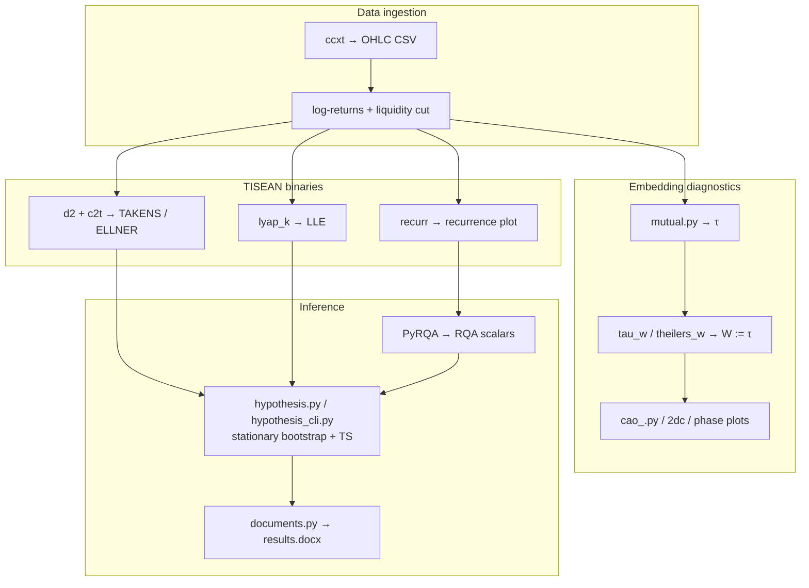
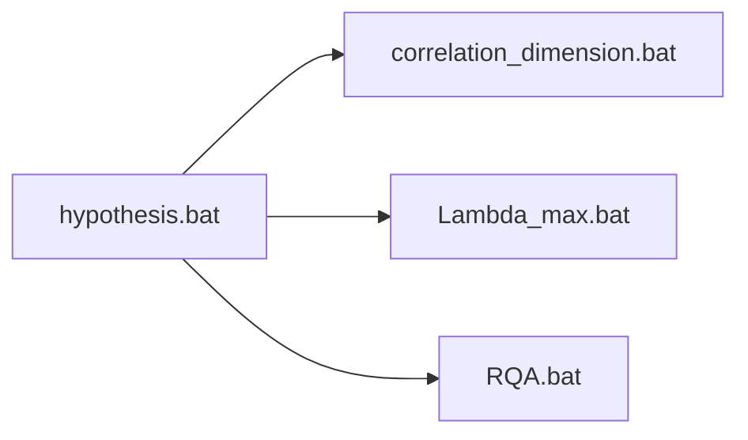
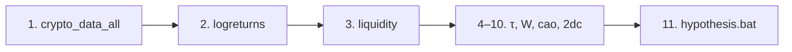
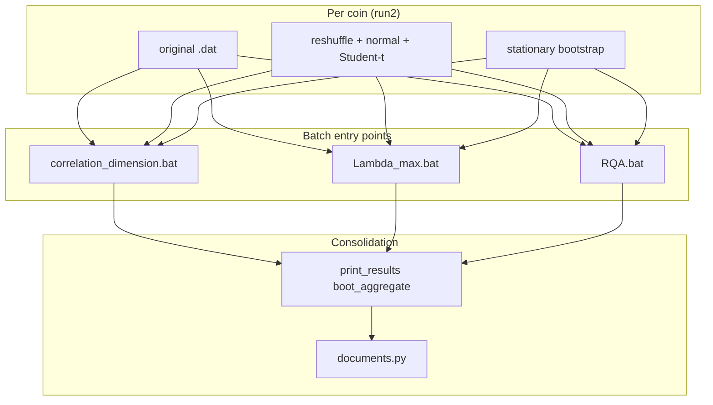

# Deterministic Chaos in Financial Time Series


End-to-end research pipeline for nonlinear analysis of cryptocurrency log-return time series, with distributed surrogate-based hypothesis testing.

This project combines:

- data download from exchange APIs (`ccxt`),
- log-return preprocessing,
- invariant estimation via TISEAN,
- recurrence quantification via `PyRQA`,
- stationary-bootstrap/reference testing with point-wise reshuffle, Gaussian and Student-t reference series, and a `TS` decision rule for dimension metrics (`ELLNER` by default, optionally `TAKENS` or `TAKENS,ELLNER`), **LLE**, and (by default) **RQA** scalars.

---
&nbsp;
&nbsp;
&nbsp;

## Table of Contents

- [Project Scope](#project-scope)
- [Current Architecture (Important)](#current-architecture-important)
- [Quick Start](#quick-start)
- [Windows CMD primer (batch files)](#windows-cmd-primer-batch-files) *(collapsible)*
- [End-to-End Workflow](#end-to-end-workflow)
- [Distributed Hypothesis Workflow](#distributed-hypothesis-workflow)
- [Statistical Model (Current, Supervisor-Aligned)](#statistical-model-current-supervisor-aligned)
- [Outputs and Folder Structure](#outputs-and-folder-structure)
- [How to Read Surrogate Results](#how-to-read-surrogate-results)
- [Per-Coin Configuration](#per-coin-configuration)
- [Repository Map](#repository-map)
- [Diagnostics: Mutual Information (`mutual.py`)](#diagnostics-mutual-information-mutualpy)
- [Diagnostics: Cao Embedding Dimension (`cao_.py`)](#diagnostics-cao-embedding-dimension-caopy)
- [Diagnostics: Capacity Dimension (`2dc.py`)](#diagnostics-capacity-dimension-2dcpy)
- [TISEAN Binaries Used (Active Pipeline)](#tisean-binaries-used-active-pipeline)
- [Method Notes by Script](#method-notes-by-script)
- [Desktop GUI](#desktop-gui)
- [Troubleshooting](#troubleshooting)
- [Historical/Removed Components](#historicalremoved-components)
- [Third-party: TISEAN](#third-party-tisean)
- [Citation](#citation)
- [License](#license)

---
&nbsp;
&nbsp;
&nbsp;
---

## Mathematical Formulations

### Phase Space Reconstruction (Takens' Embedding)

Given a scalar time series $\{x_1, x_2, \ldots, x_N\}$, we reconstruct the phase space using delay coordinates [27]:

$$\mathbf{y}_i = (x_i, x_{i+\tau}, x_{i+2\tau}, \ldots, x_{i+(m-1)\tau})$$

where:
- $m$ = embedding dimension
- $\tau$ = time delay

Takens' theorem guarantees that for sufficiently large $m$ (specifically, $m > 2D$, where $D$ is the dimension of the original attractor), the reconstructed attractor is topologically equivalent to the original.

### Correlation Integral

$$C(r) = \lim_{N \to \infty} \frac{2}{N(N-1)} \sum_{i=1}^{N} \sum_{j=i+1}^{N} \Theta(r - \|\mathbf{y}_i - \mathbf{y}_j\|)$$

where $\Theta$ is the Heaviside step function.

---
&nbsp;
&nbsp;
&nbsp;
---
## Project Scope

The pipeline is designed to test whether selected chaos-related invariants from original financial time series differ significantly from values generated by surrogate null-model series.

Main tested invariants:

- **TAKENS** — plateau mean of the Takens–Theiler estimator $d_2^{(T)}(r')$ (eqs. 8.75–8.76) from `c2t.exe`,
- **ELLNER** — Ellner extension $d_2^{(E)}$ (eq. 8.78) on the plateau $[r_{\min}, r_{\max}]$:

  $$d_2^{(E)} = \frac{C^{(m)}(r_{\max}) - C^{(m)}(r_{\min})}{\displaystyle\int_{r_{\min}}^{r_{\max}} \frac{C(r)}{r}\, dr}$$

- **LLE** — largest Lyapunov exponent proxy from `lyap_k` (Kantz $S(t)$ slope),
- **RQA** — `RR`, `DET`, `LAM`, `MAXLINE`, `ENTR`, `TT`, `TREND` (PyRQA + custom trend).

The hypothesis part is distributed across per-invariant batch scripts and consolidated with `hypothesis.bat`.

### Pipeline overview



---
&nbsp;
&nbsp;
&nbsp;

## Current Architecture (Important)

### Active execution model

- `run1` is removed from active workflow.
- All active invariant workflows are `run2`-based and per-coin parametrized.
- `hypothesis.bat` is a wrapper that calls three pipelines:



### Statistical model currently used

- **Null/reference series:** one point-wise reshuffle (`randperm`), one Gaussian $\mathcal{N}(\mu_r, \sigma_r)$ series, and one Student-$t$ reference with $\nu = 3.5$ scaled to $(\mu_r, \sigma_r)$.
- **Inference:** for metrics in `DCH_DIMENSION_METRICS` (default **ELLNER**), **LLE**, and (by default) **RQA**, `hypothesis_cli.py` draws **B** stationary-bootstrap replicates (default $B=100$), computes the invariant on each, and uses the bootstrap mean and sample SD as centre and spread.
- **Decision rule** (per metric $T$):

  $$\mathrm{TS} = \frac{\overline{T}_{\mathrm{boot}} - T_{\mathrm{resh}}}{s_{\mathrm{boot}}}, \qquad \text{reject } H_0 \text{ if } |\mathrm{TS}| > 3$$

  RQA uses the same rule when `--rqa_bootstrap on` (default); recurrence radius $r$ is **locked from the original** series for all bootstrap and reference runs.

---
&nbsp;
&nbsp;
&nbsp;

## Quick Start

### 1) Install Python dependencies

Use **Python 3.10+** (3.12 is a common choice on Windows). The dependency list is the extensionless file `requirements` at the repo root (not `requirements.txt`). Packages are grouped in that file (numerics, plotting, ML, exchange API, PyRQA, `nolds`, YAML, GUI) with compatible version ranges.

```bat
py -3 -m pip install -r requirements
```
&nbsp;

### 2) Ensure external tools are installed

- TISEAN: [https://www.pks.mpg.de/tisean/](https://www.pks.mpg.de/tisean/)
- gnuplot: [http://www.gnuplot.info/](http://www.gnuplot.info/)

The Git repository ships **only** the orchestration `.bat` files under `Tisean_3.0.0\bin\`. Install TISEAN locally and copy **`d2.exe`**, **`lyap_k.exe`**, **`recurr.exe`** into that folder (or point **`TISEAN_BIN`** at a directory that contains them).

Typical expected paths in this repository:

- TISEAN binaries: `C:\DCh\Tisean_3.0.0\bin`
- gnuplot executable: `C:\Program Files\gnuplot\bin\gnuplot.exe`

Optional environment overrides (no code changes):

| Variable | Effect |
|----------|--------|
| `TISEAN_BIN` | Directory searched first for `d2.exe`, `lyap_k.exe`, `recurr.exe` when Python resolves tools (falls back to `C:\DCh\Tisean_3.0.0\bin`, then `PATH`). |
| `DCH_TEST_MODE` | If set to `true`, active `.bat` scripts treat `TEST_MODE` as true (first **`DCH_TEST_POINTS`** rows per series, default **100** via `_dch_test_env.bat`), output roots such as `*_test_100`. |
| `DCH_TEST_POINTS` | Number of rows copied in test mode (default **100**). Used by `.bat` files and `config_loader.dch_test_point_count()`. |
| `DCH_RUN_HYPOTHESIS` | If set to `false`, active invariant `.bat` scripts compute only the invariant outputs/plots and skip `hypothesis.py` plus `_hypothesis_aggregate_summary.txt` aggregation. Default is `true`. |
| `DCH_DIMENSION_METRICS` | Controls which dimension metrics `correlation_dimension.bat` sends to `hypothesis.py`. Default: `ELLNER`. Valid practical values: `ELLNER`, `TAKENS`, `TAKENS,ELLNER`. |
| `DCH_BOOTSTRAP_SAMPLES` | Default for `hypothesis.py --bootstrap_samples` when the CLI flag is omitted (desktop sets this from the GUI spinbox). |
| `DCH_LYAP_STEPS` | `lyap_k -n` in test mode (default **40** when `DCH_TEST_MODE=true`). |
| `DCH_LYAP_MIN_NEIGHBORS` | `lyap_k -s` and LLE block filter in test mode (default **3** when `DCH_TEST_MODE=true`). |

&nbsp;

### 3) Prepare config

Create/edit `config.yaml`:

```yaml
paths:
  data_dir: "C:\\DCh\\data"
  results_dir: "C:\\DCh\\data\\results"

download:
  from: null
  to: null

liquidity:
  mode: fixed              # active pipeline: last fixed_tail_points hours; use liquidity for rolling zero-% start
  window_size: 720
  tolerance: 1.0
  analysis_end: null      # liquidity mode only: null = through last sample
  fixed_tail_points: 17520  # fixed mode: last N rows
  create_cut_files: true
  create_backup_before_cut: true
```

Notes:

- if `download.from` is `null`, downloader uses default per-asset start settings;
- if `download.to` is `null`, downloader uses current UTC date.
- `liquidity` controls how `liquidity.py` builds `*_logreturns_cut.*` (see `config.example.yaml` for full comments). **Fixed** mode keeps the last **`fixed_tail_points`** hourly samples (no calendar from/to).

&nbsp;

### 4) Smoke test (optional)

**Fast TISEAN + hypothesis** (first **100** points per series):

```bat
cd /d C:\DCh\Tisean_3.0.0\bin
set DCH_TEST_MODE=true
hypothesis.bat
```

**Hypothesis modules only** (no full TISEAN pipeline):

```bat
cd /d C:\DCh
py -3 test_hypothesis_stack.py
```

**Desktop:** `py -3 C:\DCh\desktop_app.py`, enable **TEST_MODE**, then **Run full** or run step **11. hypothesis** alone.

Note: **LLE** at N≈100 often returns `insufficient data` with production `tau`/`W`; use full mode or longer cuts for meaningful Lyapunov estimates.

---
&nbsp;
&nbsp;
&nbsp;

<details>
<summary><b>Windows CMD primer (batch files)</b> — click to expand</summary>

## Windows CMD primer (batch files)

The pipelines under `Tisean_3.0.0\bin\*.bat` are **Windows Command Prompt** scripts (`cmd.exe`). They are **not** PowerShell (`.ps1`). Below is the syntax you will actually see, in plain language.

&nbsp;
&nbsp;
&nbsp;

### What runs the script

- **Double‑clicking** a `.bat` runs it in a minimal window that may close when finished — fine for quick runs; read errors by adding `pause` temporarily or running from an open console (next bullet).

- **Recommended:** open **Command Prompt** (search “cmd”), `cd` to the folder that contains the batch file, then run:

```bat
cd /d C:\DCh\Tisean_3.0.0\bin
hypothesis.bat
```

`cd /d` changes drive **and** directory (needed when `C:` vs `D:` differs from your current drive).

&nbsp;
&nbsp;
&nbsp;

### Lines that appear at the top of almost every script

| Line | Meaning |
|------|---------|
| `@echo off` | Do not print each command before it runs (`@` suppresses echo for this line too). |
| `setlocal` | Changes to variables stay inside this script (until exit). |
| `setlocal enabledelayedexpansion` | Allows `!VAR!` syntax (see below). Used wherever the loop variable `BASE` changes and is read again in the same block. |
| `REM ...` | Comment (ignored). |

&nbsp;
&nbsp;
&nbsp;

### Setting and reading variables

- **`set NAME=value`** — no spaces around `=` in classic `set` (e.g. `set DATA_DIR=C:\DCh\data`).

- **`set "NAME=value"`** — quoted form; safer when the value contains spaces or trailing spaces.

**Immediate expansion `%VAR%`:** replaced once when the **whole line** is parsed (before loops run). Fine for paths fixed at the start.


**Delayed expansion `!VAR!`:** evaluated **when each line runs**, inside `( )` blocks and loops — required when a variable is **set and then read** in the same `for` loop. All invariant pipelines use this for `!BASE!`, `!DATA_FILE!`, etc.

&nbsp;
&nbsp;
&nbsp;

### Special parameters (`%0`, `%1`, `%~dp0`)

| Syntax | Meaning |
|--------|---------|
| `%0` | The batch file’s own path/name. |
| `%~dp0` | **D**rive + **p**ath of the folder containing the script (trailing `\`). Used so `call "%~dp0_per_coin_settings.bat"` always finds the helper next to the caller, no matter your current directory. |
| `%~1` | First argument to a subroutine, with quotes stripped; `%~2` second, etc. Used in `:RUN_D2`, `:RUN_LLE`, `:RUN_RQA`. |

&nbsp;
&nbsp;
&nbsp;

### Calling another batch vs “including” it

- **`call other.bat`** runs `other.bat` and **returns** to the caller. Without `call`, control would not come back.

- **`call :LABEL arg1 arg2`** jumps to a **subroutine** `:LABEL` inside the same file; **`exit /b`** returns from it (without closing the whole window).

&nbsp;
&nbsp;
&nbsp;

### Success and failure

- **`if errorlevel 1`** is true if the **last** program returned a non‑zero exit code (often used after `lyap_k.exe`, Python, etc.).

- **`exit /b 1`** stops this batch with error code `1` (parent `hypothesis.bat` can detect failure).

&nbsp;
&nbsp;
&nbsp;

### Quotes, spaces, and special characters in `echo`

- Paths with spaces **must** be quoted: `"%GNUPLOT_EXE%"`.

- **`^`** escapes the next character for **this** parse pass: `echo run2 = per-symbol (TAU_D2_^<sym^>)` prints literal `<` and `>` instead of redirecting input/output.

- **`()`** in `echo` lines are often wrapped with `^(` `^)` so `cmd` does not treat them as **block** syntax.

&nbsp;
&nbsp;
&nbsp;

### Line continuation (outside `.bat` examples)

In README examples, **`^` at end of line** continues a **single** command on the next line (standard `cmd` continuation). The **`^` must be the last character** on the line (no trailing spaces).

&nbsp;
&nbsp;
&nbsp;

### `for` loops: why `%%F` not `%F`

Inside a **`.bat` file**, loop variables use **double percent**: `for %%F in (...)`. If you typed the same loop **interactively** in `cmd`, you would use **single** percent: `for %F in (...)`.

This repo’s pattern:

```bat
for %%F in (%FILES%) do (
```

`%FILES` expands to the whole list of filenames **once**; `%%F` is each file in turn.

&nbsp;
&nbsp;
&nbsp;

### Nested `for /f`: extracting the coin symbol

```bat
for /f "tokens=1 delims=_" %%A in ("%%F") do set BASE=%%A
```

Splits `BTCUSD_BITSTAMP_...` on `_` and takes the **first** token → `BASE=BTCUSD`.

&nbsp;
&nbsp;
&nbsp;

### Dynamic variable names: `call set`

Per-coin settings are variables like `TAU_LLE_BTCUSD`. The script builds the name from `!BASE!`:

```bat
call set "COIN_TAU=%%TAU_LLE_!BASE!%%"
```

&nbsp;
&nbsp;
&nbsp;

**How to read it:** the inner `%% ... %%` is resolved in a second step so the **name** becomes `TAU_LLE_BTCUSD` and its **value** is assigned to `COIN_TAU`. Without this trick, `%TAU_LLE_%BASE%` would not work as intended.

&nbsp;
&nbsp;
&nbsp;

### Redirects and quick I/O

| Syntax | Meaning |
|--------|---------|
| `> file.txt echo hello` | Overwrite `file.txt` with `hello` (creates/truncates first). |
| `>> file.txt echo row` | Append a line. |
| `>nul` | Discard output. |
| `2>&1` | Send stderr to same place as stdout (often seen with gnuplot). |

&nbsp;
&nbsp;
&nbsp;

### Chained commands

- **`command1 && command2`** — run `command2` only if `command1` succeeded (exit code 0).

- **`command1 || command2`** — run `command2` only if `command1` failed (non‑zero exit).

- Example from the scripts: `cd /d "%DATA_DIR%" || (echo ERROR: Cannot enter %DATA_DIR% & exit /b 1)` — if changing directory fails, print and stop with error code 1.

<a id="recurr-batch-percent-flag"></a>

&nbsp;
&nbsp;
&nbsp;

### Why `recurr` uses `-%%2` in the `.bat` file

In a batch file, **`%%` prints one literal `%` character** (and does **not** expand `%2` as “second script argument”). So **`-%%2`** is broken apart as: `-`, then **`%%` → `%`**, then **`2`** → the executable sees the flag **`- %2`** in TISEAN’s sense (**percentage / subsampling factor 2** → keep **2%** of recurrence pairs). If you typed `- %2` with only one `%`, CMD would try to treat `%2` as the batch file’s second argument instead of passing a percent sign to `recurr.exe`.

&nbsp;
&nbsp;
&nbsp;

### Where PowerShell appears

Some steps call **`powershell -NoProfile -Command "..."`** to trim the first **`DCH_TEST_POINTS`** lines (default **100**) in test mode. Quotes inside that string use **`!FULL_DATA!`** (delayed expansion) so paths survive the nested quoting. All TISEAN `.bat` files include **`_dch_test_env.bat`** for shared test defaults.

</details>

---
&nbsp;
&nbsp;
&nbsp;

## End-to-End Workflow



### Step 1 - Download raw candles

```bat
py -3 C:\DCh\crypto_data_all.py
```

Output example:

- `BTCUSD_BITSTAMP_1h_complete.csv`

`crypto_data_all.py` validates the full downloaded hourly history for
contiguity, then exports the complete contiguous Bitstamp range for each coin.
The final analysis window is not chosen here; it is selected later by
`liquidity.py` after log-returns have been computed.

&nbsp;
&nbsp;
&nbsp;

### Step 2 - Compute logreturns

```bat
py -3 C:\DCh\compute_logreturns.py
```

Output examples:

- `BTCUSD_BITSTAMP_1h_complete_logreturns.dat`
- `BTCUSD_BITSTAMP_1h_complete_logreturns.csv`

&nbsp;
&nbsp;
&nbsp;

### Step 3 - Liquidity cut (active analysis window)

```bat
py -3 C:\DCh\liquidity.py
```

Produces `*_logreturns_cut.dat` / `.csv` used by later diagnostics and TISEAN steps.

&nbsp;
&nbsp;
&nbsp;

### Step 4 - Embedding diagnostics (recommended before TISEAN)

```bat
py -3 C:\DCh\mutual.py
py -3 C:\DCh\tau_w.py
cd /d C:\DCh\Tisean_3.0.0\bin
theilers_w.bat
py -3 C:\DCh\phase_2D.py
py -3 C:\DCh\phase_3D.py
py -3 C:\DCh\cao_.py
py -3 C:\DCh\2dc.py
```

`theilers_w.bat` runs `corr.exe` + `stp.exe` for diagnostic ACF/STP PNGs, sets **`W_final := TAU_D2_<sym>`** (rule **W = τ**), and syncs **`W_D2_<sym>`** in `_per_coin_settings.bat`.

&nbsp;
&nbsp;
&nbsp;

### Step 5 - Run distributed nonlinear pipeline

```bat
cd /d C:\DCh\Tisean_3.0.0\bin
hypothesis.bat
```

What happens per symbol:

1. **Correlation dimension** — `d2.exe` / `c2t.exe`, Takens/Ellner plots, dimension bootstrap test (`DCH_DIMENSION_METRICS`, default `ELLNER`).
2. **LLE** — `lyap_k.exe` with **`-t<W>`** (same `W_D2_<sym>` as `d2`), LLE bootstrap test.
3. **RQA** — `rqa_radius.py` → `recurr.exe`, `rqa_values.py`, RQA bootstrap test with **fixed** radius from the original series.
4. Each script writes `*_surrogate_summary.txt` and `_hypothesis_aggregate_summary.txt` where applicable; the wrapper builds **`results.docx`**.

Set `DCH_RUN_HYPOTHESIS=false` before running a single invariant script (or the wrapper) when you want only the raw invariant outputs and plots:

```bat
set DCH_RUN_HYPOTHESIS=false
correlation_dimension.bat
```

In PowerShell:

```powershell
$env:DCH_RUN_HYPOTHESIS = "false"
& "C:\DCh\Tisean_3.0.0\bin\correlation_dimension.bat"
```

---
&nbsp;
&nbsp;
&nbsp;
&nbsp;
&nbsp;
&nbsp;
## Distributed Hypothesis Workflow



### Why distributed

Each invariant family has different output files, parameterization, and practical compute profile. Running hypothesis testing inside each invariant script keeps:

- per-coin parameter consistency,
- output locality (summaries close to the generated invariant files),
- simpler debugging when one stage fails.

&nbsp;
&nbsp;
&nbsp;

### What each script calls

- `correlation_dimension.bat` -> `hypothesis.py --metrics_list %DCH_DIMENSION_METRICS%` (default `ELLNER`; can be `TAKENS` or `TAKENS,ELLNER`)
- `Lambda_max.bat` -> `hypothesis.py --metrics_list LLE`
- `RQA.bat` -> `rqa_radius.py` (percentile radius for plots) → `recurr.exe` → `rqa_values.py` → `hypothesis.py --metrics_list RR,DET,LAM,MAXLINE,ENTR,TT,TREND --rqa_radius <r> --rqa_radius_mode fixed` (radius locked for bootstrap/reference runs).

All three active invariant scripts respect `DCH_RUN_HYPOTHESIS`. With `DCH_RUN_HYPOTHESIS=false`, these `hypothesis.py` calls and the final `print_results.py boot_aggregate` step are skipped; the main TISEAN/PyRQA outputs are still produced.

&nbsp;
&nbsp;
&nbsp;

### Wrapper behavior

`hypothesis.bat` no longer contains monolithic fixed-parameter hypothesis logic; it orchestrates the three active scripts above in sequence, then runs **`documents.py`** to refresh **`results.docx`** under **`paths.results_dir`** from `config.yaml` and opens it with the default Windows handler (if the file exists). `correlation_entropy.bat` was removed from the active pipeline.

---
&nbsp;
&nbsp;
&nbsp;

## Statistical Model (Current, Supervisor-Aligned)

### Null/reference series

For each original log-return series, `hypothesis.py` constructs:

1. `surr` — point-wise random permutation of the original observations,
2. `normal` — $\mathcal{N}(\mu_r, \sigma_r)$ series of the same length,
3. `t3.5` — Student-$t$ reference with $\nu=3.5$, scaled to $(\mu_r, \sigma_r)$.

The permutation keeps the marginal mean/SD identical to the original series but destroys temporal order. The Gaussian and Student-t references are reported as descriptive benchmarks, not as the main test pair.

&nbsp;
&nbsp;
&nbsp;

### Invariant sources and test

The current statistical test is:

$$\mathrm{TS} = \frac{\overline{T}_{\mathrm{boot}} - T_{\mathrm{resh}}}{s_{\mathrm{boot}}}, \qquad \text{reject } H_0 \Leftrightarrow |\mathrm{TS}| > 3$$

For selected dimension metrics (**ELLNER** by default; optionally **TAKENS** or **TAKENS+ELLNER**) and for **LLE**, `hypothesis.py` first generates $B$ stationary-bootstrap pseudo-series (default $B=100$). It computes:

- $\overline{T}_{\mathrm{boot}}$ — mean of the $B$ bootstrap invariant values,
- $s_{\mathrm{boot}}$ — sample SD of the $B$ values,
- $T_{\mathrm{resh}}$ — invariant on one fully reshuffled series,
- $\mathrm{TS}$ as above.

If $|\mathrm{TS}| > 3$, the null that the series is independent noise is rejected (evidence of structure/memory, not proof of chaos). At the current stage:

- **TAKENS:** `d2.exe` → `.c2`; `c2t.exe` → $d_2^{(T)}(r')$ (eqs. 8.75–8.76). Plateau mean at $m=3$ is **TAKENS**; $s_{\mathrm{boot}}$ is the SD across bootstrap replicates.
- **ELLNER:** same plateau defines $r_{\min}, r_{\max}$; eq. 8.78:

  $$d_2^{(E)} = \frac{C^{(m)}(r_{\max}) - C^{(m)}(r_{\min})}{\displaystyle\int_{r_{\min}}^{r_{\max}} \frac{C(r)}{r}\, dr}$$

  evaluated on `.c2` as **ELLNER**.
- **LLE:** median Kantz slope across usable `lyap_k` ε-blocks at `m=3` (see `invariants_lyapunov.extract_lle_mean_std`). `lyap_k` is called with **`-t<W>`** matching `W_D2_<sym>`. Short test series (≈100 points) may yield `insufficient data` for LLE even when bootstrap runs complete.
- **RQA:** PyRQA scalars on the full series. Default: **4-th percentile** radius from embedded pairwise distances (`--rqa_radius_mode percentile`), locked from the original for bootstrap/reference runs when `--rqa_bootstrap on`. `RAD_RQA_<sym>` remains a fallback. PyRQA `theiler_corrector` uses `W_D2_<sym>` (mapped from TISEAN Theiler `W` via `tisean_theiler_min_diagonal_k`).

Use `--rqa_bootstrap off` for legacy original-only RQA (no TS column). `--seed` (default `0`) fixes reshuffle, reference series, and bootstrap draws.

`d2.exe` currently runs with `-M1,3 -#100 -N0`, matching `EMBED=1,3` in `correlation_dimension.bat`. `-#100` fixes the epsilon grid size explicitly and `-N0` uses all available pairs instead of TISEAN's default pair cap. The radius scan is otherwise left at the TISEAN default so the `.d2` diagnostic plot and the `.c2` input for `c2t.exe` cover the full available scale range; the practical scale choice is made afterwards by plateau detection on the Takens curve.

---

&nbsp;
&nbsp;
&nbsp;

## Outputs and Folder Structure

### Root result folders

Typical folders under `C:\DCh\data\results`:

- `correlation_dimension_test_100` / `correlation_dimension_full` (test suffix is `test_<N>`; default **N=100**)
- `lambda_max_test_100` / `lambda_max_full`
- `rqa_test_100` / `rqa_full`
- `theiler_w_test_100` / `theiler_w` — per-coin ACF/STP plots and `_theiler_summary.txt`
&nbsp;
&nbsp;
&nbsp;
### Per-coin run folder pattern

Examples:

- `BTCUSD_run2_tau2_W0`
- `ETHUSD_run2_tau3_W2`

Inside these, you get:

- raw TISEAN outputs (`.d2`, `.h2`, `.c2`, recurrence listings `*_recurr.txt`, etc.),
- optional plot images (`.png`) if gnuplot is available,
- hypothesis subfolders such as:
  - `hypothesis_d2` (dimension metrics from `correlation_dimension.bat`),
  - `hypothesis_lle` (from `Lambda_max.bat`),
  - `hypothesis_rqa` (from `RQA.bat`).

Summary file naming:

- `<BASE>_surrogate_summary.txt`

No active `_bootstrap_summary.txt` naming should be used.

---

&nbsp;
&nbsp;
&nbsp;

## How to Read Surrogate Results

In each `<BASE>_surrogate_summary.txt`, key columns are:

- `orig` - invariant value on the original series,
- `resh` / `surr` - invariant value on one fully reshuffled series,
- `normal`, `t3.5` - descriptive reference invariant values where recomputed,
- `boot_mean` - arithmetic mean of the stationary-bootstrap invariant values,
- `boot_sd` - sample SD of the stationary-bootstrap invariant values,
- `B` - number of stationary-bootstrap pseudo-series, default **100**,
- `TS` - `(boot_mean-resh)/boot_sd`,
- `abs_TS` - absolute value of `TS`,
- `decision` - per-metric `reject H0`, `fail to reject H0`, `insufficient data`, `no sd`, or `not bootstrap-tested`.

Interpretation:

- $|\mathrm{TS}| > 3$: reject $H_0$ for that metric (structure/memory vs. reshuffle),
- otherwise: fail to reject $H_0$,
- `nan` / `insufficient data` / `no sd`: bootstrap or reshuffle values missing (common for **LLE** on very short test windows),
- `not bootstrap-tested`: RQA with `--rqa_bootstrap off`, or metrics outside the active bootstrap set.

When `print_results.py boot_aggregate` builds the compact table, column **`rej_all`** is **YES** only if every bootstrap-tested metric in that summary rejects `H0`.

---

&nbsp;
&nbsp;
&nbsp;

## Per-Coin Configuration

Single source of truth:

- `Tisean_3.0.0\bin\_per_coin_settings.bat`

Used variables:

- `TAU_D2_<sym>`, `W_D2_<sym>` for the Takens/Ellner branch (**`W_D2_<sym> := TAU_D2_<sym>`** after `theilers_w.bat`),
- `TAU_LLE_<sym>` for LLE branch,
- `TAU_RQA_<sym>`, `RAD_RQA_<sym>` for RQA branch.

Operational notes:

- edit one place, all active scripts inherit updates;
- run **`theilers_w.bat`** (or desktop step 6) before hypothesis so **`W_D2_<sym>`** is synced to **`TAU_D2_<sym>`**;
- `DCH_TEST_MODE` / `DCH_TEST_POINTS` override per-script `TEST_MODE` and trim length;
- desktop GUI forwards test mode, hypothesis toggle, dimension metrics, and bootstrap **B** via environment variables.

---

&nbsp;
&nbsp;
&nbsp;

## Repository Map

### Core pipeline scripts

- `crypto_data_all.py` - download market data and export the contiguous Bitstamp history.
- `compute_logreturns.py` - build log-return datasets.
- `liquidity.py` - build `*_logreturns_cut.*` (active analysis window).
- `hypothesis.py` - thin **CLI entry point + re-exports** (backward compatible with `rqa_radius.py`, `plot_lyap_k_output.py`).
- `hypothesis_cli.py` - argparse, stationary bootstrap, TS table, summary writer.
- `hypothesis_config.py` - shared constants and metric registry.
- `hypothesis_surrogates.py`, `hypothesis_ts.py` - reference series and TS decision rule.
- `invariants_compute.py` - dispatch `compute_invariants()` (TISEAN + PyRQA per metric set).
- `invariants_correlation.py`, `invariants_lyapunov.py`, `invariants_rqa.py` - metric extractors.
- `tisean_io.py` - `run_d2`, `run_c2t`, `run_lyap_k`, parsers.
- `print_results.py` - parse/print/aggregate outputs and surrogate summaries.
- `documents.py` - build **`results.docx`** from aggregate summaries; invoked at the end of `hypothesis.bat`.
- `test_hypothesis_stack.py` - integration smoke test (imports, `rqa_radius.py`, short `hypothesis.py` runs on 100-point BTC cut).

### Batch orchestrators

- `Tisean_3.0.0\bin\_dch_test_env.bat` - shared `DCH_TEST_POINTS` (default 100) and test-mode `lyap_k` defaults.
- `Tisean_3.0.0\bin\hypothesis.bat` - wrapper (dimension + LLE + RQA), then `documents.py` → `results.docx`.
- `Tisean_3.0.0\bin\correlation_dimension.bat` - `d2.exe`, `c2t.exe`, Takens/Ellner + dimension hypothesis (`DCH_DIMENSION_METRICS`).
- `Tisean_3.0.0\bin\Lambda_max.bat` - `lyap_k.exe` with `-t<W>` + LLE hypothesis.
- `Tisean_3.0.0\bin\RQA.bat` - `recurr.exe`, `rqa_values.py`, RQA hypothesis (`--rqa_radius_mode fixed` + radius from `rqa_radius.py`).
- `Tisean_3.0.0\bin\theilers_w.bat` - `corr.exe`, `stp.exe`, `detect_theiler.py` (W := τ); gnuplot ACF + STP PNGs.
- `Tisean_3.0.0\bin\_per_coin_settings.bat` - per-coin `TAU_*`, `W_D2_*`, `RAD_RQA_*`.

### Analytical helpers

- `mutual.py`, `tau_w.py`, `cao_.py`, `2dc.py`, `phase_2D.py`, `phase_3D.py`, `rqa_values.py`, `rqa_radius.py`, `plot_lyap_k_output.py`, `report_helper.py`.

### Config / GUI

- `config.yaml`, `config.example.yaml`, `config_loader.py`
- `desktop_app.py`, `build_desktop_app.bat`, `DChPipelineApp.spec`

---
&nbsp;
&nbsp;
&nbsp;

## Diagnostics: Mutual Information (`mutual.py`)

Standalone Python diagnostic for choosing embedding delay **tau**. It does **not** call TISEAN.

The implementation is meant to follow the paper **equation-by-equation**; the longest rationale lives in **`mutual.py`** (module docstring + comments on Eqs 19–22, 20a/b, and the χ² thresholds).

&nbsp;
&nbsp;
&nbsp;

### Primary reference (paper)

Fraser, A. M., & Swinney, H. L. (1986). Independent coordinates for strange attractors from mutual information. *Physical Review A*, *33*(2), 1134–1140. [https://doi.org/10.1103/PhysRevA.33.1134](https://doi.org/10.1103/PhysRevA.33.1134)

&nbsp;
&nbsp;
&nbsp;

### Paper ↔ code correspondence (Fraser & Swinney)

| Paper | Role in this repo |
|-------|-------------------|
| Dyadic length `2^n` pairs; rank transform to permutations of `0 … 2^n−1` | `mi_fraser_swinney`: `n_pow2`, `rx`, `ry` (see comments in `mutual.py` §1–2). |
| Eq. **(19)** — mutual information from total `F` | `I_nats = F_total / N - log(N)` then bits via `log(2)`. |
| Eq. **(20a)** — flat cell | `F = N log N` (natural log). |
| Eq. **(20b)** — subdivide | `N log 4 + Σ F_quadrants`; code cites link to **(14)** / **(16b)** for the `N log 4` term. |
| Eq. **(21)** — 4-cell uniformity test | Reduced χ² with prefactor `(16/5)/N`, threshold **1.547** (20% level, 3 df). |
| Eq. **(22)** — 16-cell test | Prefactor `(256/225)/N`, threshold **1.287** (20% level, 15 df), only if both rank spans ≥ 4. |

&nbsp;
&nbsp;
&nbsp;

### Algorithm (Fraser & Swinney, 1986)

1. **Pairs.** For delay `tau`, form pairs `(x(t), x(t+tau))`. Let `n_total = len(s) - tau`. The algorithm keeps only the first `n_pow2` pairs where `n_pow2` is the **largest power of two** ≤ `n_total` (paper requires dyadic lengths). If `n_pow2 < 4`, MI is returned as `0.0`.

2. **Rank transform.** Replace `x` and delayed `x` by integer ranks `0 .. n_pow2-1` so both marginals are discrete uniforms on that grid.

3. **Recursive partition.** On the rank square `[0, n_pow2)²`, recursively subdivide rectangular cells into four quadrants until:
   - **4-cell χ² test (paper Eq. 21):** reduced statistic with prefactor `(16/5)/N`; if `χ²₃ < 1.547`, treat as “flat enough” at 20% level *or* refine further if the cell is large enough for the 16-cell test.
   - **16-cell χ² test (paper Eq. 22):** only if both rank spans are ≥ 4; prefactor `(256/225)/N`; if `χ²₁₅ < 1.287`, cell is **flat**.
   - If flat: contribution `F = N log N` (natural log, Eq. 20a).
   - Else: split into four subcells and recurse; combine as `F = N log 4 + Σ F_quadrants` (Eq. 20b).

4. **Mutual information.** After recursion over the full square, `I (nats) = F_total / N - log(N)` (paper Eq. 19). Convert to **bits**: `I_bits = I_nats / log(2)`. Negative numerical noise is clipped to `0`.

5. **Suggested τ.** `find_first_minimum` scans for the **first local minimum** of `I(tau)` (strictly lower than both neighbours along the discrete τ grid). This follows the usual “first minimum of MI” rule cited by Fraser & Swinney / Shaw.

&nbsp;
&nbsp;
&nbsp;

### Constants and implementation notes

- `DEFAULT_MAX_TAU = 100` unless you change it at the top of `mutual.py`.
- Recursion depth safety: `sys.setrecursionlimit(200000)` at import (deep partitions on long series).
- Aggregated summary header columns: `series_id`, `N`, `max_tau`, `first_min_tau`, `I(first_min)`, `I(tau=1)` (`SUMMARY_HEADER` in source).

&nbsp;
&nbsp;
&nbsp;

### Outputs (per file)

Written under `paths.results_dir/mutual/`:

| Artifact | Description |
|----------|-------------|
| `<stem>_mi_plot.png` | `I(tau)` vs τ with optional red star at first local minimum |
| `<stem>_mi_results.txt` | Full console-style report from `Reporter` |
| `_mi_summary.txt` | One appended row per processed series (reset at each script run) |

&nbsp;
&nbsp;
&nbsp;

### Inputs and data selection

- Hard-coded list of seven `*_BITSTAMP_1h_complete_logreturns.dat` names (edit in `if __name__ == "__main__"` block).
- **Data length**: `crypto_data_all.py` exports the full contiguous Bitstamp range (end date from `download.to` or “today”, never a hardcoded calendar cap). `compute_logreturns.py` computes log-returns for that full range, and `liquidity.py` writes the active `*_logreturns_cut.*` files. Windowing is controlled by `config.yaml` → `liquidity`: either the rolling zero-return **liquidity** rule (optional `analysis_end`; `null` means through the last sample) or **fixed** mode, which keeps the last **`fixed_tail_points`** rows (same trailing length for every series). Legacy YAML value **`fixed_date`** is accepted as an alias for **fixed**. `prefer_liquidity_cut` redirects callers to those cut files and fails if they are missing.

&nbsp;
&nbsp;
&nbsp;

### How to run

```bat
py -3 C:\DCh\mutual.py
```

No argparse; all paths from `config.yaml`. To extend symbols or τ range, edit the `files` list and/or `DEFAULT_MAX_TAU`.

&nbsp;
&nbsp;
&nbsp;

### Relation to the main pipeline

Chosen τ from the **first local minimum** of Fraser–Swinney mutual information is written to ``mutual/_mi_summary.txt``. Python tools (**`2dc.py`**, **`phase_2D.py`**, **`phase_3D.py`**, **`cao_.py`**) read that file via ``config_loader.tau_for_symbol_from_mutual`` (with legacy fallbacks if the summary is missing). At the end of each **`mutual.py``** run, **`sync_per_coin_bat_tau_from_mutual_summary`** updates ``TAU_D2_*``, ``TAU_LLE_*``, and ``TAU_RQA_*`` in ``_per_coin_settings.bat`` so TISEAN batches and ``hypothesis.py`` use the same delays.

---

&nbsp;
&nbsp;
&nbsp;

## Diagnostics: Cao Embedding Dimension (`cao_.py`)

Standalone Python implementation of **Cao (1997)**. It does **not** call TISEAN.

Step-by-step labels (`STEP 1` … `STEP 4`, Takens → NN → `(m+1)` distance → `a_i`) match the comments in **`cao_.py`** (`calculate_for_m`), including Chebyshev norm and `a_i` as distance ratio.

&nbsp;
&nbsp;
&nbsp;

### Primary reference (paper)

Cao, L. (1997). Practical method for determining the minimum embedding dimension of a scalar time series. *Physica D*, *110*(1–2), 43–50. [https://doi.org/10.1016/S0167-2789(97)00118-8](https://doi.org/10.1016/S0167-2789(97)00118-8)

&nbsp;
&nbsp;
&nbsp;

### Paper ↔ code correspondence (Cao)

| Idea in Cao (1997) | Implementation |
|--------------------|----------------|
| Takens vectors `X_m` with delay `τ` | Columns `data[k*τ : …]` for `k = 0 … m−1`; valid length `N_valid = N − m·τ`. |
| Nearest neighbour in dimension `m`, **maximum norm** | `NearestNeighbors(..., metric='chebyshev')`; neighbour index `1` skips self-match. |
| Distance in `m+1` vs `m` | Chebyshev in `(m+1)` is `max(d_m, abs diff new coordinate)`; ratio **a_i(m)** as in code (`distance_m_plus_1 / nn_distance`). **Source of truth:** `cao_.py` (one inline comment mentions an equation number from a specific printing — the code definitions prevail). |
| **E(m)**, **E\*(m)** | Means of `a_i` and of `\|Δ new coord.\|` respectively. |
| **E1(m) = E(m+1)/E(m)**, **E2(m) = E\*(m+1)/E\*(m)** | Built after parallel passes over `m = 1 … d_max+1`. |

&nbsp;
&nbsp;
&nbsp;

### Geometry and notation

- Scalar series `data` length `N`. Takens embedding with integer delay `τ` and dimension `m`:
  - Valid points: `N_valid = N - m·τ`.
  - Row `i` of `X_m`: `[data[i], data[i+τ], …, data[i+(m-1)τ]]`.

&nbsp;
&nbsp;
&nbsp;

### Nearest neighbours

- Metric: **Chebyshev** (`L∞`): `NearestNeighbors(..., metric='chebyshev', algorithm='kd_tree', n_neighbors=2)`.
- Index `1` is the **true** NN (index `0` is the query point itself).
- If distance `0`, `find_nonzero_neighbor` increases `k` until a positive-distance neighbour is found (avoids division by zero in ratios).

&nbsp;
&nbsp;
&nbsp;

### Cao statistics (per `m`)

Let `a_i(m)` be the ratio of `(m+1)`-dimensional Chebyshev NN distance to `m`-dimensional NN distance for point `i` (see code: uses `max(nn_distance, |new_coord_diff|)` for the `(m+1)` distance). Then:

- $E(m) = \frac{1}{N_{\mathrm{valid}}}\sum_i a_i(m)$
- $E^*(m) = \frac{1}{N_{\mathrm{valid}}}\sum_i \bigl|x_i^{\mathrm{new}} - x_{\mathrm{NN}}^{\mathrm{new}}\bigr|$ (mean absolute increment on the new coordinate only)

From arrays $E(m)$ and $E^*(m)$ for $m = 1 \ldots d_{\max}+1$:

- $E_1(m) = E(m+1) / E(m)$ — saturates when embedding dimension is sufficient (false neighbours stop growing).
- $E_2(m) = E^*(m+1) / E^*(m)$ — tends to **1** for stochastic-looking trajectories; deviations support deterministic structure (see Cao, 1997).

Returned arrays to plotting are `E1[1:], E2[1:]` indexed by `m = 1..d_max`.

&nbsp;
&nbsp;
&nbsp;

### Parallelism

- `multiprocessing.Pool`; default `num_processes = mp.cpu_count()`.
- Inside workers, `NearestNeighbors` uses `n_jobs=1` to avoid nested parallelism warnings.

&nbsp;
&nbsp;
&nbsp;

### Parameters (defaults)

- `d_max = 20` → dimensions `m = 1 .. 20` on plots (internally needs `m+1` for ratios).
- Per-symbol `(file, tau)` in `file_settings` (BTC/ETH τ=2, LTC/LINK τ=4, XRP/DOGE τ=3, ADA τ=2 in the checked-in list).

&nbsp;
&nbsp;
&nbsp;

### Outputs

Under `paths.results_dir/cao/`:

| Artifact | Description |
|----------|-------------|
| `<filename_stem>_tau{tau}_cao_graph.png` | E1 (blue) and E2 (red) vs `m`, reference line at `y=1`, 300 dpi |
| `<filename_stem>_tau{tau}_cao_results.txt` | Tabular E1/E2 and heuristic “optimal m” / verdict text |
| `_cao_summary.txt` | Aggregated rows (`SUMMARY_HEADER` in source); cleared each run |

&nbsp;
&nbsp;
&nbsp;

### How to run

```bat
py -3 C:\DCh\cao_.py
```

Customize `file_settings`, `d_max`, or `num_processes` in the `__main__` section.

---

&nbsp;
&nbsp;
&nbsp;

## Diagnostics: Capacity Dimension (`2dc.py`)

**Pure NumPy / SciPy** capacity dimension estimate on Takens sets — **no** `boxcount.exe`.

&nbsp;
&nbsp;
&nbsp;

### Takens construction

For embedding dimension `m` and delay `τ`:

- Number of vectors `L = len(x) - (m-1)·τ`.
- Row `i`: `[x[i], x[i+τ], …, x[i+(m-1)τ]]`.

&nbsp;
&nbsp;
&nbsp;

### Normalization and boxes

- Each coordinate column min–max scaled to `[0, 1]` (epsilon `1e-12` in denominator against degenerate columns).
- For each box scale `r` in `logspace(log10(0.02), log10(0.5), 40)`:
  - `n_bins = ceil(1/r)`; grid indices `floor(Y/r)` clipped to `[0, n_bins-1]` per axis.
  - `M(r) =` number of **distinct** index tuples (unique rows) — occupancy count.

&nbsp;
&nbsp;
&nbsp;

### Scaling fit

- Working variables: `ln M(r)` vs `ln(1/r)`.
- Drop points where `M(r) ≥ 0.15·L` (saturation / full lattice artefact). If fewer than 5 valid points remain, fallback keeps first ~15 `r` levels then filters again.
- `select_best_scaling_window` scans **all contiguous windows** with at least `MIN_WINDOW_POINTS = 8` points; score `R² + 0.05·(window_length / n)` picks the trade-off between linearity and interval length.
- Slope = estimate of capacity dimension `d_c` for that `m`. Uncertainty: `ci95 = 1.96 * stderr` from `scipy.stats.linregress` on the chosen window.

&nbsp;
&nbsp;
&nbsp;

### Choosing best `m`

- Candidates must satisfy `R² ≥ MIN_R2_FOR_TRUST` (`0.98`).
- Among those, pick **smallest 95% CI half-width**; tie-break by larger `R²`.
- Flags in per-m rows: `LOW_R2`, `SATURATION_HIGH` if too many discarded `r` (see source).

&nbsp;
&nbsp;
&nbsp;

### Defaults

- Input files: seven `*_complete_logreturns.csv` names at top of script.
- `TAU_BY_SYMBOL`: BTC/ETH/ADA `2`, XRP/DOGE `3`, LTC/LINK `4`.
- `m_values = [2, 3, 4, 5, 10]`.

&nbsp;
&nbsp;
&nbsp;

### Outputs

Under `paths.results_dir/2dc/`:

| Artifact | Description |
|----------|-------------|
| `<stem>_2dc_capacity_dimension_tau{tau}.png` | Left: ln `M` vs ln`(1/r)` with fitted segment; right: `d_c` vs `m` plus red dashed `d_c = m` reference |
| `<stem>_2dc_tau{tau}_results.txt` | Per-m table and best-m summary |
| `_2dc_summary.txt` | One row per asset (reset each run) |

&nbsp;
&nbsp;
&nbsp;

### How to run

```bat
py -3 C:\DCh\2dc.py
```

&nbsp;
&nbsp;
&nbsp;

### Relation to TISEAN `boxcount`

Same scaling idea (count occupied ε-boxes in embedding space); here it is **implemented directly** so you do not depend on TISEAN’s grid conventions for this diagnostic.

---

&nbsp;
&nbsp;
&nbsp;

## TISEAN Binaries Used (Active Pipeline)

`hypothesis.bat` orchestrates three invariant pipelines. Additional TISEAN tools run in **`theilers_w.bat`** (before hypothesis in the desktop chain):

| Binary | Scientific role | Primary outputs |
|--------|-----------------|-----------------|
| `d2.exe` | Grassberger–Procaccia correlation integral / local slopes `D₂(ε,m)`; auxiliary `.h2`, `.c2` | `<BASE>.d2`, `.h2`, `.c2` |
| `lyap_k.exe` | Kantz method — divergence curves `S(t)` vs iteration | `<BASE>_lyap.txt` |
| `recurr.exe` | Recurrence matrix (sparse listing) | `<BASE>_recurr.txt` (saved with `.txt` in this repo to avoid Windows `.rec` associations) |
| `corr.exe` | Autocorrelation (Theiler estimate) | used by `theilers_w.bat` / `detect_theiler.py` |
| `stp.exe` | Space-time separation plot | STP PNGs + Theiler saturation bands |
| `c2t.exe` | Takens curve from `.c2` | `<BASE>_takens.dat` (in `correlation_dimension.bat`) |

&nbsp;
&nbsp;
&nbsp;

### Where to read the full manuals

The CLI flags are the same style as in **GNU Octave’s TISEAN package** (thin wrappers around the same routines). Useful entry points:

| Program | Octave doc (HTML) | Official TISEAN 3.0.1 HTML (MPI PKS) |
|---------|-------------------|--------------------------------------|
| `lyap_k` | [octave.sourceforge.io — lyap_k](https://octave.sourceforge.io/tisean/function/lyap_k.html) | [pks.mpg.de — lyap_k](https://www.pks.mpg.de/tisean/Tisean_3.0.1/docs/docs_c/lyap_k.html) |
| `d2` | [octave.sourceforge.io — d2](https://octave.sourceforge.io/tisean/function/d2.html) | [pks.mpg.de — d2](https://www.pks.mpg.de/tisean/Tisean_3.0.1/docs/docs_c/d2.html) |
| `recurr` | [octave.sourceforge.io — recurr](https://octave.sourceforge.io/tisean/function/recurr.html) | [pks.mpg.de — recurr](https://www.pks.mpg.de/tisean/Tisean_3.0.1/docs/docs_c/recurr.html) |

General conventions (`-l`, `-x`, `-c`, `-d`, `-m`/`-M`, `-t`, `-r`/`-R`, …) are summarized in [TISEAN general usage](https://www.pks.mpg.de/tisean/TISEAN_2.1/docs/general.html). Package overview: [TISEAN contents](https://www.pks.mpg.de/tisean/Tisean_3.0.1/docs/contents.html).

---

&nbsp;
&nbsp;
&nbsp;

### `lyap_k` — Kantz largest Lyapunov exponent

**Role (manual):** estimates the **largest Lyapunov exponent** from a scalar time series using **Kantz’s algorithm** (average logarithmic divergence of neighbour volumes over a range of length scales).

**Output file layout** (each block = one combination of embedding dimension and ε-scale): **3 columns**

1. iteration index in time,
2. **natural logarithm of the stretching factor** `S` — the **slope** of column 2 vs column 1 (in the linear regime) estimates the exponent,
3. count of points still contributing at that iteration.

**Common options** (defaults from [lyap_k manual](https://www.pks.mpg.de/tisean/Tisean_3.0.1/docs/docs_c/lyap_k.html); `#` is a number):

| Flag | Meaning |
|------|---------|
| `-d#` | embedding delay |
| `-m#` | **minimal** embedding dimension |
| `-M#` | **maximal** embedding dimension |
| `-r#`, `-R#` | **min / max** radius for neighbour search in **data units** (length scales in phase space) |
| `-##` | number of ε-scales between `-r` and `-R` (often shown as `-#` in docs) |
| `-n#` | **number of reference points** (subsample of trajectory points used as orbit centres) |
| `-s#` | minimum number of neighbours / neighbourhood size threshold (used here as `-s10`) |
| `-t#` | **Theiler window** — excluded temporal neighbourhood around each reference index |
| `-o` | output path stub |
| `-l#`, `-x#`, `-c#` | length, skipped lines, column |

**This repository’s `Lambda_max.bat` line** uses:

```text
lyap_k.exe -d<tau> -m3 -M3 -t<W> -n<steps> -s<min_neighbors> -o "<OUT>\<BASE>_lyap.txt" "<DATA.dat>"
```

Interpretation:

- **Embedding dimension is fixed at m = 3** (`-m3 -M3`).
- **`-t<W>`** uses **`W_D2_<sym>`** from `theilers_w.bat` (same temporal exclusion as `d2.exe -t<W>`). **`tisean_io.run_lyap_k`** passes the same `-t` when `hypothesis.py` recomputes LLE.
- **Full mode:** `-n500 -s10` (defaults in `Lambda_max.bat`). **Test mode:** `-n` / `-s` from `DCH_LYAP_STEPS` / `DCH_LYAP_MIN_NEIGHBORS` (defaults **40** / **3** via `_dch_test_env.bat`).
- Neighbourhood search uses **TISEAN defaults** for `-r` and `-R` (because the flags are omitted): approximately data interval / 1000 and data interval / 100.
- **Gnuplot (`Lambda_max.bat`):** each output **block** is one **ε-scan** at fixed embedding dimension (`#epsilon= … dim= …`). Legends label **ε blocks**, not different **m**.
- **Hypothesis:** median Kantz slope across usable ε-blocks; included in the stationary-bootstrap **TS** test like dimension metrics.

For comparison, **Rosenstein’s method** is `lyap_r` (not used in this repo); see [lyap_r](https://www.pks.mpg.de/tisean/Tisean_3.0.1/docs/docs_c/lyap_r.html).

---

&nbsp;
&nbsp;
&nbsp;

### `d2` — Grassberger–Procaccia correlation integral

**Role:** estimates the **correlation sum** $C^{(m)}(r)$ and derived **local slopes** for correlation dimension $D_2$ and related files.

**`-M` syntax:** two integers **`-M <components>,<max_embedding>`** — for a **scalar** series this is **temporal embedding**: first number is components (usually **1**), second is the **maximum number of delays** / embedding dimension **m**. This repo uses `-M1,3`: **m = 1, 2, 3** in one run.

**Important flags:**

| Flag | Meaning |
|------|---------|
| `-d#` | delay τ |
| `-t#` | **Theiler window** — exclude pairs closer than `t` in **time index** |
| `-r#`, `-R#` | min/max radius `r` for distances |
| `-##` | number of epsilon values (used here as `-#100`) |
| `-o` | output **prefix**; produces `<prefix>.d2`, `.h2`, `.c2`, `.stat` depending on build |
| `-N#` | cap on pair count (0 = all) |

Outputs used here:

- **`.d2`** — per `#dim=m` block: column **1** is the distance scale **r** (TISEAN output scale), column **2** is the **local slope** estimate **D₂(r,m)** (MPI PKS `d2` convention). Kept only as a diagnostic plot; the active correlation-dimension estimator is the Takens / Ellner pair below.
- **`.h2`** — same **ε** grid as `.d2`; ordinate is **K2** from `ln C_m − ln C_{m+1}`. It may still be generated by `d2.exe`, but it is not part of the active hypothesis pipeline.
- **`.c2`** — correlation integral itself; `correlation_dimension.bat` also passes this to `c2t.exe` to produce `*_takens.dat`, `*_takens_all_m.png`, `*_ellner.dat`, per-coin `*_takens_summary.txt`, and the central `_takens_summary.csv` with the Ellner-extension correlation-dimension estimate at `m=3`, plateau point count, and audit columns `r_min_m3` / `r_max_m3`.

`hypothesis.py` keeps **TAKENS** and **ELLNER** separate. **TAKENS** is the plateau mean of $d_2^{(T)}(r')$ ($m=3$). **ELLNER** uses plateau endpoints $r_{\min}, r_{\max}$ and eq. 8.78:

$$d_2^{(E)} = \frac{C^{(m)}(r_{\max}) - C^{(m)}(r_{\min})}{\displaystyle\int_{r_{\min}}^{r_{\max}} \frac{C(r)}{r}\, dr}$$

In summaries, $s_{\mathrm{boot}}$ is the sample SD across $B$ bootstrap replicates per metric.

Manual: [d2](https://www.pks.mpg.de/tisean/Tisean_3.0.1/docs/docs_c/d2.html).

**Plots (`correlation_dimension.bat`, optional gnuplot):** `*_D2_all_m.png` shows the default-range local slopes from `.d2` as a diagnostic view of the correlation-sum scaling. `*_takens_all_m.png` overlays the scale-by-scale Takens curves and the Ellner horizontal interval segments for **m = 1…3** (`index 0…2`) against **`ln r`**. Ellner is an interval estimate rather than a pointwise curve, so it is drawn directly on the Takens graph over the auto-detected plateau interval `[r_min, r_max]` and labelled as `Ellner interval m=<m>`. The active dimension estimates are `TAKENS` and/or `ELLNER` according to `DCH_DIMENSION_METRICS`.

---

&nbsp;
&nbsp;
&nbsp;

### `recurr` — recurrence plot

**Role:** lists pairs `(i, j)` whose **embedded vectors** lie within distance **`-r`** (Chebyshev/Euclidean per build; see manual).

**`-m` syntax:** **`-m <components>,<embedding_dimension>`** — here `-m1,3` means **one scalar component**, **m = 3**.

| Flag | Meaning |
|------|---------|
| `-d#` | delay τ |
| `-r#` | neighbourhood radius (same units as data / embedding distance) |
| `-%#` | write only a **percentage** of recurrence pairs → keeps listings smaller (in `.bat`, **`-%%2`** becomes the literal flag **`- %2`** → **2%** subsampling; see [CMD primer](#recurr-batch-percent-flag)) |
| `-l#`, `-c#` | length limit, column |

**Warning (manual):** `-r` too large → enormous sparse-matrix dumps.

Manual: [recurr](https://www.pks.mpg.de/tisean/Tisean_3.0.1/docs/docs_c/recurr.html).

---

&nbsp;
&nbsp;
&nbsp;

### Exact patterns from `*.bat`

**Correlation dimension** (`correlation_dimension.bat`):

```text
d2.exe -d<tau> -M1,3 -t<W> -#100 -N0 -o "<OUT>\<BASE>" "<DATA.dat>"
```

- `EMBED=1,3` ⇒ embedding dimensions **1 through 3** (single `d2` run writes multi-block files).
- `-#100` fixes 100 epsilon values; `-N0` uses all pairs rather than the default cap.
- `correlation_dimension.bat` additionally runs `c2t.exe -V0 -o "<BASE>_takens.dat" "<BASE>.c2"` inside the output directory to avoid the FORTRAN path-length limit.
- Per coin: `tau = TAU_D2_<sym>`, `W = W_D2_<sym>` from `_per_coin_settings.bat` (defaults `3` / `0` if unset).
- TEST mode: first **`DCH_TEST_POINTS`** samples (default **100**) copied to a temp `.dat` under `data\results_test_<N>`; output root `correlation_dimension_test_<N>`.

**Lambda / LLE** (`Lambda_max.bat`):

```text
lyap_k.exe -d<tau> -m3 -M3 -t<W> -n<steps> -s<min_neighbors> -o "<OUT>\<BASE>_lyap.txt" "<DATA.dat>"
```

- Embedding fixed to **m = 3** (`M_MIN=M_MAX=3`).
- **`-t<W>`** from `W_D2_<sym>`; full mode **`-n500 -s10`**, test mode reduced via `_dch_test_env.bat`.
- Neighbourhood radii use **TISEAN defaults** for `-r` and `-R` (see `lyap_k` table above).
- Hypothesis call uses `tau = TAU_LLE_<sym>` when Python reports LLE. The reported LLE is one slope estimate from `S(t)`, not an average over epsilon blocks; therefore the stationary-bootstrap TS test is unavailable for LLE.

**Recurrence** (`RQA.bat`):

```text
recurr.exe -m1,3 -d<tau> -r<radius> -%%2 -o "<OUT>\<BASE>_recurr.txt" "<DATA.dat>"
```

(See [Why `recurr` uses `-%%2`](#recurr-batch-percent-flag): batch **`%%`** emits one **`%`**, then **`2`** → TISEAN’s **2%** subsampling.)

- `-m1,3` ⇒ **1** component, embedding **m = 3**.
- `tau = TAU_RQA_<sym>`, `r = percentile radius`; `RQA.bat` computes the **4-th percentile of pairwise Euclidean distances between embedded state vectors** (`m=3`, `tau=TAU_RQA_<sym>`) before calling `recurr.exe`, then passes the same effective radius through to the RQA hypothesis output folder. `RAD_RQA_<sym>` remains a fallback only.

&nbsp;
&nbsp;
&nbsp;

### Supporting tooling

- **gnuplot** (`GNUPLOT_EXE`): optional PNG plots next to numeric outputs; pipeline continues if missing (`.bat` sets `HAS_GNUPLOT=false`).
- **Python** (`py -3`): `print_results.py` for quick numeric summaries; `hypothesis.py` for surrogates + statistics; `rqa_values.py` for PyRQA scalars after `recurr`.

&nbsp;
&nbsp;
&nbsp;

### Binary discovery (`hypothesis.py` helpers)

`resolve_tool(name)` searches `TISEAN_BIN` env, then `C:\DCh\Tisean_3.0.0\bin\<name>.exe`, then `PATH`. Hypothesis recomputation uses this for `d2`, `lyap_k`, etc.

&nbsp;
&nbsp;
&nbsp;

### Python TISEAN wrappers (`tisean_io.py`)

The active pipeline shells out through **`tisean_io.py`** (imported by `invariants_*` / `hypothesis.py`), not ad-hoc calls in each script:

| Wrapper | Binary | Role in this repo |
|---------|--------|-------------------|
| `run_d2` | `d2.exe` | Grassberger–Procaccia `.d2` / `.h2` / `.c2` (`.h2` is diagnostic only) |
| `run_c2t` | `c2t.exe` | Takens curve from `.c2` → Takens/Ellner invariants |
| `run_lyap_k` | `lyap_k.exe` | Kantz `S(t)` curves → LLE (with `-t<W>`) |

`run_c2t` uses **`cwd` + relative filenames** when calling TISEAN because FORTRAN uses **`character*72`** path buffers — long absolute paths can truncate silently.

Removed standalone BATs (`information_dimension.bat`, `kolmogorov_entropy.bat`, `correlation_entropy.bat`) and their Python chains (`run_c1`, `run_c2d`, `run_boxcount`) are **not** in the current tree; see [Historical/Removed Components](#historicalremoved-components).

**Not used in this repo** but related Lyapunov tools: [lyap_r](https://www.pks.mpg.de/tisean/Tisean_3.0.1/docs/docs_c/lyap_r.html) (Rosenstein), [lyap_spec](https://www.pks.mpg.de/tisean/Tisean_3.0.1/docs/docs_c/lyap_spec.html) (Sano–Sawada spectrum).

---

&nbsp;
&nbsp;
&nbsp;

## Method Notes by Script

Cross-reference of how pieces fit together.

### `mutual.py`

Delay diagnostic (Fraser–Swinney MI); full detail under [Diagnostics: Mutual Information](#diagnostics-mutual-information-mutualpy).

### `cao_.py`

Embedding dimension diagnostic (Cao E1/E2); full detail under [Diagnostics: Cao Embedding Dimension](#diagnostics-cao-embedding-dimension-caopy).

### `tau_w.py`

Empirical window heuristic; complementary only.

### `2dc.py`

Python capacity dimension on Takens sets; full detail under [Diagnostics: Capacity Dimension](#diagnostics-capacity-dimension-2dcpy).

### `correlation_dimension.bat`

Invokes `d2.exe` once per coin, runs `c2t.exe`, then calls `hypothesis.py` for the selected dimension metric(s). `DCH_DIMENSION_METRICS` controls the hypothesis scope: default `ELLNER`, or `TAKENS`, or `TAKENS,ELLNER`.

### `Lambda_max.bat`

Batch runs `lyap_k.exe` with `-m3 -M3 -n500 -s10` + LLE hypothesis.

### `RQA.bat` / `rqa_values.py`

Batch runs `recurr.exe`, then `rqa_values.py`, then RQA hypothesis.

`rqa_values.py` reads **`TAU_RQA_<sym>`**, **`RAD_RQA_<sym>`**, and **`W_D2_<sym>`** from `_per_coin_settings.bat` via `config_loader.rqa_params_for_symbol`. **`W_D2_<sym>`** is passed to PyRQA as **`theiler_corrector`** (mapped from TISEAN `W` via `tisean_theiler_min_diagonal_k`) and to **`compute_rqa_trend`** as `min_k`. **`hypothesis.py`** receives **`tau`**, **`--theiler`**, and **`--rqa_radius`** from `RQA.bat` (`--rqa_radius_mode fixed` in the batch path). Embedding dimension is **m = 3**. Series length follows **`DCH_TEST_MODE`**: first **`DCH_TEST_POINTS`** rows (default **100**) in test mode, full series otherwise.

**Percentile-based recurrence threshold (default).** `RQA.bat`, `rqa_values.py`, and `hypothesis.py` no longer use the static `RAD_RQA_<sym>` directly for RQA. Instead, the active radius `r` is the **4-th percentile of pairwise Euclidean distances between embedded state vectors** (`m=3`, `tau=TAU_RQA_<sym>`) of the analysed series:

1. build the embedded matrix `X[i] = (x_i, x_{i+tau}, x_{i+2 tau})`;
2. randomly subsample at most **5000** rows (fixed RNG seed) to keep `pdist` memory bounded;
3. compute `pdist` (Euclidean) and take `np.percentile(distances, 4.0)`.

`RAD_RQA_<sym>` is kept as a deterministic fallback only. `RQA.bat` calls `rqa_radius.py` to compute the effective radius before `recurr.exe`, so the recurrence plot and PyRQA metrics use the same threshold. `hypothesis.py` exposes `--rqa_radius_mode {percentile,fixed}` (default `percentile`) and `--rqa_percentile <p>` (default `4.0`) to switch behavior. The active radius and its source are logged to stdout and written into `*_surrogate_summary.txt`; for `rqa_values.py` they are also recorded in `*_rqa_metrics.txt` headers.

**Line of identity / MAXLINE.** PyRQA's `theiler_corrector` uses `W_D2_<sym>`, which equals the embedding delay τ (`W := τ` after `theilers_w.bat`); the same integer is passed as `min_k` to `compute_rqa_trend`. `RR` is PyRQA's recurrence-rate output. `TREND` is computed from diagonal recurrence densities for `k >= max(1, W)` (pair of diagonals `+k/-k`), then a weighted linear slope of density versus `k`.

&nbsp;
&nbsp;
&nbsp;

### `print_results.py`

Parsing and aggregates for console logs and surrogate summaries.

---

&nbsp;
&nbsp;
&nbsp;

## Desktop GUI

`desktop_app.py` is a **PySide6** runner for the full research chain (11 steps), aligned with the CLI workflow above.

### Pipeline steps (Run full / Run selected)

| # | Step | Command |
|---|------|---------|
| 1 | crypto_data_all | `crypto_data_all.py` |
| 2 | logreturns | `compute_logreturns.py` |
| 3 | liquidity | `liquidity.py` |
| 4 | mutual | `mutual.py` |
| 5 | tau_w | `tau_w.py` |
| 6 | theilers_w | `theilers_w.bat` |
| 7 | phase_2D | `phase_2D.py` |
| 8 | phase_3D | `phase_3D.py` |
| 9 | cao_ | `cao_.py` |
| 10 | 2dc | `2dc.py` |
| 11 | hypothesis | `hypothesis.bat` |

### UI features

- **Step status** in the sidebar: pending / running / ok / fail (colour-coded).
- **Progress bar** (top-right) with idle / running / success / error states.
- **Logs:** monospace stream, timestamps, stderr colouring, **Follow tail**, **Clear log**.
- **TEST_MODE** checkbox → sets `DCH_TEST_MODE` for child processes.
- **Settings panel:** `DCH_RUN_HYPOTHESIS`, `DCH_DIMENSION_METRICS`, bootstrap **B** → `DCH_BOOTSTRAP_SAMPLES`.
- **Artifacts tab:** tree grouped by folder; presets (STP/ACF, Lyapunov, RQA, …); auto-refresh and jump to newest PNG after plot-producing steps.
- **Preview tab:** large image/text viewer, path bar, **Fit / 100% / +/-** zoom.

Run:

```bat
py -3 C:\DCh\desktop_app.py
```

Build EXE:

```bat
cd /d C:\DCh
build_desktop_app.bat
```

Expected binary: `C:\DCh\dist\DChPipelineApp.exe`

---

&nbsp;
&nbsp;
&nbsp;

## Troubleshooting

### Python launcher issues

If `python` command is unavailable, use:

```bat
py -3 <script.py>
```

### Missing plots

- verify `GNUPLOT_EXE` path in relevant `.bat`,
- numeric processing still works without graph generation in many stages.

### TISEAN execution failures

- verify binaries exist in `C:\DCh\Tisean_3.0.0\bin`,
- verify script paths and permissions,
- check whether working directories avoid too-long path edge cases.

### Result file appears missing

- verify correct mode folder (`*_test_100` or `*_test_<N>` vs `*_full`),
- verify per-script output subfolder (`hypothesis_d2`, `hypothesis_lle`, `hypothesis_rqa`),
- verify naming now expects `_surrogate_summary.txt`.

### Slow runs

- use `DCH_TEST_MODE=true` (default **100** points via `_dch_test_env.bat`) for smoke tests,
- restrict symbols during debugging,
- run full mode only for final reporting.

### Empty LLE / lyap_k plots at N=100

- Kantz output may be header-only when the series is too short for `tau`, `W`, and `m=3`; summaries show `insufficient data` instead of crashing.
- For LLE smoke tests, use a longer cut (e.g. 250+ points) or full `liquidity` window.

### Single-file manual hypothesis command

```bat
py -3 C:\DCh\hypothesis.py ^
  --input C:\DCh\data\BTCUSD_BITSTAMP_1h_complete_logreturns.dat ^
  --base BTCUSD ^
  --delay 2 ^
  --theiler 0 ^
  --output_dir C:\DCh\data\results\correlation_dimension_full\BTCUSD_run2_tau2_W0\hypothesis_d2 ^
  --test_mode false ^
  --metrics_list ELLNER ^
  --ts_threshold 3 ^
  --bootstrap_samples 100 ^
  --seed 0
```

(`--ts_threshold` defaults to **3**; reject `H0` when `|TS|` exceeds it. `--bootstrap_samples` defaults to **100** or `DCH_BOOTSTRAP_SAMPLES`. Omit `--metrics_list` for `ELLNER`; use `TAKENS` or `TAKENS,ELLNER` for alternative dimension scopes. Entry point is `hypothesis.py`; implementation lives in `hypothesis_cli.py` and the `invariants_*` modules.)

---

&nbsp;
&nbsp;
&nbsp;

## Historical/Removed Components

The following are not part of active execution flow:

- `information_dimension.bat` (removed),
- `kolmogorov_entropy.bat` (removed),
- `correlation_entropy.bat` (removed),
- `predictability.py` (removed),
- `surr_norm.py` (removed; surrogate workflow uses `surrogate_sampling.py` only),
- run1 branches in active invariant `.bat` scripts.

Historical mentions may remain in methodology context, but operationally the project is run2-only distributed workflow.

---

&nbsp;
&nbsp;
&nbsp;

## Third-party: TISEAN

This repository **does not redistribute** the TISEAN source tree or compiled binaries. You install TISEAN yourself from the Max Planck Institute distribution and place `d2.exe`, `lyap_k.exe`, `recurr.exe`, etc. next to the shipped `.bat` files (or set `TISEAN_BIN`). Only the Windows orchestration scripts under `Tisean_3.0.0\bin\` are part of this project.

**Upstream project and documentation**

- MPI PKS — TISEAN homepage: [https://www.pks.mpg.de/tisean/](https://www.pks.mpg.de/tisean/)

**Canonical article (methods / attribution)**

Hegger, R., Kantz, H., & Schreiber, T. (1999). Practical implementation of nonlinear time series methods: The TISEAN package. *Chaos: An Interdisciplinary Journal of Nonlinear Science, 9*(2), 413–435. [https://doi.org/10.1063/1.166424](https://doi.org/10.1063/1.166424)

**License of the TISEAN package**

The official TISEAN distribution is released under the **GNU General Public License v2** (GPL-2.0). The full license text is shipped with upstream sources as the file **`COPYING`** in the root of the package you download from MPI PKS (GPLv2 text begins with “GNU GENERAL PUBLIC LICENSE Version 2, June 1991”). If you redistribute or modify TISEAN itself, comply with GPLv2; using this pipeline only as a caller of unmodified binaries is typically governed by those terms as well — when in doubt, read **`COPYING`** in your local TISEAN tree or consult the upstream maintainers.

---

&nbsp;
&nbsp;
&nbsp;

## Citation

When citing **TISEAN** in publications, use Hegger, Kantz, & Schreiber (1999) as above; see [Third-party: TISEAN](#third-party-tisean) for links.

---

&nbsp;
&nbsp;
&nbsp;

## License

**This repository (original Python code, batch orchestrators, documentation, and other files authored here)** is licensed under the **MIT License**.

Copyright (c) 2026 Teodor Tsohla

See the full MIT text in [`LICENSE`](LICENSE).

**Third-party:** TISEAN is **not** covered by that MIT grant; it remains under its **GPL-2.0** license from MPI PKS when you obtain and use the upstream package — see [Third-party: TISEAN](#third-party-tisean).
